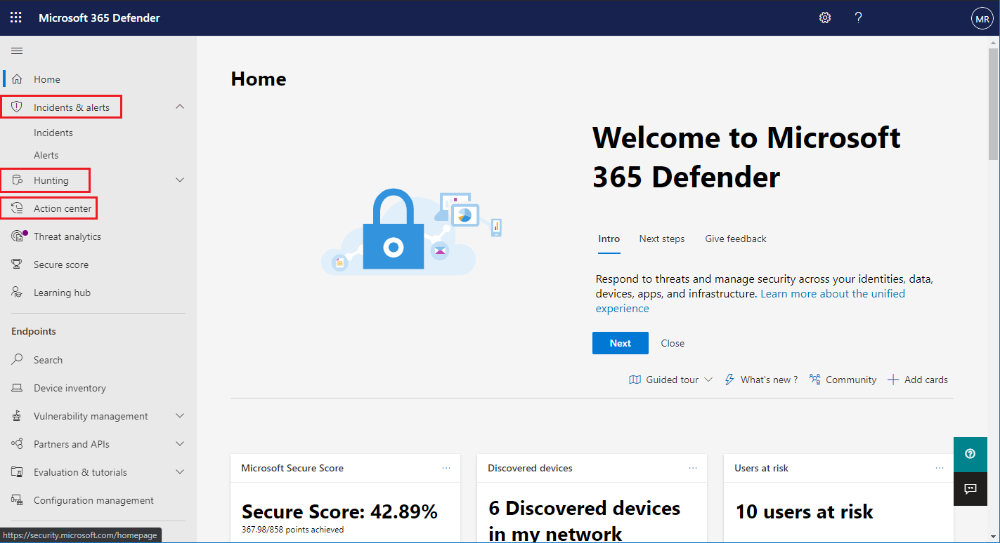

# Turn on Microsoft 365 Defender

[!INCLUDE [Microsoft 365 Defender rebranding](../includes/microsoft-defender.md)]

**Applies to:**
- Microsoft 365 Defender

[Microsoft 365 Defender](microsoft-365-defender.md) unifies your incident response process by integrating key capabilities across Microsoft Defender for Endpoint, Microsoft Defender for Office 365, Microsoft Cloud App Security, and Microsoft Defender for Identity. This unified experience adds powerful features you can access in the Microsoft 365 security center.

Microsoft 365 Defender automatically turns on when eligible customers with the required permissions visit Microsoft 365 security center. Read this article to understand various prerequisites and how Microsoft 365 Defender is provisioned.

## Check license eligibility and required permissions

A license to a Microsoft 365 security product generally entitles you to use Microsoft 365 Defender in Microsoft 365 security center without additional licensing cost. We do recommend getting a Microsoft 365 E5, E5 Security, A5, or A5 Security license or a valid combination of licenses that provides access to all supported services.

For detailed licensing information, [read the licensing requirements](prerequisites.md#licensing-requirements).

### Check your role

You must be a **global administrator** or a **security administrator** in Azure Active Directory to turn on Microsoft 365 Defender. [View your roles in Azure AD](/azure/active-directory/users-groups-roles/directory-manage-roles-portal)

## Supported services

Microsoft 365 Defender aggregates data from the various supported services that you've already deployed. It will process and store data centrally to identify new insights and make centralized response workflows possible. It does this without affecting existing deployments, settings, or data associated with the integrated services.

To get the best protection and optimize Microsoft 365 Defender, we recommend deploying all applicable supported services on your network. For more information, [read about deploying supported services](deploy-supported-services.md).

## Onboard to the service
Onboarding to Microsoft 365 Defender is simple. From the navigation menu, select any item under the Endpoints section, such as Incidents, Hunting, Action center, or Threat analytics to initiate the onboarding process. 

### Data center location

Microsoft 365 Defender will store and process data in the [same location used by Microsoft Defender for Endpoint](/windows/security/threat-protection/microsoft-defender-atp/data-storage-privacy). If you don't have Microsoft Defender for Endpoint, a new data center location is automatically selected based on the location of active Microsoft 365 security services. The selected data center location is shown in the screen.

Select **Need help?** in the Microsoft 365 security center to contact Microsoft support about provisioning Microsoft 365 Defender in a different data center location.

> [!NOTE]
> Microsoft Defender for Endpoint automatically provisions in European Union (EU) data centers when turned on through Azure Defender. Microsoft 365 Defender will automatically provision in the same EU data center for customers who have provisioned Defender for Endpoint in this manner.

### Confirm that the service is on

Once the service is provisioned, it adds:

- [Incidents management](incidents-overview.md)
- [Alerts queue](investigate-alerts.md)
- An action center for managing [automated investigation and response](m365d-autoir.md)
- [Advanced hunting](advanced-hunting-overview.md) capabilities
- Threat analytics

*Microsoft 365 security center with incidents management and other Microsoft 365 Defender capabilities*

### Getting Microsoft Defender for Identity data 
To enable the integration with Microsoft Cloud App Security, you'll need to login to the Microsoft Cloud App Security at least once.

## Get assistance

To get answers to the most commonly asked questions about turning on Microsoft 365 Defender, [read the FAQ](m365d-enable-faq.md).

Microsoft support staff can help provision or deprovision the service and related resources on your tenant. For assistance, select **Need help?** in the Microsoft 365 security center. When contacting support, mention Microsoft 365 Defender.

## Related topics

- [Frequently asked questions](m365d-enable-faq.md)
- [Licensing requirements and other prerequisites](prerequisites.md)
- [Deploy supported services](deploy-supported-services.md)
- [Microsoft 365 Defender overview](microsoft-365-defender.md)
- [Microsoft Defender for Endpoint overview](../defender-endpoint/microsoft-defender-endpoint.md)
- [Defender for Office 365 overview](../office-365-security/defender-for-office-365.md)
- [Microsoft Cloud App Security overview](/cloud-app-security/what-is-cloud-app-security)
- [Microsoft Defender for Identity overview](/azure-advanced-threat-protection/what-is-atp)
- [Microsoft Defender for Endpoint data storage](../defender-endpoint/data-storage-privacy.md)
