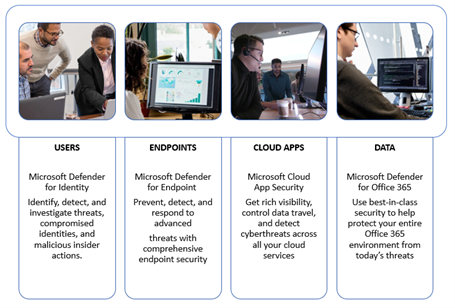

# Run your pilot Microsoft 365 Defender project 

[!INCLUDE [Microsoft 365 Defender rebranding](../includes/microsoft-defender.md)]

**Applies to:**
- Microsoft 365 Defender

This guide helps you run a pilot project by providing pointers to ensure you have a well-structured plan, guiding you through using the attack simulation feature, and finally concluding the pilot with key take-aways for you to reflect on and document results.

Running a pilot helps you effectively determine the benefit of adoptiing Microsoft 365 Defender. Before enabling Microsoft 365 Defender in your production environment and starting your use cases, it's best to plan to determine the tasks to accomplish for your pilot project and set the success criteria. 

## How to use this pilot playbook

This guide provides an overview of Microsoft 365 Defender and step-by-step instructions on how to set up your pilot project. 

Microsoft 365 Defender is a unified pre- and post-breach enterprise defense suite that natively coordinates protection, detection, prevention, investigation, and response across endpoints, identities, email, and applications to provide integrated protection against sophisticated attacks. It does so by combining and orchestrating the following capabilities into a single security solution:
  - Microsoft Defender for Endpoint (endpoints)
  -	Microsoft Defender for Office 365 (email) 
  -	Microsoft Defender for Identity (identity) 
  -	Microsoft Cloud App Security (apps)

With the integrated Microsoft 365 Defender solution, security professionals can stitch together the threat signals that Microsoft Defender for Endpoint, Microsoft Defender for Office 365, Microsoft Defender for Identity, and Microsoft Cloud App Security receive, and determine the full scope and impact of the threat, how it entered the environment, what it's affected, and how it's currently impacting the organization. Microsoft 365 Defender takes automatic action to prevent or stop the attack and self-heal affected mailboxes, endpoints, and user identities. See the [Microsoft 365 Defender overview](microsoft-365-defender.md) for details.

The following sample timeline varies depending on having the right resources in your environment. Some detections and workflows might need more learning time than the others.

>[!IMPORTANT]
>For optimum results, follow the pilot instructions as closely as possible.

### Pilot playbook phases 

There are four phases in running a Microsoft 365 Defender pilot:

|Phase | Description | 
|:-------|:-----|
| [Planning](m365d-pilot-plan.md)  ~ 1 day| Learn what you need to consider before running your Microsoft 365 Defender pilot project:   - Scope   - Use cases  - Requirements  - Test plan   - Success criteria   - Scorecard 
| [Preparation](m365d-evaluation.md)  ~2 days|  Access Microsoft 365 Security Center to set up your Microsoft 365 Defender pilot  environment. You'll be guided to:  - Identify stakeholders and seek sign-off for your pilot   - Environment considerations  - Access  - Azure Active Directory setup   - Configuration order   - Sign up for Microsoft 365 E5 Trial   - Configure domain  - Assign Microsoft 365 E5 licenses   - Complete the setup wizard in the portal|
| [Attack simulation](m365d-pilot-simulate.md)  ~2 days| To simulate an attack, you'll be guided to:  - Verify the test environment requirements  -  Run the simulation  - Investigate an incident  - resolve the incident 
| [Closing and summary](m365d-pilot-close.md)  ~ 1 day| When you've reached the end of the process, you'll be guided to:  - Go through your final output - Present your output to your stakeholders  - Provide feedback  - Take next steps 

## Next step
|[Planning phase](m365d-pilot-plan.md) | Plan your Microsoft 365 Defender pilot project 
|:-------|:-----|
