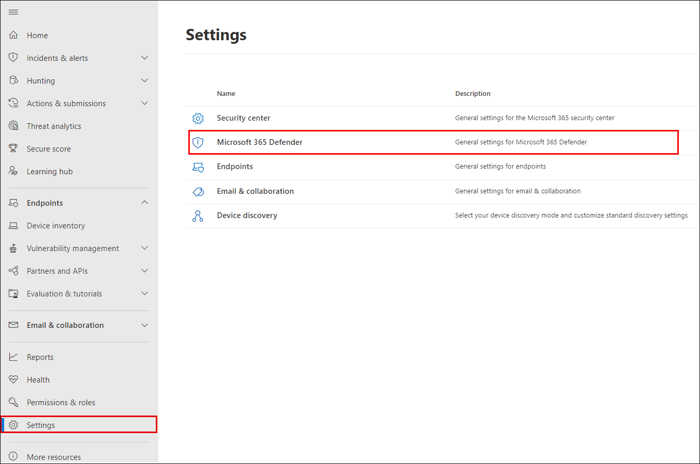
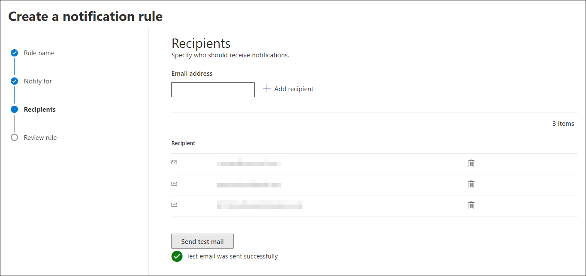
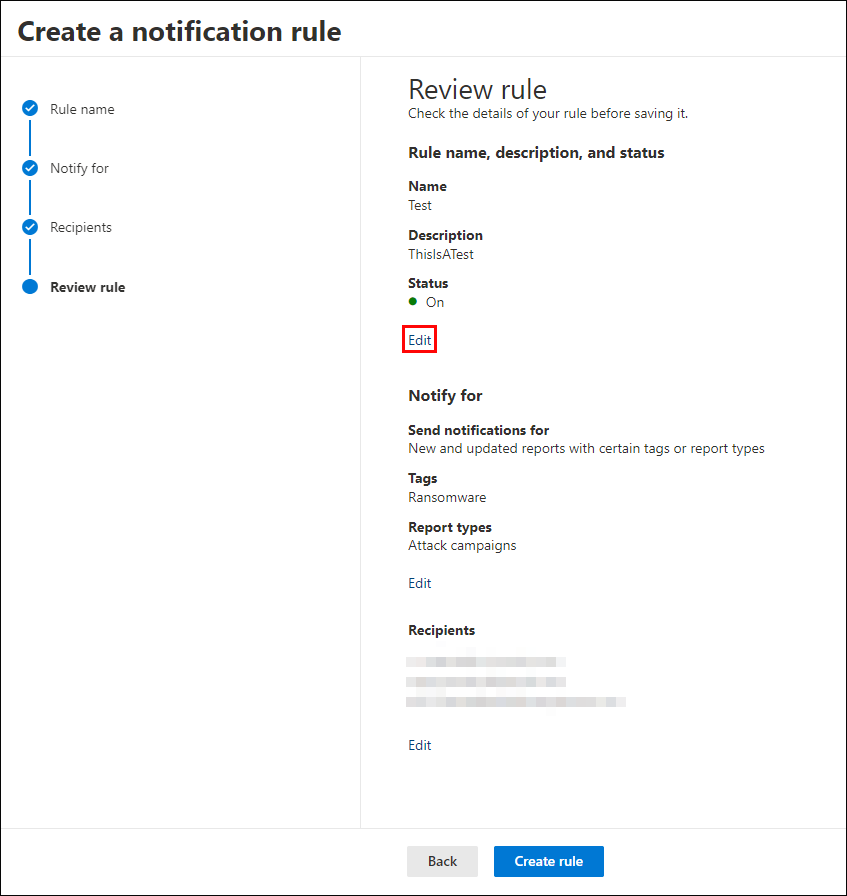
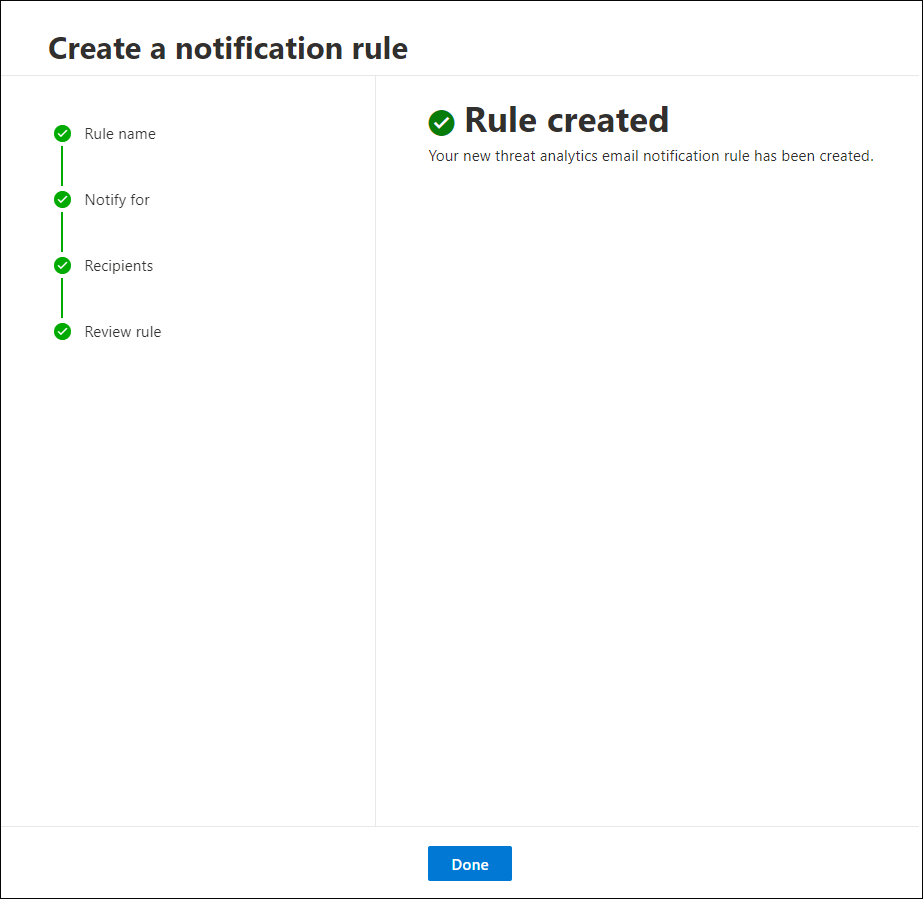

# Get email notifications for Threat analytics updates in Microsoft Defender XDR

[!INCLUDE [Microsoft Defender XDR rebranding](../includes/microsoft-defender.md)]

**Applies to:**

- Microsoft Defender XDR

You can set up email notifications that will send you updates on [threat analytics](threat-analytics.md) reports.

## Set up email notifications for report updates

To set up email notifications for threat analytics reports, perform the following steps:

1. Select **Settings** in the Microsoft Defender XDR sidebar. Select **Microsoft Defender XDR** from the list of settings.
 

2. Choose **Email notifications** > **Threat analytics**, and select the button, **+ Create a notification rule**. A flyout will appear.

3. Follow the steps listed in the flyout. First, give your new rule a name. The description field is optional, but a name is required. You can toggle the rule on or off using the checkbox under the description field.

> [!NOTE]
> The name and description fields for a new notification rule only accept English letters and numbers. They don't accept spaces, dashes, underscores, or any other punctuation.

4. Choose which kind of reports you want to be notified about. You can choose between being updated about all newly published or updated reports, or only those reports which have a certain tag or type.

5. Add at least one recipient to receive the notification emails. You can also use this screen to check how the notifications will be received, by sending a test email.

6. Review your new rule. If there is anything you would like to change, select the **Edit** button at the end of each subsection. Once your review is complete, select the **Create rule** button.

7. Congratulations! Your new rule has been successfully created. Select the **Done** button to complete the process and close the flyout.

8. Your new rule will now appear in the list of Threat analytics email notifications.

## Next steps

- [Get email notifications on incidents](m365d-notifications-incidents.md)
- [Get email notifications on response actions](m365d-response-actions-notifications.md)

[!INCLUDE [Microsoft Defender XDR rebranding](../../includes/defender-m3d-techcommunity.md)]
