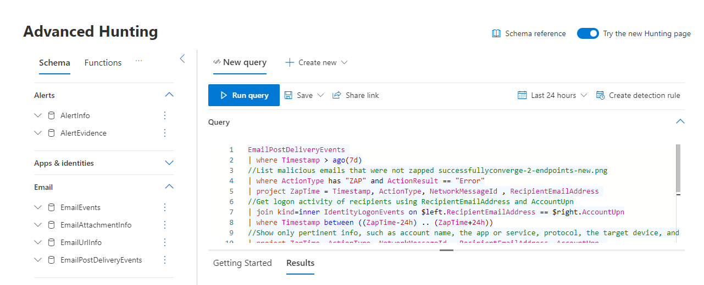

# Microsoft 365 Defender

[!INCLUDE [Microsoft 365 Defender rebranding](../includes/microsoft-defender.md)]

**Applies to:**
- Microsoft 365 Defender

> Want to experience Microsoft 365 Defender? You can [evaluate it in a lab environment](m365d-evaluation.md?ocid=cx-docs-MTPtriallab) or [run your pilot project in production](m365d-pilot.md?ocid=cx-evalpilot).
>

Microsoft 365 Defender is a unified pre- and post-breach enterprise defense suite that natively coordinates detection, prevention, investigation, and response across endpoints, identities, email, and applications to provide integrated protection against sophisticated attacks.

With the integrated Microsoft 365 Defender solution, security professionals can stitch together the threat signals that each of these products receive and determine the full scope and impact of the threat; how it entered the environment, what it's affected, and how it's currently impacting the organization. Microsoft 365 Defender takes automatic action to prevent or stop the attack and self-heal affected mailboxes, endpoints, and user identities.  

<h2>Microsoft 365 Defender services
</h2>
<table><tr><td>
<b><a href="/microsoft-365/security/defender-endpoint/microsoft-defender-endpoint"><b>Microsoft Defender for Endpoint</b>
</a></td>
<td>
<b><a href="/microsoft-365/security/office-365-security/overview"><b>Microsoft Defender for Office 365</b>
</a></td>
<td>
<b><a href="/defender-for-identity/"><b>Microsoft Defender for Identity</b></a>
</td>
<td>
<b><a href="/cloud-app-security/"><b>Microsoft Cloud App Security</b></a>
</td>
</tr>
</table>
 

## Microsoft 365 Defender interactive guide

In this interactive guide, you'll learn how to protect your organization with Microsoft 365 Defender. You'll see how Microsoft 365 Defender can help you detect security risks, investigate attacks to your organization, and prevent harmful activities automatically.

[Check out the interactive guide](https://aka.ms/M365Defender-InteractiveGuide)

Microsoft 365 Defender suite protects: 
- **Endpoints with Defender for Endpoint** - Defender for Endpoint is a unified endpoint platform for preventative protection, post-breach detection, automated investigation, and response. 
- **Email and collaboration with Defender for Office 365** - Defender for Office 365 safeguards your organization against malicious threats posed by email messages, links (URLs) and collaboration tools. 
- **Identities with  Defender for Identity and Azure Active Directory (Azure AD) Identity Protection** - Defender for Identity uses your on-premises Active Directory Domain Services (AD DS) signals to identify, detect, and investigate advanced threats, compromised identities, and malicious insider actions directed at your organization. Azure AD Identity Protection automates the detection and remediation of identity-based risks in your cloud-based Azure AD.
- **Applications with Microsoft Cloud App security** - Microsoft Cloud App security is a comprehensive cross-SaaS solution bringing deep visibility, strong data controls, and enhanced threat protection to your cloud apps. 

>[!VIDEO https://www.microsoft.com/en-us/videoplayer/embed/RE4Bzww] 

Microsoft 365 Defender's unique cross-product layer augments the individual suite components to:

- Help protect against attacks and coordinate defensive responses across the suite through signal sharing and automated actions.
- Narrate the full story of the attack across product alerts, behaviors, and context for security teams by joining data on alerts, suspicious events and impacted assets to 'incidents'.
- Automate response to compromise by triggering self-healing for impacted assets through automated remediation.
- Enable security teams to perform detailed and effective threat hunting across endpoint and Office data.

Here's an example of how the Microsoft 365 Defender portal correlates all related alerts across the suite of products into a single incident.

  

Here's an example of the list of related alerts for an incident.

 

Here's an example of query-based hunting on top of email and endpoint raw data.

 

Microsoft 365 Defender cross-product features include: 

- **Cross-product single pane of glass** - Central view for all information on detections, impacted assets, automated actions taken, and related evidence in a single queue and a single pane in [security.microsoft.com](https://security.microsoft.com). 
- **Combined incidents queue** - To help security professionals focus on what is critical by ensuring the full attack scope, impacted assets and automated remediation actions are grouped together and surfaced in a timely manner. 
- **Automatic response to threats** - Critical threat information is shared in real time between the Microsoft 365 Defender products to help stop the progression of an attack. 

   For example, if a malicious file is detected on an endpoint protected by Defender for Endpoint, it will instruct Defender for Office 365 to scan and remove the file from all e-mail messages. The file will be blocked on sight by the entire Microsoft 365 security suite.
- **Self-healing for compromised devices, user identities, and mailboxes** - Microsoft 365 Defender uses AI-powered automatic actions and playbooks to remediate impacted assets back to a secure state. Microsoft 365 Defender leverages automatic remediation capabilities of the suite products to ensure all impacted assets related to an incident are automatically remediated where possible.
- **Cross-product threat hunting** - Security teams can leverage their unique organizational knowledge to hunt for signs of compromise by creating their own custom queries over the raw data collected by the various protection products. Microsoft 365 Defender provides query-based access to 30 days of historic raw signals and alert data across endpoint and Defender for Office 365 data. 

## Get started

Microsoft 365 Defender licensing requirements must be met before you can enable the service in the Microsoft 365 Defender portal at [security.microsoft.com](https://security.microsoft.com). For more information, see:

- [Licensing requirements](prerequisites.md#licensing-requirements)
- [Turn on Microsoft 365 Defender](m365d-enable.md)

## Training for security analysts

With this learning path from Microsoft Learn, you can understand Microsoft 365 Defender and how it can help identify, control, and remediate security threats.

|Training:|Detect and respond to cyber attacks with Microsoft 365 Defender|
|---|---|
||Microsoft 365 Defender unifies threat signals across endpoints, identities, email, and applications to provide integrated protection against sophisticated cyber attacks. Microsoft 365 Defender is the central experience to investigate and respond to incidents and proactively search for ongoing malicious cyber security activities.
 1 hr 38 min - Learning Path - 5 Modules|

> [!div class="nextstepaction"]
> [Start >](/learn/paths/defender-detect-respond/)

## See also
- [Deploy ransomware protection for your Microsoft 365 tenant](/microsoft-365/solutions/ransomware-protection-microsoft-365)
