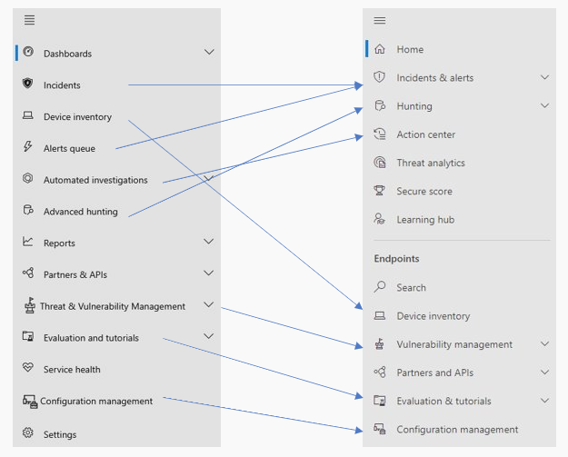
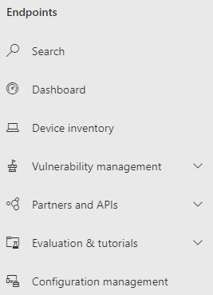
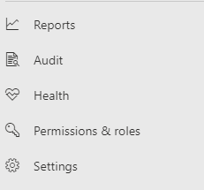

# Microsoft Defender for Endpoint in the Microsoft 365 security center

[!INCLUDE [Microsoft 365 Defender rebranding](../includes/microsoft-defender.md)]

**Applies to:**

- [Microsoft 365 Defender](microsoft-365-defender.md)
- [Microsoft Defender for Endpoint](https://go.microsoft.com/fwlink/p/?linkid=2154037)
- [Microsoft Defender for Office 365](/microsoft-365/security/office-365-security/defender-for-office-365)

## Quick reference

The image and the table below lists the changes in navigation between the Microsoft Defender Security Center and the Microsoft 365 security center.

> [!div class="mx-imgBorder"]
> 

|**Microsoft Defender Security Center (MDE)**  |**Microsoft 365 security center (M3D)** |
|---------|---------|
| Dashboards <ul><li>Security Operations</li><li>Threat Analytics</li></ul>  |Home <ul><li>Threat analytics</li></ul>   |
| Incidents | Incidents & alerts |
| Device inventory | Device inventory |
| Alerts queue | Incidents & alerts |
| Automated investigations | Action center |
| Advanced hunting | Hunting |
| Reports | Reports |
| Partners & APIs | Partners & APIs |
| Threat & Vulnerability Management | Vulnerability management |
| Evaluation and tutorials | Evaluation & tutorials |
| Configuration management | Configuration management |
| Settings | Settings | 

The improved [Microsoft 365 security center](overview-security-center.md) at [https://security.microsoft.com](https://security.microsoft.com) combines security capabilities that protect, detect, investigate, and respond to email, collaboration, identity, and device threats. This security center brings together functionality from existing Microsoft security portals, including Microsoft Defender Security Center and the Office 365 Security & Compliance center.

If you're familiar with the Microsoft Defender Security Center, this article helps describe some of the changes and improvements in the improved Microsoft 365 security center. However there are some new and updated elements to be aware of.

Historically, the [Microsoft Defender Security Center](/windows/security/threat-protection/microsoft-defender-atp/portal-overview) has been the home for Microsoft Defender for Endpoint. Enterprise security teams have used it to monitor and help responding to alerts of potential advanced persistent threat activity or data breaches. To help reduce the number of portals, the Microsoft 365 security center will be the home for monitoring and managing security across your Microsoft identities, data, devices, apps, and infrastructure.

Microsoft Defender for Endpoint in the Microsoft 365 security center supports [granting access to managed security service providers (MSSPs)](/windows/security/threat-protection/microsoft-defender-atp/grant-mssp-access) in the same way [access is granted in the Microsoft Defender security center](mssp-access.md).

> [!IMPORTANT]
> What you see in the Microsoft 365 security center depends on your current subscriptions. For example, if you don't have a license for Microsoft Defender for Office 365, then the Email & Collaboration section will not be shown.

>[!Note]
>The new unified portal is not available for:
>- US Government Community Cloud (GCC)
>- US Government Community Cloud High (GCC High)
>- US Department of Defense
>- All US government institutions with commercial licenses

Take a look at the improved Microsoft 365 security center: [https://security.microsoft.com](https://security.microsoft.com).

Learn more about the benefits: [Overview of the Microsoft 365 security center](overview-security-center.md)

## What's changed

This table is a quick reference of the changes between the Microsoft Defender Security Center and the Microsoft 365 security center.

### Alerts and actions

|**Area**  |**Description of change** |
|---------|---------|
| [Incidents & alerts](incidents-overview.md)  | In the Microsoft 365 security center, you can manage incidents and alerts across all of your endpoints, email, and identities. We've converged the experience to help you find related events more easily. For more information, see [Incidents Overview](incidents-overview.md).   |
| [Hunting](advanced-hunting-overview.md)  |  Modifying custom detection rules created in Microsoft Defender for Endpoint to include identity and email tables automatically moves them to Microsoft 365 Defender. Their corresponding alerts will also appear in Microsoft 365 Defender. For more details about these changes, read [Migrate custom detection rules](advanced-hunting-migrate-from-mde.md#migrate-custom-detection-rules).   The `DeviceAlertEvents` table for advanced hunting isn't available in Microsoft 365 Defender. To query device-specific alert information in Microsoft 365 Defender, you can use the `AlertInfo` and `AlertEvidence` tables to accommodate even more information from a diverse set of sources. Craft your next device-related query by following [Write queries without DeviceAlertEvents](advanced-hunting-migrate-from-mde.md#write-queries-without-devicealertevents).|
|[Action center](m365d-action-center.md)    | Lists pending and completed actions that were taken following automated investigations and remediation actions. Formerly, the Action center in the Microsoft Defender Security Center listed pending and completed actions for remediation actions taken on devices only, while Automated investigations listed alerts and status. In the  improved Microsoft 365 security center, the Action center brings together remediation actions and investigations across email, devices, and users—all in one location.  |
| [Threat analytics](threat-analytics.md) |  Moved to the top of the navigation bar for easier discovery and use. Now includes threat information for both endpoints and email and collaboration.    |

### Endpoints

|**Area**  |**Description of change**  |
|---------|---------|
|Search   |  Instead of being in the heading, Microsoft Defender for Endpoint search bar is moving under the Endpoints section. You can continue to search for devices, files, users, URLs, IPs, vulnerabilities, software, and recommendations.  |
|[Dashboard](/windows/security/threat-protection/microsoft-defender-atp/security-operations-dashboard)   |  This is your security operations dashboard. See an overview of how many active alerts were triggered, which devices are at risk, which users are at risk, and severity level for alerts, devices, and users. You can also see if any devices have sensor issues, your overall service health, and how any unresolved alerts were detected. |
|Device inventory | No changes. |
|[Vulnerability management](/windows/security/threat-protection/microsoft-defender-atp/next-gen-threat-and-vuln-mgt)    |    Name was shortened to fit in the navigation pane. It's the same as the threat and vulnerability management section, with all the pages underneath.     |
| Partners and APIs | No changes. |
| Evaluations & tutorials    |     New testing and learning capabilities.     |
| Configuration management   |  No changes.  |

> [!NOTE]
> **Automatic investigation and remediation** is now a part of  incidents. You can see Automated  investigation and remediation events in the **Incident > Investigation** tab.

> [!TIP]
> Device search is done from Endpoints > Search.

### Access and reporting

|**Area**  |**Description of change**  |
|---------|---------|
| Reports  | See reports for endpoints and email & collaboration, including Threat protection, Device health and compliance, and Vulnerable devices. |
| Health  |  Currently links out to the "Service health" page in the [Microsoft 365 admin center](https://admin.microsoft.com/). |
| Settings |  Manage your settings for the Microsoft 365 security center, Microsoft 365 Defender, Endpoints, Email & collaboration, Identities, and Device discovery.   |

## Microsoft 365 security navigation and capabilities

The left navigation, or quick launch bar, will look familiar. However, there are some new and updated elements in this security center.

### Incidents and alerts

Brings together incident and alert management across your email, devices, and identities. The alert page provides full context to the alert by combining attack signals to construct a detailed story. A new, unified experience now brings together a consistent view of alerts across workloads. You can quickly triage, investigate, and take effective action.

- [Learn more about incidents](incidents-overview.md)
- [Learn more about managing alerts](investigate-alerts.md)

### Hunting

Proactively search for threats, malware, and malicious activity across your endpoints, Office 365 mailboxes, and more by using [advanced hunting queries](advanced-hunting-overview.md). These powerful queries can be used to locate and review threat indicators and entities for both known and potential threats.

[Custom detection rules](custom-detection-rules.md) can be built from advanced hunting queries to help you proactively watch for events that might be indicative of breach activity and misconfigured devices.

### Action center

Action center shows you the investigations created by automated investigation and response capabilities. This automated, self-healing in Microsoft 365 Defender can help security teams by automatically responding to specific events.

[Learn more about the Action center](m365d-action-center.md)

### Threat Analytics

Get threat intelligence from expert Microsoft security researchers. Threat Analytics helps security teams be more efficient when facing emerging threats. Threat Analytics includes:

- Email-related detections and mitigations from Microsoft Defender for Office 365. This is in addition to the endpoint data already available from Microsoft Defender for Endpoint.
- Incidents view related to the threats.
- Enhanced experience for quickly identifying and using actionable information in the reports.

You can access threat analytics either from the upper left navigation bar in the Microsoft 365 security center, or from a dedicated dashboard card that shows the top threats for your organization.

Learn more about how to [track and respond to emerging threats with threat analytics](./threat-analytics.md)

### Endpoints section

View and manage the security of endpoints in your organization. If you've used the Microsoft Defender Security Center, it will look familiar.

### Access and reports

View reports, change your settings, and modify user roles.

### SIEM API connections

If you use the [Defender for Endpoint SIEM API](../defender-endpoint/enable-siem-integration.md), you can continue to do so. We’ve added new links on the API payload that point to the alert page or the incident page in the Microsoft 365 security portal. New API fields include LinkToMTP and IncidentLinkToMTP. For more information, see [Redirecting accounts from Microsoft Defender for Endpoint to the Microsoft 365 security center](./microsoft-365-security-mde-redirection.md).

### Email alerts

You can continue to use email alerts for Defender for Endpoint. We've added new links in the emails that point to the alert page or the incident page in the Microsoft 365 security center. For more information, see [Redirecting accounts from Microsoft Defender for Endpoint to the Microsoft 365 security center](./microsoft-365-security-mde-redirection.md).

## Related information

- [Microsoft 365 security center](overview-security-center.md)
- [Microsoft Defender for Endpoint in the Microsoft 365 security center](microsoft-365-security-center-mde.md)
- [Redirecting accounts from Microsoft Defender for Endpoint to the Microsoft 365 security center](microsoft-365-security-mde-redirection.md)