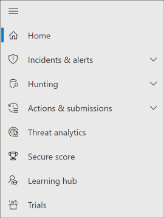
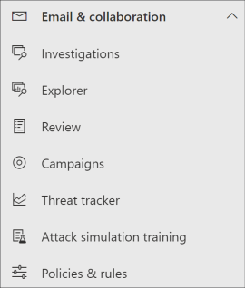
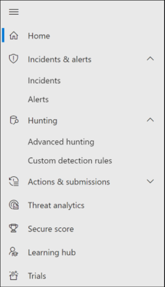
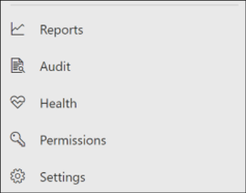

# Microsoft Defender for Office 365 in Microsoft 365 Defender

[!INCLUDE [Microsoft 365 Defender rebranding](../includes/microsoft-defender.md)]

**Applies to:**
- [Microsoft 365 Defender](microsoft-365-defender.md)
- [Microsoft Defender for Office 365](/microsoft-365/security/office-365-security/defender-for-office-365)

## Quick reference

The table below lists the changes in navigation between the Security & Compliance Center and Microsoft 365 Defender.

****

|[Security & Compliance Center](https://protection.office.com)|[Microsoft 365 Defender](https://security.microsoft.com)|[Microsoft Purview compliance portal](https://compliance.microsoft.com/homepage)|[Exchange admin center](https://admin.exchange.microsoft.com)|
|---|---|---|---|
|Alerts|<ul><li>[Alert Policies](https://security.microsoft.com/alertpolicies)</li><li>[Incidents & alerts](https://security.microsoft.com/alerts)</li></ul>|[Alerts page](https://compliance.microsoft.com/homepage)||
|Classification||See [Microsoft Purview compliance portal](https://compliance.microsoft.com/homepage)||
|Data loss prevention||See [Microsoft Purview compliance portal](https://compliance.microsoft.com/homepage)||
|Records management||See [Microsoft Purview compliance portal](https://compliance.microsoft.com/homepage)||
|Information governance||See [Microsoft Purview compliance portal](https://compliance.microsoft.com/homepage)||
|Threat management|[Email & Collaboration](https://security.microsoft.com/homepage)|||
|Permissions|[Permissions & roles](https://security.microsoft.com/emailandcollabpermissions)|See [Microsoft Purview compliance portal](https://compliance.microsoft.com/homepage)||
|Mail flow|||See [Exchange admin center](https://admin.exchange.microsoft.com/#/)|
|Data privacy||See [Microsoft Purview compliance portal](https://compliance.microsoft.com/homepage)||
|Search|[Audit](https://security.microsoft.com/auditlogsearch?viewid=Async%20Search)|Search (content search)||
|Reports|[Report](https://security.microsoft.com/emailandcollabreport)|||
|Service assurance||See [Microsoft Purview compliance portal](https://compliance.microsoft.com/homepage)||
|Supervision||See [Microsoft Purview compliance portal](https://compliance.microsoft.com/homepage)||
|eDiscovery||See [Microsoft Purview compliance portal](https://compliance.microsoft.com/homepage)||

[Microsoft 365 Defender](./microsoft-365-defender.md) at <a href="https://go.microsoft.com/fwlink/p/?linkid=2077139" target="_blank"><https://security.microsoft.com></a> combines security capabilities from existing Microsoft security portals, including the Security & Compliance Center. This improved center helps security teams protect their organization from threats more effectively and efficiently.

If you're familiar with the Security & Compliance Center (protection.office.com), this article describes some of the changes and improvements in Microsoft 365 Defender.

Learn more about the benefits: [Overview of Microsoft 365 Defender](microsoft-365-defender.md)

If you're looking for compliance-related items, visit the <a href="https://go.microsoft.com/fwlink/p/?linkid=2077149" target="_blank">Microsoft Purview compliance portal</a>.

## New and improved capabilities

The left navigation, or quick launch bar, will look familiar. However, there are some new and updated elements in this Defender for Cloud.

With the unified Microsoft 365 Defender solution, you can stitch together the threat signals and determine the full scope and impact of the threat, and how it's currently impacting the organization.

Defender for Office 365 safeguards your organization against malicious threats posed by email messages, links (URLs), and collaboration tools.

### Incidents and alerts

Brings together incident and alert management across your email, devices, and identities. Alerts are now available under the Investigation node, and help provide a broader view of an attack. The alert page provides full context to the alert, by combining attack signals to construct a detailed story. Previously, alerts were specific to different workloads. A new, unified experience now brings together a consistent view of alerts across workloads. You can quickly triage, investigate, and take effective action.

- [Learn more about Investigations](incidents-overview.md)
- [Learn more about managing alerts](/windows/security/threat-protection/microsoft-defender-atp/review-alerts)

### Hunting

Proactively search for threats, malware, and malicious activity across your endpoints, Office 365 mailboxes, and more by using [advanced hunting queries](advanced-hunting-overview.md). These powerful queries can be used to  locate and review threat indicators and entities for both known and potential threats.

[Custom detection rules](/windows/security/threat-protection/microsoft-defender-atp/custom-detection-rules) can be built from advanced hunting queries to help you proactively watch for events that might be indicative of breach activity and misconfigured devices.

Here's an [example on advanced hunting](advanced-hunting-example.md) in Microsoft Defender for Office 365.

### Action center

Action center shows you the investigations created by automated investigation and response capabilities. This automated, self-healing in Microsoft 365 Defender can help security teams by automatically responding to specific events.

Learn more about [Action center](m365d-action-center.md).

#### Threat Analytics

Get threat intelligence from expert Microsoft security researchers. Threat Analytics helps security teams be more efficient when facing emerging threats. Threat Analytics includes:

- Email-related detections and mitigations from Microsoft Defender for Office 365. This is in addition to the endpoint data already available from Microsoft Defender for Endpoint.
- Incidents view related to the threats.
- Enhanced experience for quickly identifying and using actionable information in the reports.

You can access Threat analytics either from the upper left navigation bar in Microsoft 365 Defender, or from a dedicated dashboard card that shows the top threats for your organization.

Learn more about how to [track and respond to emerging threats with threat analytics](./threat-analytics.md).

### Email & collaboration

Track and investigate threats to your users' email, track campaigns, and more. If you've used the Security & Compliance Center, this will be familiar.

  
#### Email entity page

The [Email entity page](../office-365-security/mdo-email-entity-page.md) *unifies* email information that had been scattered across different pages or views in the past. Investigating email for threats and trends is *centralized*. Header information and email preview are accessible through the same email page, along with other useful email-related information. Likewise, the detonation status for malicious file attachments or URLs can be found on a tab of the same page. The Email entity page empowers admins and security operations teams to understand an email threat and its status, fast, and then act quickly determine handling.

### Access and Reports

View reports, change your settings, and modify user roles.

  
> [!NOTE]
> DomainKeys Identified Mail (DKIM) ensures that destination email systems trust messages sent outbound from your custom domain.
> For Defender for Office 365 users, you can now *manage and rotate* DKIM keys through Microsoft 365 Defender: <https://security.microsoft.com/threatpolicy>, or navigate to **Policy & rules** \> **Threat policies** \> \> **Rules** section \> **DKIM**.
>
> For more information, see [Use DKIM to validate outbound email sent from your custom domain](/microsoft-365/security/office-365-security/email-authentication-dkim-configure).

## What's changed

This table is a quick reference of Threat management where change has occurred between the Security & Compliance center and the Microsoft 365 Defender portal. Click the links to read more about these areas.

|Area|Description of change|
|---|---|
|[Investigation](../office-365-security/air-about.md#the-overall-flow-of-air) |Brings together AIR capabilities in [Defender for Office 365](/microsoft-365/security/office-365-security/defender-for-office-365) and [Defender for Endpoint](../defender-endpoint/automated-investigations.md). With these updates and improvements, your security operations team will be able to view details about automated investigations and remediation actions across your email, collaboration content, user accounts, and devices, all in one place.|
|[Alert queue](../../compliance/alert-policies.md)|The **View alerts** flyout pane in the Security & Compliance Center now includes links to Microsoft 365 Defender. Click on the **Open Alert Page** link and Microsoft 365 Defender opens. You can access the **View alerts** page by clicking on any Office 365 alert in the Alerts queue.|
|[Attack Simulation training](../office-365-security/attack-simulation-training-insights.md)|Use Attack Simulation training to run realistic attack scenarios in your organization. These simulated attacks can help train your workforce before a real attack impacts your organization. Attack simulation training includes, more options, enhanced reports, and improved training flows help make your attack simulation and training scenarios easier to deliver and manage.|

No changes to these areas:

- [Explorer](../office-365-security/threat-explorer-about.md)
- [Policies & Rules](../../compliance/alert-policies.md)
- [Campaign](../office-365-security/campaigns.md)
- [Submissions](../office-365-security/submissions-admin.md)
- [Review](./m365d-action-center.md)
- [Threat Tracker](../office-365-security/threat-trackers.md)

Also, check the **Related Information** section at the bottom of this article.

> [!IMPORTANT]
> The <a href="https://go.microsoft.com/fwlink/p/?linkid=2077139" target="_blank">Microsoft 365 Defender portal</a> combines security features in <https://securitycenter.windows.com>, and <https://protection.office.com>. However, what you see will depend on your subscription. If you only have Microsoft Defender for Office 365 Plan 1 or 2, as standalone subscriptions, for example, you won't see capabilities around Security for Endpoints and Defender for Office Plan 1 customers won't see items such as Threat Analytics.

> [!TIP]
> All Exchange Online Protection (EOP) functions will be included in Microsoft 365 Defender, as EOP is a core element of Defender for Office 365.

## Microsoft 365 Defender Home page

The Home page of the portal surfaces important summary information about the security status of your Microsoft 365 environment.

Using the **Guided tour** you can take a quick tour of Endpoint or Email & collaboration pages. Note that what you see here will depend on if you have license for Defender for Office 365 and/or Defender for Endpoint.

Also included is a link to the Security & Compliance Center for comparison. The last link is to the **What's New** page that describes recent updates.

## Related information

- [Redirecting Security & Compliance Center to Microsoft 365 Defender](microsoft-365-security-mdo-redirection.md)
- [The Action center](./m365d-action-center.md)
- [Email & collaboration alerts](../../compliance/alert-policies.md#default-alert-policies)
- [Custom detection rules](/microsoft-365/security/defender-endpoint/custom-detection-rules)
- [Create a phishing attack simulation](../office-365-security/attack-simulation-training-simulations.md) and [create a payload for training your people](../office-365-security/attack-simulation-training-payloads.md)
[!INCLUDE [Microsoft 365 Defender rebranding](../../includes/defender-m3d-techcommunity.md)]
