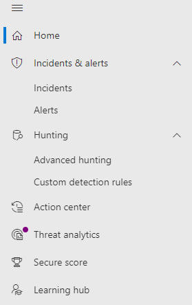

# Microsoft Defender for Office 365 in the Microsoft 365 security center

[!INCLUDE [Microsoft 365 Defender rebranding](../includes/microsoft-defender.md)]

[!INCLUDE [Prerelease](../includes/prerelease.md)]

**Applies to:**
- [Microsoft 365 Defender](microsoft-365-defender.md)
- [Microsoft Defender for Endpoint](https://go.microsoft.com/fwlink/p/?linkid=2154037)
- [Microsoft Defender for Office 365](/microsoft-365/security/office-365-security/defender-for-office-365)

The improved [Microsoft 365 security center](./overview-security-center.md) at [https://security.microsoft.com](https://security.microsoft.com) combines security capabilities from existing Microsoft security portals, including Microsoft Defender Security Center and the Office 365 Security & Compliance Center. This improved center helps security teams protect their organization from threats more effectively and efficiently.

If you are familiar with the Office 365 Security and Compliance portal (protection.office.com), this article describes some of the changes and improvements in the Microsoft 365 security center.

Learn more about the benefits: [Overview of the Microsoft 365 security center](overview-security-center.md)

If you are looking for compliance-related items, visit the [Microsoft 365 compliance center](https://compliance.microsoft.com/homepage).

## What's changed

This table is a quick reference of Email & Collaboration areas where change has occurred between the **Security & Compliance center** and the **Microsoft 365 Security** portal. Click the links to read more about these areas.

|**Area**  |**Description of change**  |
|---------|---------|
| [Email entity page](../office-365-security/mdo-email-entity-page.md) | This page **unifies** email information that had been scattered across different pages or views in the past. Investigating email for threats and trends is *centralized*. Header information and email preview are accessible through the same email page, along with other useful email-related information. Likewise, the detonation status for malicious file attachments or URLs can be found on a tab of the same page. The Email entity page empowers admins and security operations teams to understand an email threat and its status, fast, and then act quickly determine handling.  |
| [Investigation](../office-365-security/office-365-air.md#changes-are-coming-soon-in-your-security-center) | Brings together AIR capabilities in [Defender for Office 365](/microsoft-365/security/office-365-security/defender-for-office-365) and [Defender for Endpoint](../defender-endpoint/automated-investigations.md). With these updates and improvements, your security operations team will be able to view details about automated investigations and remediation actions across your email, collaboration content, user accounts, and devices, all in one place.  | 
| [Alert view](../../compliance/alert-policies.md) | The **View alerts** flyout pane in the Office Security and Compliance center now includes links to the Microsoft 365 security center. Click on the **Open Alert Page** link and the Microsoft 365 security center opens. You can access the **View alerts** page by clicking on any Office 365 alert in the Alerts queue. |
| [Attack Simulation training](../office-365-security/attack-simulation-training-insights.md)   | Use Attack Simulation training to run realistic attack scenarios in your organization. These simulated attacks can help train your workforce before a real attack impacts your organization. Attack simulation training includes, more options, enhanced reports, and improved training flows help make your attack simulation and training scenarios easier to deliver and manage.  |

No changes to these areas:
- [Explorer](../office-365-security/threat-explorer.md)
- [Policies & Rules](../../compliance/alert-policies.md)
- [Campaign](../office-365-security/campaigns.md)
- [Submissions](../office-365-security/admin-submission.md)
- [Review](./m365d-action-center.md)
- [Threat Tracker](../office-365-security/threat-trackers.md)

Also, check the **Related Information** section at the bottom of this article.

> [!IMPORTANT]
> The Microsoft 365 Security portal (https://security.microsoft.com) combines security features in https://securitycenter.windows.com, and https://protection.office.com. However, what you see will depend on your subscription. If you only have Microsoft Defender for Office 365 Plan 1 or 2, as standalone subscriptions, for example, you won't see capabilities around Security for Endpoints and Defender for Office Plan 1 customers won't see items such as Threat Analytics.

## Microsoft 365 security center Home page

The Home page of the portal surfaces:

- Secure Score ratings
- the number of users and devices at risk
- active incident lists
- lists of privileged OAuth apps
- device health data
- tweets from Microsoft’s security intelligence twitter feed
- and more summary information

Using the **Guided tour** you can take a quick tour of Endpoint or Email & collaboration pages. Note that what you see here will depend on if you have license for Defender for Office 365 and/or Defender for Endpoint.  

Also included is a link to the **Office 365 Security and Compliance center** for comparison. The last link is to the **What's New** page that describes recent updates.

## Improved capabilities

The left navigation, or quick launch bar, will look familiar. However, there are some new and updated elements in this security center.

### Incidents and alerts
Brings together incident and alert management across your email, devices, and identities. Alerts are now available under the Investigation node, and help provide a broader view of an attack. The alert page provides full context to the alert, by combining attack signals to construct a detailed story. Previously, alerts were specific to different workloads. A new, unified experience now brings together a consistent view of alerts across workloads. You can quickly triage, investigate, and take effective action.

- [Learn more about Investigations](incidents-overview.md)
- [Learn more about managing alerts](/windows/security/threat-protection/microsoft-defender-atp/review-alerts)




### Hunting
Proactively search for threats, malware, and malicious activity across your endpoints, Office 365 mailboxes, and more by using [advanced hunting queries](advanced-hunting-overview.md). These powerful queries can be used to  locate and review threat indicators and entities for both known and potential threats.

[Custom detection rules](/windows/security/threat-protection/microsoft-defender-atp/custom-detection-rules)  can be built from advanced hunting queries to help you proactively watch for events that might be indicative of breach activity and misconfigured devices.

### Action center

Action center shows you the investigations created by automated investigation and response capabilities. This automated, self-healing in Microsoft 365 Defender can help security teams by automatically responding to specific events.

[Learn more about Action Center](m365d-action-center.md)

#### Threat Analytics
Get threat intelligence from expert Microsoft security researchers. Threat Analytics helps security teams be more efficient when facing emerging threats. Threat Analytics includes:

- Email-related detections and mitigations from Microsoft Defender for Office 365. This is in addition to the endpoint data already available from Microsoft Defender for Endpoint.
- Incidents view related to the threats. 
- Enhanced experience for quickly identifying and using actionable information in the reports. 
You can access Threat analytics either from the upper left navigation bar in the Microsoft 365 security center, or from a dedicated dashboard card that shows the top threats for your organization. 

Learn more about how to [track and respond to emerging threats with threat analytics](./threat-analytics.md)

### Email & collaboration

Track and investigate threats to your users' email, track campaigns, and more. If you've used the Office 365 Security and Compliance center, this will be familiar.

:::image type="content" source="../../media/converge-3-email-and-collab-new.png" alt-text="The quick launch menu for Email & Collab (or MSDO), on the left side of the Microsoft 365 security center.":::

### Access and Reports

View reports, change your settings, and modify user roles.

:::image type="content" source="../../media/converge-4-access-and-reporting-new.png" alt-text="The quick launch menu for Microsoft 365 security center permissions and reporting, on the left side of the security center.":::


> [!NOTE]
> For Defender for Office 365 users, you can now *manage and rotate* DomainKeys Identified Mail (DKIM) keys through the Microsoft 365 security center: https://security.microsoft.com/threatpolicy, or navigate to **Policy & rules > Threat policies > DKIM**.

## Advanced Hunting example for Microsoft Defender for Office 365
Want to get started searching for email threats using advanced hunting? Try this:

The [Getting Started](/microsoft-365/security/office-365-security/defender-for-office-365.md#getting-started) section of the [Microsoft Defender for Office 365 article](/microsoft-365/security/office-365-security/defender-for-office-365) has logical early configuration chunks that look like this:

1. Configure everything with 'anti' in the name.
- anti-malware
- anti-phishing
- anti-spam
2. Set up everything with 'safe' in the name.
- safe links
- safe attachments
3. Defend the workloads (ex. SharePoint Online, OneDrive, and Teams)
4. Protect with Zero-Hour auto purge

Along with a [link](../office-365-security/protect-against-threats.md) to jump right in and get configuration going on Day 1.

The last step in **Getting Started** is protecting users with **Zero-Hour auto purge**, also known as ZAP. Knowing if your efforts to ZAP a suspicious or malicious mail, post-delivery, were successful can be very important.

Quickly navigating to Kusto query language to hunt for issues is an advantage of converging these two security centers. Security teams can monitor ZAP misses by taking their next steps [here](https://security.microsoft.com/advanced-hunting), under **Hunting** > **Advanced Hunting**.

1. On the Advanced Hunting page, click Query.
1. Copy the query below into the query window.
1. Select Run query.


```kusto
EmailPostDeliveryEvents 
| where Timestamp > ago(7d)
//List malicious emails that were not zapped successfullyconverge-2-endpoints-new.png
| where ActionType has "ZAP" and ActionResult == "Error"
| project ZapTime = Timestamp, ActionType, NetworkMessageId , RecipientEmailAddress 
//Get logon activity of recipients using RecipientEmailAddress and AccountUpn
| join kind=inner IdentityLogonEvents on $left.RecipientEmailAddress == $right.AccountUpn
| where Timestamp between ((ZapTime-24h) .. (ZapTime+24h))
//Show only pertinent info, such as account name, the app or service, protocol, the target device, and type of logon
| project ZapTime, ActionType, NetworkMessageId , RecipientEmailAddress, AccountUpn, 
LogonTime = Timestamp, AccountDisplayName, Application, Protocol, DeviceName, LogonType
```

:::image type="content" source="../../media/converge-13-advanced-hunt-an-email-zap-new.png" alt-text="The Advanced hunting page (under Hunting)with Query selected at the top of the query panel, and running a Kusto query to capture ZAP actions over the last 7 days.":::

The data from this query will appear in the results panel below the query itself. Results include information like 'DeviceName', 'AccountDisplayName', and 'ZapTime' in a customizable result set. Results can also be exported for your records. If the query is one you'll need again, select **Save** > **Save As** and add the query to your list of queries, shared, or community queries.

## Related information
- [Microsoft Defender for Office 365 in the Microsoft 365 security center](microsoft-365-security-center-mdo.md)
- [The Action center](./m365d-action-center.md)
- [Email & collaboration alerts](../../compliance/alert-policies.md#default-alert-policies)
- [Hunt for threats across devices, emails, apps, and identities](./advanced-hunting-query-emails-devices.md)
- [Custom detection rules](/microsoft-365/security/defender-endpoint/custom-detection-rules)
- [Create a phishing attack simulation](../office-365-security/attack-simulation-training.md) and [create a payload for training your people](../office-365-security/attack-simulation-training-payloads.md)
