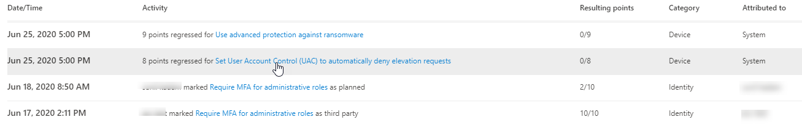
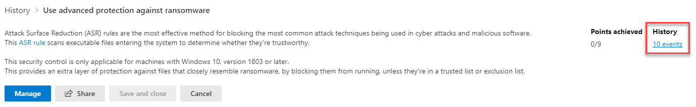
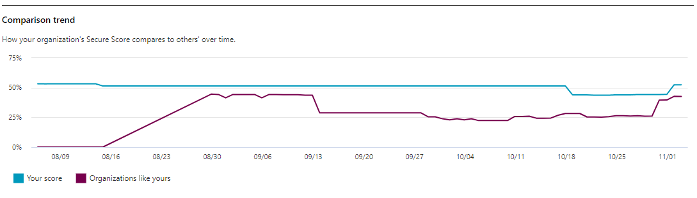

# Track your Microsoft Secure Score history and meet goals

[!INCLUDE [Microsoft 365 Defender rebranding](../includes/microsoft-defender.md)]

[Microsoft Secure Score](microsoft-secure-score.md) is a measurement of an organization's security posture, with a higher number indicating more improvement actions taken. It can be found at https://security.microsoft.com/securescore in the [Microsoft 365 security center](overview-security-center.md).

## Gain insights into activity that has affected your score

View a graph of your organization's score over time in the **History** tab.

Below the graph is a list of all the actions taken in the selected time range and their attributes, such as resulting points and category. You can customize a date range and filter by category.

If you select the improvement action associated with an activity, the full improvement action flyout will appear.

To view all history for that specific improvement action, select the history link in the flyout.

## Discover trends and set goals

In the **Metrics & trends** tab, there are several graphs and charts to give you more visibility into trends and set goals. You can set the date range for the whole page of visualizations. The visualizations include:

* **Your Secure Score zone** - Customized based on your organization's goals and definitions of good, okay, and bad score ranges.
* **Regression trend** - A timeline of points that have regressed because of configuration, user, or device changes.  
* **Comparison trend** - How your organization's Secure Score compares to others' over time. This view can include lines representing the score average of organizations with similar seat count and a custom comparison view that you can set.
* **Risk acceptance trend** - Timeline of improvement actions marked as "risk accepted."
* **Score changes** - The number of points achieved, points regressed, and changes to your score in the specified date range.

### Compare your score to organizations like yours

There are two places to see how your score compares to organizations that are similar to you. In both charts, you can select **Manage comparisons** to view and edit your organization's information. You can also create a custom comparison based on industry, organization size, licenses, and regions.

#### Comparison bar chart

The comparison bar chart is the **Overview** tab. Hover over the chart to view the score and score opportunity. The comparison data is anonymized so we don’t know exactly which others tenants are in the mix.

- **Organizations like yours**: an average score of other tenants (provided we have at least five or more tenants to compare) that qualify with the following criteria:
    1. Same industry
    2. Same organization size
    3. All regions
    4. Microsoft products used are 80% similar
    5. Opportunity (max score that can be achieved by current license) within a 20% range from your tenant

- **Custom Comparison**: needs to be set up by selecting **Manage Comparison** based on the following criteria:
    1. Selected industry(s)
    2. Selected organization size(s)
    3. Selected region(s)
    4. Selected license(s)
    5. Microsoft products used are 80% similar
    6. Opportunity (max score that can be achieved by current license) within a 20% range from your tenant

If you've made a custom selection but the results have less than five other tenants that we can compare against, you'll see “Not available due to limited data”.

#### Comparison trend

In the **Metrics & trends** tab, view how your organization's Secure Score compares to others' over time.

## We want to hear from you

If you have any issues, let us know by posting in the [Security, Privacy & Compliance](https://techcommunity.microsoft.com/t5/Security-Privacy-Compliance/bd-p/security_privacy) community. We're monitoring the community and will provide help.

## Related resources

- [Microsoft Secure Score overview](microsoft-secure-score.md)
- [Assess your security posture](microsoft-secure-score-improvement-actions.md)
- [What's coming](microsoft-secure-score-whats-coming.md)
- [What's new](microsoft-secure-score-whats-new.md)
