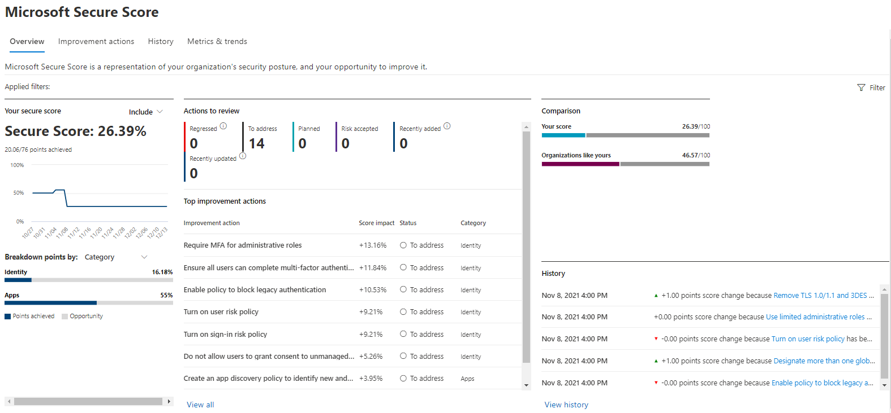

# Track your Microsoft Secure Score history and meet goals

[!INCLUDE [Microsoft 365 Defender rebranding](../includes/microsoft-defender.md)]

[Microsoft Secure Score](microsoft-secure-score.md) is a measurement of an organization's security posture, with a higher number indicating more recommended actions taken. It can be found at https://security.microsoft.com/securescore in the [Microsoft 365 Defender portal](microsoft-365-defender-portal.md).

## Gain insights into activity that has affected your score

View a graph of your organization's score over time in the **History** tab.

Below the graph is a list of all the actions taken in the selected time range and their attributes, such as resulting points and category. You can customize a date range and filter by category.

:::image type="content" source="../../media/secure-score/secure-score-history-activity.png" alt-text="An example of the page that describes the activity history in the Microsoft 365 Defender portal" lightbox="../../media/secure-score/secure-score-history-activity.png":::

If you select the recommended action associated with an activity, the full recommended action flyout will appear.

To view all history for that specific recommended action, select the history link in the flyout.

:::image type="content" source="../../media/secure-score/secure-score-history-flyout.png" alt-text="The History pane regarding recommended action in the Microsoft 365 Defender portal" lightbox="../../media/secure-score/secure-score-history-flyout.png":::

## Discover trends and set goals

In the **Metrics & trends** tab, there are several graphs and charts to give you more visibility into trends and set goals. You can set the date range for the whole page of visualizations. The visualizations include:

* **Your Secure Score zone** - Customized based on your organization's goals and definitions of good, okay, and bad score ranges.
* **Regression trend** - A timeline of points that have regressed because of configuration, user, or device changes.  
* **Comparison trend** - How your organization's Secure Score compares to others' over time. This view can include lines representing the score average of organizations with similar seat count and a custom comparison view that you can set.
* **Risk acceptance trend** - Timeline of recommended actions marked as "risk accepted."
* **Score changes** - The number of points achieved, points regressed, and changes to your score in the specified date range.

### Compare your score to organizations like yours

There are two places to see how your score compares to organizations that are similar to yours.

#### Comparison bar chart

The comparison bar chart is available on the **Overview** tab. Hover over the chart to view the score and score opportunity. 

:::image type="content" source="../../media/secure-score/secure-score-comparison-bar.png" alt-text="An example of the bar graph of similar organization's scores in the Microsoft 365 Defender portal" lightbox="../../media/secure-score/secure-score-comparison-bar.png":::

The comparison data is anonymized so we don't know exactly which others tenants are in the mix.

#### Comparison trend

In the **Metrics & trends** tab, view how your organization's Secure Score compares to others' over time.

:::image type="content" source="../../media/secure-score/secure-score-comparison-trend.png" alt-text="An example of a line graph of similar organization's scores over time in the Microsoft 365 Defender portal" lightbox="../../media/secure-score/secure-score-comparison-trend.png":::

## We want to hear from you

If you have any issues, let us know by posting in the [Security, Privacy & Compliance](https://techcommunity.microsoft.com/t5/Security-Privacy-Compliance/bd-p/security_privacy) community. We're monitoring the community and will provide help.

## Related resources

- [Microsoft Secure Score overview](microsoft-secure-score.md)
- [Assess your security posture](microsoft-secure-score-improvement-actions.md)
- [What's coming](microsoft-secure-score-whats-coming.md)
- [What's new](microsoft-secure-score-whats-new.md)
[!INCLUDE [Microsoft 365 Defender rebranding](../../includes/defender-m3d-techcommunity.md)]
