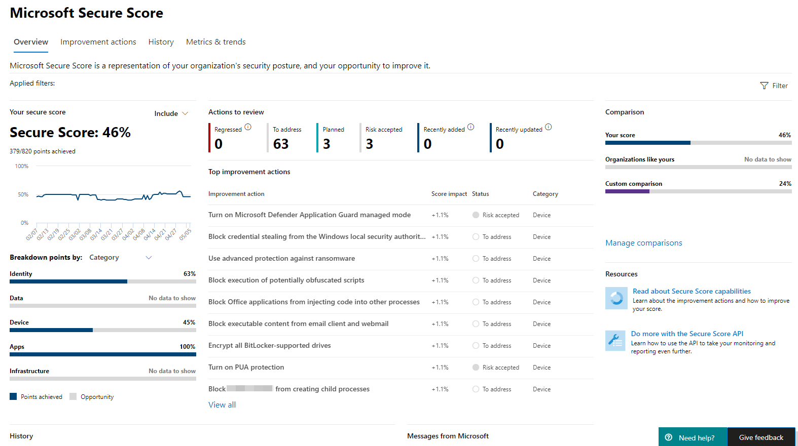

# Microsoft Secure Score

[!INCLUDE [Microsoft 365 Defender rebranding](../includes/microsoft-defender.md)]

Microsoft Secure Score is a measurement of an organization's security posture, with a higher number indicating more improvement actions taken. It can be found at https://security.microsoft.com/securescore in the [Microsoft 365 security center](overview-security-center.md).

Following the Secure Score recommendations can protect your organization from threats. From a centralized dashboard in the Microsoft 365 security center, organizations can monitor and work on the security of their Microsoft 365 identities, apps, and devices.

Secure Score helps organizations:  

* Report on the current state of the organization's security posture.
* Improve their security posture by providing discoverability, visibility, guidance, and control.  
* Compare with benchmarks and establish key performance indicators (KPIs).

Organizations gain access to robust visualizations of metrics and trends, integration with other Microsoft products, score comparison with similar organizations, and much more. The score can also reflect when third-party solutions have addressed recommended actions.

## How it works

You're given points for the following actions:

- Configuring recommended security features
- Doing security-related tasks
- Addressing the improvement action with a third-party application or software, or an alternate mitigation

Some improvement actions only give points when fully completed. Some give partial points if they're completed for some devices or users. If you can't or don't want to enact one of the improvement actions, you can choose to accept the risk or remaining risk.

If you have a license for one of the supported Microsoft products, then you'll see recommendations for those products. We show you the full set of possible improvements for a product, regardless of license edition, subscription, or plan. This way, you can understand security best practices and improve your score. Your absolute security posture, represented by Secure Score, stays the same no matter what licenses your organization owns for a specific product. Keep in mind that security should be balanced with usability, and not every recommendation can work for your environment.

Your score is updated in real time to reflect the information presented in the visualizations and improvement action pages. Secure Score also syncs daily to receive system data about your achieved points for each action.

### Key scenarios

- [Check your current score](microsoft-secure-score-improvement-actions.md#check-your-current-score)
- [Compare your score to organizations like yours](microsoft-secure-score-history-metrics-trends.md#compare-your-score-to-organizations-like-yours)
- [View improvement actions and decide an action plan](microsoft-secure-score-improvement-actions.md#take-action-to-improve-your-score)
- [Initiate work flows to investigate or implement](microsoft-secure-score-improvement-actions.md#view-improvement-action-details)

### How improvement actions are scored

Each improvement action is worth 10 points or less, and most are scored in a binary fashion. If you implement the improvement action, like create a new policy or turn on a specific setting, you get 100% of the points. For other improvement actions, points are given as a percentage of the total configuration.

For example, an improvement action states you get 10 points by protecting all your users with multi-factor authentication. You only have 50 of 100 total users protected, so you'd get a partial score of 5 points (50 protected / 100 total * 10 max pts = 5 pts).

### Products included in Secure Score

Currently there are recommendations for the following products:

- Microsoft 365 (including Exchange Online)
- Azure Active Directory
- Microsoft Defender for Endpoint
- Microsoft Defender for Identity
- Cloud App Security
- Microsoft Teams

Recommendations for other security products are coming soon. The recommendations won't cover all the attack surfaces associated with each product, but they're a good baseline. You can also mark the improvement actions as covered by a third party or alternate mitigation.

### Security defaults

Microsoft Secure Score has updated improvement actions to support [security defaults in Azure Active Directory](/azure/active-directory/fundamentals/concept-fundamentals-security-defaults), which make it easier to help protect your organization with pre-configured security settings for common attacks.

If you turn on security defaults, you'll be awarded full points for the following improvement actions:

- Ensure all users can complete multi-factor authentication for secure access (9 points)
- Require MFA for administrative roles (10 points)
- Enable policy to block legacy authentication (7 points)

>[!IMPORTANT]
>Security defaults include security features that provide similar security to the "sign-in risk policy" and "user risk policy" improvement actions. Instead of setting up these policies on top of the security defaults, we recommend updating their statuses to "Resolved through alternative mitigation."

## Required permissions

To have permission to access Microsoft Secure Score, you must be assigned one of the following roles in Azure Active Directory.

### Read and write roles

With read and write access, you can make changes and directly interact with Secure Score. You can also assign read-only access to other users.

* Global administrator
* Security administrator
* Exchange administrator
* SharePoint administrator
* Account administrator

### Read-only roles

With read-only access, you aren't able to edit status or notes for an improvement action, edit score zones, or edit custom comparisons.

* Helpdesk administrator
* User administrator
* Service administrator
* Security reader
* Security operator
* Global reader

## Risk awareness

Microsoft Secure Score is a numerical summary of your security posture based on system configurations, user behavior, and other security-related measurements. It isn't an absolute measurement of how likely your system or data will be breached. Rather, it represents the extent to which you have adopted security controls in your Microsoft environment that can help offset the risk of being breached. No online service is immune from security breaches, and secure score shouldn't be interpreted as a guarantee against security breach in any manner.

## We want to hear from you

If you have any issues, let us know by posting in the [Security, Privacy & Compliance](https://techcommunity.microsoft.com/t5/Security-Privacy-Compliance/bd-p/security_privacy) community. We're monitoring the community and will provide help.

## Related resources

- [Assess your security posture](microsoft-secure-score-improvement-actions.md)
- [Track your Microsoft Secure Score history and meet goals](microsoft-secure-score-history-metrics-trends.md)
- [What's coming](microsoft-secure-score-whats-coming.md)
- [What's new](microsoft-secure-score-whats-new.md)