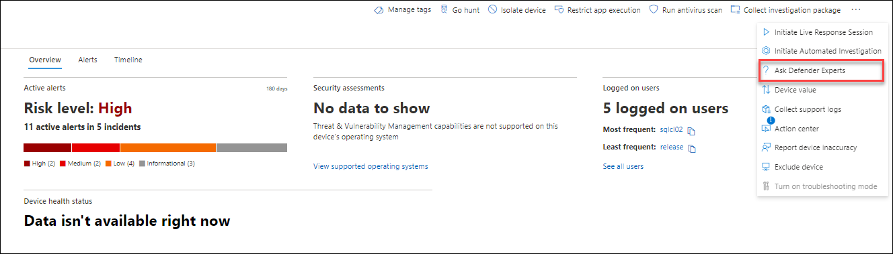
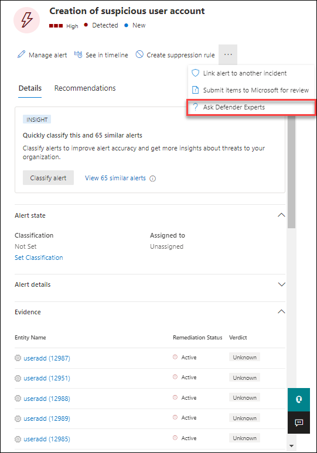
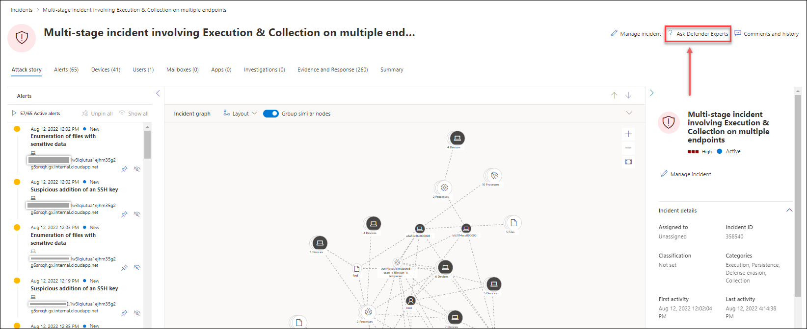

# Microsoft Defender Experts in Microsoft 365 overview

[!INCLUDE [Microsoft 365 Defender rebranding](../includes/microsoft-defender.md)]

**Applies to:**

- [Microsoft 365 Defender](https://go.microsoft.com/fwlink/?linkid=2118804)
- [Microsoft Defender for Endpoint](https://go.microsoft.com/fwlink/p/?linkid=2154037)

[!INCLUDE [Prerelease](../includes/prerelease.md)]

> [!NOTE]
> As of August 2022, the Experts on Demand option to **Consult a threat expert** has been rebranded to **Ask Defender Experts**.

Endpoint Attack Notifications (previously referred to as Microsoft Threat Experts - Targeted Attack Notification) is a managed threat hunting service. Once you apply and are accepted, you'll receive endpoint attack notifications from Microsoft threat experts, so you won't miss critical threats to your environment. These notifications will help you protect your organization's endpoints, email, and identities.

Microsoft Defender Experts – Experts on Demand lets you get expert advice about threats your organization is facing. You can reach out for help on threats your organization is facing. It's available as a subscription service.

## Apply for Endpoint Attack Notifications

> [!IMPORTANT]
> Before you apply, make sure to discuss the eligibility requirements for Endpoint Attack Notifications with your Microsoft Technical Service provider and account team.

If you already have Microsoft Defender for Endpoint and Microsoft 365 Defender, you can apply for Endpoint Attack Notifications through their Microsoft 365 Defender portal. Go to **Settings > Endpoints > General > Advanced features > Endpoint Attack Notifications**, and select **Apply**. See [Configure Microsoft Defender Experts capabilities](./configure-microsoft-threat-experts.md) for a full description.

Once your application is approved, you'll start receiving endpoint attack notifications whenever Defender Experts detect a threat to your environment.

## Subscribe to Microsoft Defender Experts - Experts on Demand

> [!NOTE]
> Experts on Demand is not a security incident response service. It’s intended to provide a better understanding of complex threats affecting your organization. Engage with your own security incident response team to address urgent security incident response issues. If you don't have your own security incident response team and would like Microsoft's help, create a support request in the [Premier Services Hub](/services-hub/).

Contact your Microsoft representative to subscribe to Experts on Demand.  See [Configure Microsoft Defender Experts capabilities](./configure-microsoft-threat-experts.md) for full details.

## Receive Endpoint Attack Notification

The Endpoint Attack Notification capability provides proactive hunting for the most important threats to your network. Our Defender Experts hunt for human adversary intrusions, hands-on-keyboard attacks, and advanced attacks, such as cyberespionage. These notifications will show up as a new alert. The managed hunting service includes:

- Threat monitoring and analysis, reducing dwell time and the risk to your business
- Hunter-trained artificial intelligence to discover and target both known attacks and emerging threats
- Identification of the most pertinent risks, helping SOCs maximize their effectiveness
- Help scoping compromises and providing as much context as can be quickly delivered to enable a swift SOC response.

## Collaborate with experts on demand

Select **Ask Defender Experts** directly inside the Microsoft 365 security portal.  Experts can provide insight to better understand the complex threats your organization might face.  Ask Defender Experts to:

- Gather additional information on alerts and incidents, including root causes and scope
- Gain clarity into suspicious devices, alerts, or incidents and get next steps if faced with an advanced attacker
- Determine risks and available protections related to threat actors, campaigns, or emerging attacker techniques

> [!NOTE]
> As of August 2022, the Experts on Demand option to **Consult a threat expert** has been rebranded to **Ask Defender Experts**.

The option to **Ask Defender Experts** is available in several places throughout the portal:

- ***Device page actions menu***

- ***Alerts page actions menu***

- ***File page actions menu***

> [!NOTE]
> If you have Premier Support subscription mapped to your Microsoft Defender for Office 365 license, you can track the status of your Experts on Demand cases through Microsoft Services Hub.

Watch this video for a quick overview of the Microsoft Services Hub.

> [!VIDEO https://www.microsoft.com/videoplayer/embed/RE4pk9f]

## See also

- [Configure Microsoft Defender Experts capabilities](./configure-microsoft-threat-experts.md)
