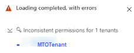

# Manage tenants

**Applies to:**

- [Microsoft Defender XDR](https://go.microsoft.com/fwlink/?linkid=2118804)

## View the tenants page

To view the list of tenants that appear in multitenant management, go to [Settings page](https://mto.security.microsoft.com/mtosettings) in multitenant management in Microsoft Defender XDR:

   :::image type="content" source="../../media/defender/mto-tenant-settings.png" alt-text="Screenshot of multitenant management in Microsoft Defender XDR" lightbox="../../media/defender/mto-tenant-settings.png":::

From the **Settings** page you can:

- **Add a tenant**: Select **Add tenants** > Choose the tenants to want to add > Select **Add tenant**.
- Select a tenant from the list to open the [Microsoft Defender portal](https://security.microsoft.com) for that tenant.
- **Remove a tenant**: Select the tenant you'd like to remove > select **Remove**.

## Multitenant management status indicator

The multitenant management status indicator provides information on whether data issues exist for the page you're viewing, such as data loading issues or permissions issues. The indicator appears in the bottom right corner of the page:

When no issue exists, the status indicator is a green tick:

- 

When an issue exists, the status indicator shows a red warning sign:

- 

Hovering over the red warning sign displays the issues that occurred and the tenant information. By expanding each section, you see all the tenants with this issue.

- 
