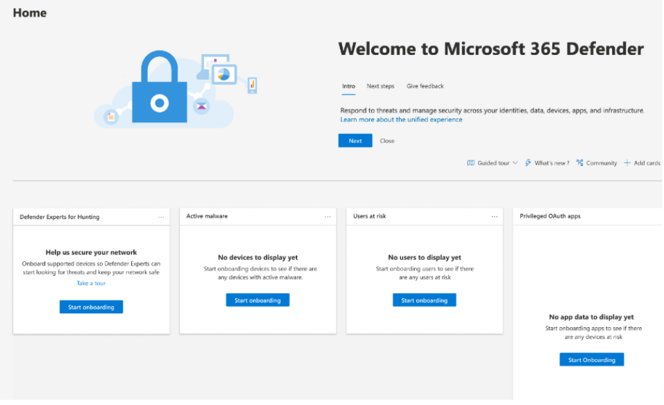
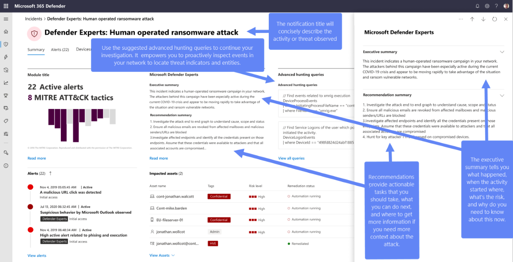
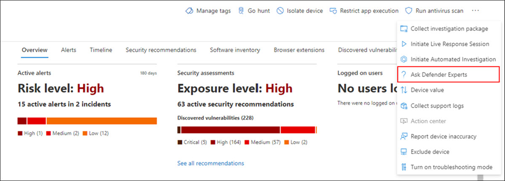
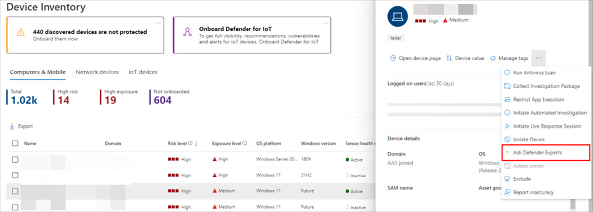
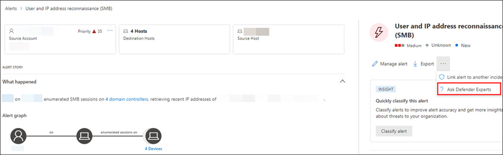
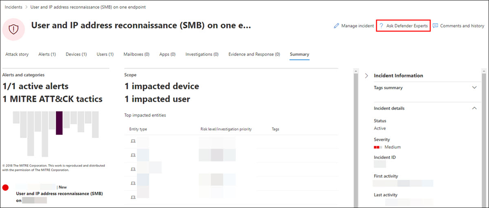

# Start using Microsoft Defender Experts for Hunting

[!INCLUDE [Microsoft 365 Defender rebranding](../../includes/microsoft-defender.md)]

**Applies to:**

- [Microsoft 365 Defender](https://go.microsoft.com/fwlink/?linkid=2118804)

## Onboarding

If you're new to Microsoft 365 Defender and Defender Experts for Hunting:

1. Upon getting your welcome email, select **Log into Microsoft 365 Defender**.
2. Sign in if you already have a Microsoft account. If none, create one.
3. The Microsoft 365 Defender quick tour will get you familiar with the security suite, where the capabilities are and how important they are. Select **Take a quick tour**.
4. Read the short descriptions about what the Microsoft Defender Experts service is and the capabilities it provides. Select **Next**. You'll see the welcome page:

## Receive Defender Experts Notifications

The Defender Experts Notifications service includes:

- Threat monitoring and analysis, reducing dwell time and the risk to your business
- Hunter-trained artificial intelligence to discover and target both known attacks and emerging threats
- Identification of the most pertinent risks, helping SOCs maximize their effectiveness
- Help in scoping compromises and as much context as can be quickly delivered to enable a swift SOC response

Refer to the following screenshot to see a sample Defender Experts Notification:

### Where you'll find Defender Experts Notifications

You can receive Defender Experts Notifications from Defender Experts through the following mediums:

- The Microsoft 365 Defender portal's [Incidents](https://security.microsoft.com/incidents) page
- The Microsoft 365 Defender portal's [Alerts](https://security.microsoft.com/alerts) page
- OData alerting [API](../../security/defender-endpoint/get-alerts.md) and [REST API](../defender-endpoint/configure-siem.md)
- [DeviceAlertEvents](../../security/defender-endpoint/advanced-hunting-devicealertevents-table.md) table in Advanced hunting
- Your email if you [configure an email notifications rule](/microsoft-365/security/defender/onboarding-defender-experts-for-hunting#set-up-defender-experts-email-notifications)

### Filter to view just the Defender Experts Notifications

You can filter your incidents and alerts if you want to only see the Defender Experts Notifications amongst the many alerts. To do so:

1. On the navigation menu, go to **Incidents & alerts** > **Incidents** > select the  icon.
2. Scroll down to the **Tags** field > select the **Defender Experts** check box.
3. Select **Apply**.

### Set up Defender Experts email notifications

You can set up Microsoft 365 Defender to notify you or your staff with an email about new incidents or updates to existing incidents, including those observed by Microsoft Defender Experts. [Learn more about getting incident notifications by email](/microsoft-365/security/defender/incidents-overview#get-incident-notifications-by-email)

1. In the Microsoft 365 Defender navigation pane, select **Settings** > **Microsoft 365 Defender** > **Email notifications** > **Incidents**.
2. Update your existing email notification rules or create a new one. [Learn more about creating a rule for email notifications](/microsoft-365/security/defender/incidents-overview#create-a-rule-for-email-notifications)
3. On the rule's **Notification settings** page, make sure to configure the following:
    - **Source** – Choose **Microsoft Defender Experts** under **Microsoft 365 Defender** and **Microsoft Defender for Endpoint**
    - **Alert severity** – Choose the alert severities that will trigger an incident notification. For example, if you only want to be informed about high-severity incidents, select High.

## Collaborate with Experts on Demand

> [!NOTE]
> Experts on Demand is included in your Defender Experts for Hunting subscription with [monthly allocations](/microsoft-365/security/defender/before-you-begin-defender-experts#eligibility-and-licensing). However, it's not a security incident response service. It's intended to provide a better understanding of complex threats affecting your organization. Engage with your own security incident response team to address urgent security incident response issues. If you don't have your own security incident response team and would like Microsoft's help, create a support request in the [Premier Services Hub](/services-hub/).

Select **Ask Defender Experts** directly inside the Microsoft 365 security portal to get swift and accurate responses to all your threat hunting questions. Experts can provide insight to better understand the complex threats your organization may face. Experts on Demand can help to:

- Gather additional information on alerts and incidents, including root causes and scope
- Gain clarity into suspicious devices, alerts, or incidents and take next steps if faced with an advanced attacker
- Determine risks and available protections related to threat actors, campaigns, or emerging attacker techniques

The option to **Ask Defender Experts** is available in several places throughout the portal:

- ***Device page actions menu***

- ***Device inventory page flyout menu***

- ***Alerts page flyout menu***

- ***Incidents page actions menu***

> [!NOTE]
> If you'd like to track the status of your Experts on Demand cases through Microsoft Services Hub, reach out to your Customer Success Account Manager. Watch this [video](https://www.microsoft.com/videoplayer/embed/RE4pk9f) for a quick overview of the Microsoft Services Hub.

### Sample questions you can ask from Defender Experts

**Alert information**

- We saw a new type of alert for a living-off-the-land binary. We can provide the alert ID. Can you tell us more about this alert and if it's related to any incident and how we can investigate it further?
- We've observed two similar attacks, which both try to execute malicious PowerShell scripts but generate different alerts. One is "Suspicious PowerShell command line" and the other is "A malicious file was detected based on indication provided by Office 365." What is the difference?
- We received an odd alert today about an abnormal number of failed logins from a high profile user's device. We can't find any further evidence for these attempts. How can Microsoft 365 Defender see these attempts? What type of logins are being monitored?
- Can you give more context or insight about the alert and any related incidents, "Suspicious behavior by a system utility was observed"?
- I observed an alert titled "Creation of forwarding/redirect rule". I believe the activity is benign. Can you tell me why I received an alert?

**Possible device compromise**

- Can you help explain why we see a message or alert for "Unknown process observed" on many devices in our organization? We appreciate any input to clarify whether this message or alert is related to malicious activity or incidents.
- Can you help validate a possible compromise on the following system, dating from last week? It's behaving similarly as a previous malware detection on the same system six months ago.

**Threat intelligence details**

- We detected a phishing email that delivered a malicious Word document to a user. The document caused a series of suspicious events, which triggered multiple alerts for a particular malware family. Do you have any information on this malware? If yes, can you send us a link?
- We recently saw a blog post about a threat that is targeting our industry. Can you help us understand what protection Microsoft 365 Defender provides against this threat actor?
- We recently observed a phishing campaign conducted against our organization. Can you tell us if this was targeted specifically to our company or vertical?

**Microsoft Defender Experts for Hunting alert communications**

- Can your incident response team help us address the Defender Experts Notification that we got?
- We received this Defender Experts Notification from Microsoft Defender Experts for Hunting. We don't have our own incident response team. What can we do now, and how can we contain the incident?
- We received a Defender Experts Notification from Microsoft Defender Experts for Hunting. What data can you provide to us that we can pass on to our incident response team?

### Next step

- [Understand the Defender Experts for Hunting report in Microsoft 365 Defender](defender-experts-report.md)
[!INCLUDE [Microsoft 365 Defender rebranding](../../includes/defender-m3d-techcommunity.md)]
