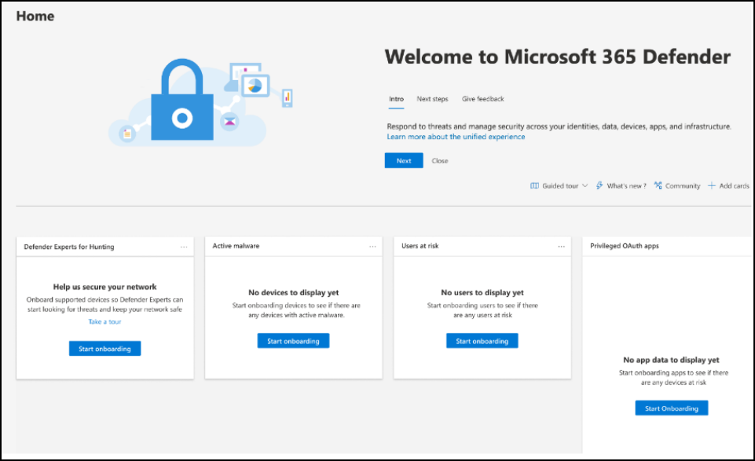
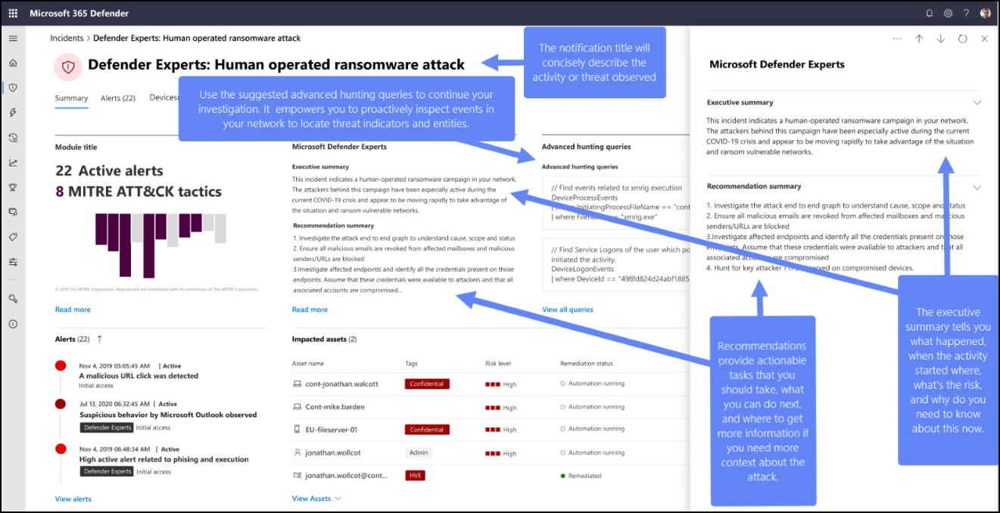

# Start using Microsoft Defender Experts for Hunting

[!INCLUDE [Microsoft Defender XDR rebranding](../../includes/microsoft-defender.md)]

**Applies to:**

- [Microsoft Defender XDR](https://go.microsoft.com/fwlink/?linkid=2118804)

## Onboarding

If you're new to Microsoft Defender XDR and Defender Experts for Hunting:

1. Upon getting your welcome email, select **Log into Microsoft Defender XDR**.
2. Sign in if you already have a Microsoft account. If none, create one.
3. The Microsoft Defender XDR quick tour gets you familiar with the security suite, where the capabilities are and how important they are. Select **Take a quick tour**.
4. Read the short descriptions about what the Microsoft Defender Experts service is and the capabilities it provides. Select **Next**. You see the welcome page:

## Receive Defender Experts Notifications

The Defender Experts Notifications service includes:

- Threat monitoring and analysis, reducing dwell time and the risk to your business
- Hunter-trained artificial intelligence to discover and target both known attacks and emerging threats
- Identification of the most pertinent risks, helping SOCs maximize their effectiveness
- Help in scoping compromises and as much context as can be quickly delivered to enable a swift SOC response

Refer to the following screenshot to see a sample Defender Experts Notification:

### Where to find Defender Experts Notifications

You can receive Defender Experts Notifications from Defender Experts through the following mediums:

- The Microsoft Defender portal's [Incidents](https://security.microsoft.com/incidents) page
- The Microsoft Defender portal's [Alerts](https://security.microsoft.com/alerts) page
- OData alerting [API](../../security/defender-endpoint/get-alerts.md) and [REST API](../defender-endpoint/configure-siem.md)
- [DeviceAlertEvents](../../security/defender-endpoint/advanced-hunting-devicealertevents-table.md) table in Advanced hunting
- Your email if you [configure an email notifications rule](/microsoft-365/security/defender/onboarding-defender-experts-for-hunting#set-up-defender-experts-email-notifications)

### Filter to view just the Defender Experts Notifications

You can filter your incidents and alerts if you want to only see the Defender Experts Notifications among the many alerts. To do so:

1. On the navigation menu, go to **Incidents & alerts** > **Incidents** > select the  icon.
2. Scroll down to **Service/detection sources** then select the **Microsoft Defender Experts** checkboxes under *Microsoft Defender for Endpoint* and *Microsoft Defender XDR*.
3. Select **Apply**.

### Set up Defender Experts email notifications

You can set up Microsoft Defender XDR to notify you or your staff with an email about new incidents or updates to existing incidents, including those observed by Microsoft Defender Experts. [Learn more about getting incident notifications by email](/microsoft-365/security/defender/incidents-overview#get-incident-notifications-by-email)

1. In the Microsoft Defender XDR navigation pane, select **Settings** > **Microsoft Defender XDR** > **Email notifications** > **Incidents**.
2. Update your existing email notification rules or create a new one. [Learn more about creating a rule for email notifications](/microsoft-365/security/defender/incidents-overview#create-a-rule-for-email-notifications)
3. On the rule's **Notification settings** page, make sure to configure the following:
    - **Source** – Choose **Microsoft Defender Experts** under **Microsoft Defender XDR** and **Microsoft Defender for Endpoint**
    - **Alert severity** – Choose the alert severities that will trigger an incident notification. For example, if you only want to be informed about high-severity incidents, select High.

### Generate sample Defender Experts Notifications

You can generate a sample Defender Experts Notification to start experiencing the Defender Experts for Hunting service without having to wait for an actual critical activity to happen in your environment. Generating a sample notification also lets you test the [email notifications](#set-up-defender-experts-email-notifications) you might have previously configured in the Microsoft Defender portal for this service, as well as test the configuration of playbooks (if configured for such notifications) and rules in your Security Information and Event Management (SIEM) environment.

A sample Defender Experts Notification shows up in your **Incidents** page with the title _Defender Experts: Test Notification from Microsoft Defender Experts_. The [contents](#receive-defender-experts-notifications) of the notification are placeholder texts, while the other elements such as alerts are randomly generated from events present in your tenant and aren't actually impacted.

:::image type="content" source="../../media/mte/defenderexperts/sample-den-dexh.png" alt-text="Screenshot of Sample DEN in Defender Experts for Hunting." lightbox="../../media/mte/defenderexperts/sample-den-dexh.png":::

**To generate a sample notification:**

1. In your Microsoft Defender XDR navigation pane, go to **Settings** > **Defender Experts** and then select **Sample notifications**.
2. Select **Generate a sample notification**. A green status message appears, confirming that your sample notification is ready for review.
3. Under **Recently generated Defender Experts Notification**, select a link from the list to view its corresponding generated sample notification. The most recent sample appears on the top of the list. Selecting a link redirects you to the **Incidents** page.

:::image type="content" source="../../media/mte/defenderexperts/sample-den-links-dexh.png" alt-text="Screenshot of Sample DEN links." lightbox="../../media/mte/defenderexperts/sample-den-links-dexh.png":::

