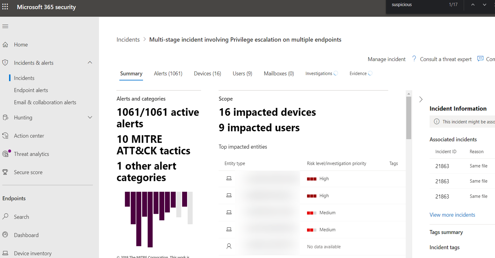
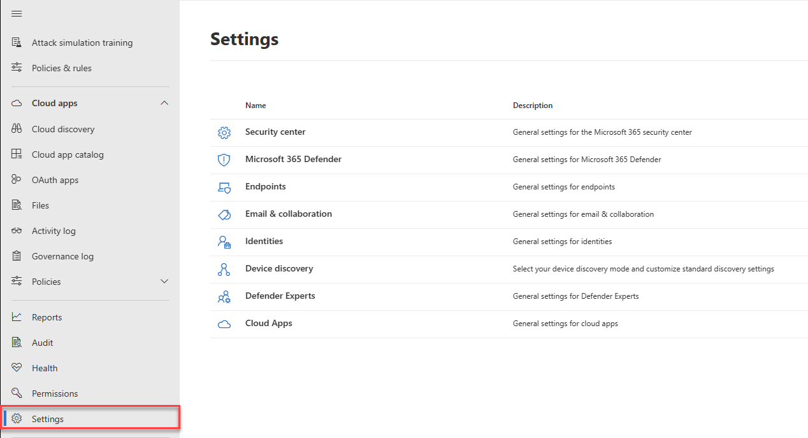
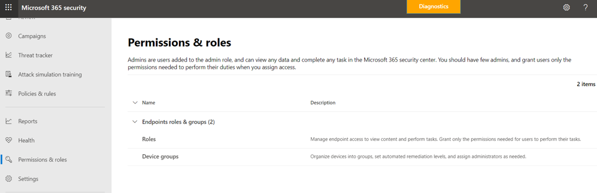

# The unified Microsoft 365 security center overview

[!INCLUDE [Microsoft 365 Defender rebranding](../includes/microsoft-defender.md)]

[!INCLUDE [Prerelease](../includes/prerelease.md)]

**Applies to:**

- [Microsoft 365 Defender](https://go.microsoft.com/fwlink/?linkid=2118804)
- [Microsoft Defender for Endpoint](https://go.microsoft.com/fwlink/p/?linkid=2146631)
- [Microsoft Defender for Office 365](https://go.microsoft.com/fwlink/?linkid=2148715)

> Want to experience Microsoft 365 Defender? You can [evaluate it in a lab environment](https://aka.ms/mtp-trial-lab) or [run your pilot project in production](https://aka.ms/m365d-pilotplaybook).

The improved **Microsoft 365 security center** ([https://security.microsoft.com](https://security.microsoft.com)) combines protection, detection, investigation, and response to *email*, *collaboration*, *identity*, and *device* threats, in a central portal.

Microsoft 365 security center brings together functionality from existing Microsoft security portals, like Microsoft Defender Security Center and the Office 365 Security & Compliance center. The security center emphasizes quick access to information, simpler layouts, and bringing related information together for easier use. This center includes:

- **[Microsoft Defender for Office 365](https://docs.microsoft.com/microsoft-365/security/defender-365-security/office-365-atp)** Microsoft Defender for Office 365 helps organizations secure their enterprise with a set of prevention, detection, investigation and hunting features to protect email, and Office 365 resources.
- **[Microsoft Defender for Endpoint](https://docs.microsoft.com/windows/security/threat-protection/microsoft-defender-atp/microsoft-defender-advanced-threat-protection)** delivers preventative protection, post-breach detection, automated investigation, and response for devices in your organization.
- **[Microsoft 365 Defender](microsoft-threat-protection.md)**
is part of Microsoft’s *Extended Detection and Response* (XDR) solution that leverages the Microsoft 365 security portfolio to automatically analyze threat data across domains, and build a picture of an attack on a single dashboard.

If you need information about what's changed from the Office 365 Security & Compliance center or the Microsoft Defender Security Center, see:

- [Defender for Office 365 in the Microsoft 365 security center](microsoft-365-security-center-mdo.md)
- [Defender for Endpoint in the Microsoft 365 security center](microsoft-365-security-center-mde.md)

## What to expect

All the security content that you use in the Office 365 Security and Compliance Center (protection.office.com) and the Microsoft Defender security center (securitycenter.microsoft.com) can now be found in the *Microsoft 365 security center*.

Microsoft 365 security center helps security teams investigate and respond to attacks by brining in signals from different workloads into a single, unified experiences:

- Incidents & alerts
- Hunting
- Action Center
- Threat analytics

The Microsoft 365 security center emphasizes *unity, clarity, and common goals* as it merges Microsoft Defender for Office 365 and Microsoft Defender for Endpoint. The merge was based on the priorities listed below, and made without sacrificing the capabilities that each security suite brought to the combination:

- common building blocks
- common terminology
- common entities
- feature parity with other workloads

## Unified investigations

Streamlining security centers creates a single pane for investigating any incidents across a Microsoft 365 organization. A primary example is the **Incidents** node on the quick launch of the Microsoft 365 security center.

:::image type="content" source="../../media/converged-incidents-2.png.png" alt-text="The Incidents page in MDO.":::

As an example, double-clicking on an incident name with **High** severity brings you to a page that demonstrates the advantage of converging centers.

> [!TIP]
> The converged **Users** tab is a good place to begin your inquiries. This single page surfaces information for users from converged workloads (Microsoft Defender for Endpoint, Microsoft Defender for Identity, and MCAS, if you leverage it) and a range of sources such as on-premises Active Directory, Azure Active Directory, synced, local, and third-party users. Learn more about [the new Users experience](investigate-users.md).

Incident information shows user/identity specifics and at-risk devices, beside affected mailboxes. It also relates any **Investigation information** and gathered **Evidence**. This makes it easier for admins and security operation teams to pivot from one high-risk alert to the affected users and mailboxes. Looking at the **Incident** tabs at the top of this page, there are other key security pivots available from this single location.

> [!IMPORTANT]
> Along the top of any page for a specific Incident, you'll see the **Summary**, **Alerts**, **Devices**, **Users**, **Mailboxes**, **Investigations**, and **Evidence** tabs.

Selecting **Investigations** opens  a page that features a graphic of the analysis taking place and lists a status (such as **pending approval**) for remediation. Take time to select specific incidents in your environment, drill down into these tabs, and practice building a profile for different kinds of threats. Familiarity will benefit any later pressing investigations.

## Improved processes

Common controls and content either appear in the same place, or are condensed into one feed of data making it easier to find. For example, unified settings.

### Unified settings

### Permissions & roles

 Access the Microsoft 365 security center is configured with Azure Active Directory global roles or by using custom roles. For Defender for Endpoint, see [Assign user access to Microsoft Defender Security Center](https://docs.microsoft.com/windows/security/threat-protection/microsoft-defender-atp/assign-portal-access). For Defender for Office 365, see [Permissions in the Microsoft 365 compliance center and Microsoft 365 security center](../defender-365-security/permissions-microsoft-365-compliance-security.md).

- Learn more about how to [manage access to Microsoft 365 Defender](mtp-permissions.md)
- Learn more about how to [create custom roles](custom-roles.md) in Microsoft 365 security center

### Integrated reports

Reports are also unified in the Microsoft 365 security center. Admins can start with a general security report, and branch into specific reports about endpoints, email & collaboration. The links here are dynamically generated based upon workload configuration.

### Quickly view your Microsoft 365 environment

The **Home** page shows many of the common cards that security teams need. The composition of cards and data is dependent on the user role. Because the Microsoft 365 security center uses role-based access control, different roles will see cards that are more meaningful to their day to day jobs.  

This at-a-glance information helps you keep up with the latest activities in your organization. The Microsoft 365 security center brings together signals from different sources to present a holistic view of your Microsoft 365 environment.

The cards fall into these categories:

- **Identities**- Monitor the identities in your organization and keep track of suspicious or risky behaviors. [Learn more about identity protection](https://docs.microsoft.com/azure/active-directory/identity-protection/overview-identity-protection).
- **Data** - Help track user activity that could lead to unauthorized data disclosure.
- **Devices** - Get up-to-date information on alerts, breach activity, and other threats on your devices.
- **Apps** - Gain insight into how cloud apps are being used in your organization. [Learn more about Cloud App Security discovered apps](https://docs.microsoft.com/cloud-app-security/discovered-apps).

## Threat analytics with better data coverage
Track and respond to emerging threats with the following Microsoft 365 Defender threat analytics integrated experience:

- Better data coverage between Microsoft Defender for Endpoint and Microsoft Defender for Office 365, making combined incident management, automatic investigation, remediation, and proactive or reactive threat hunting across-domain possible. 
- Email-related detections and mitigations from Microsoft Defender for Office 365, in addition to the endpoint data already available from Microsoft Defender for Endpoint.
- A view of threat-related incidents which aggregate alerts into end-to-end attack stories across Microsoft Defender for Endpoint and Microsoft Defender for Office 365 to reduce the work queue, as well as simplify and speed up your investigation.
- Attack attempts detected and blocked by Microsoft 365 Defender solutions. There's also data that you can use to drive preventive actions that mitigate the risk of further exposure and increase resilience. 
- Enhanced design that puts actionable information in the spotlight to help you  quickly identify data to urgently focus on, investigate, and leverage from the reports.

## A centralized Learning Hub

The Microsoft 365 security center includes a learning hub that bubbles up official guidance from resources such as the Microsoft security blog, the Microsoft security community on YouTube, and the official documentation at docs.microsoft.com.

Inside the learning hub, Email & Collaboration (Microsoft Defender for Office 365 or MDO) guidance is side-by-side with Endpoint (Microsoft Defender for Endpoint or MDE), and Microsoft 365 Defender learning resources.

The learning hub opens with Learning paths organized around topics such as “How to Investigate Using Microsoft 365 Defender?” and “Microsoft Defender for Office 365 Best Practices”. This section is currently curated by the security Product Group inside Microsoft. Each Learning path reflects a projected time it takes to get through the concepts. For example 'Steps to take when a Microsoft Defender for Office 365 user account is compromised' is projected to take 8 minutes, and is valuable learning on the fly.

After clicking through to the content, it may be useful to bookmark this site and organize bookmarks into a 'Security' or 'Critical' folder. To see all Learning paths, click the Show all link in the main panel.

> [!NOTE]
> There are helpful **filters** along the top of the Microsoft 365 security center learning hub that will let you choose between products (currently Microsoft 365 Defender, Microsoft Defender for Endpoint, and Microsoft Defender for Office 365). Notice that the number of learning resources for each section is listed, which can help learners keep track of how many resources they have at hand for training and learning.
>
> Along with the Product filter, current topics, types of resources (from videos to webinars), levels of familiarity or experience with security areas, security roles, and product features are listed.

## Send us your feedback

We need your feedback. We're always looking to improve, so if there's something you'd like to see, [send us your Microsoft 365 Defender feedback](https://www.microsoft.com/videoplayer/embed/RE4K5Ci).

You can also leave feedback from this article. In the 'Feedback' section at the end under 'Submit and view feedback for', the options are *This product*, or *This page*.

Use the **This product** button for *product* feedback:

1. Select *This product* at the bottom of the article.
    1. Right-click the button and 'Open in a new tab' if you want to keep reading these directions.
2. This will navigate to the **UserVoice forum**.
3. You have 2 options:
    1. Scroll down to the text box *How can we improve compliance or protect your users better in Office 365?* and paste in *Microsoft 365 security center*. You can search the results for an idea like yours and up-vote it, or use the button for **Post a new idea**.
    1. If you feel certain this issue is already reported, and want to raise its profile with a vote (or votes), use the *Give Feedback* box on the right side of UserVoice. Search for *Microsoft 365 security center*, **find the issue, and use the vote button** to raise its status.

Use *This page* for feedback on the article itself. Thanks for your feedback. Your voice helps us improve products.

### Explore what the security center has to offer

Keep exploring the features and capabilities in the Microsoft 365 security center:

- [Manage incidents and alerts](manage-incidents.md)
- [Track and respond to emerging threats with threat analytics](threat-analytics.md)
- [The Action center](https://docs.microsoft.com/microsoft-365/security/defender/mtp-action-center)
- [Hunt for threats across devices, emails, apps, and identities](https://docs.microsoft.com/microsoft-365/security/defender/advanced-hunting-query-emails-devices)
- [Custom detection rules](https://docs.microsoft.com/microsoft-365/security/defender/custom-detection-rules)
- [Email & collaboration alerts](https://docs.microsoft.com/microsoft-365/compliance/alert-policies#default-alert-policies)
- [Create a phishing attack simulation](https://docs.microsoft.com/microsoft-365/security/defender-365-security/attack-simulation-training) and [create a payload for training your teams](https://docs.microsoft.com/microsoft-365/security/defender-365-security/attack-simulation-training-payloads)
 
### Related information
- [Microsoft 365 security center](overview-security-center.md)
- [Microsoft Defender for Office 365 in the Microsoft 365 security center](microsoft-365-security-center-mdo.md)
- [Microsoft Defender for Endpoint in the Microsoft 365 security center](microsoft-365-security-center-mde.md)
- [Redirecting accounts from Microsoft Defender for Endpoint to the Microsoft 365 security center](microsoft-365-security-mde-redirection.md)
