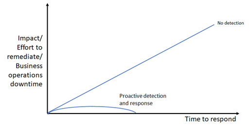

# Detecting human-operated ransomware attacks with Microsoft 365 Defender

[!INCLUDE [Microsoft 365 Defender rebranding](../includes/microsoft-defender-for-office.md)]

Ransomware is a type of extortion attack that destroys or encrypts files and folders, preventing access to critical data or disrupting critical business systems. There are two types of ransomware:

- Commodity ransomware is malware that spreads with phishing or between devices and encrypts files before demanding a ransom.
- Human-operated ransomware is a planned and coordinated attack by active cybercriminals who employ multiple attack methods. In many cases, known techniques and tools are used to infiltrate your organization, find the assets or systems worth extorting, and then demand a ransom. Upon compromising a network, the attacker carries out reconnaissance of assets and systems which can be encrypted or extorted. The attackers then encrypt or exfiltrate data before demanding a ransom.

This article describes proactive detection of new or ongoing human-operated ransomware attacks with the Microsoft 365 Defender portal, an extended detection and response (XDR) solution for the following security services:

- Microsoft Defender for Endpoint
- Microsoft Defender for Office 365
- Microsoft Defender for Identity
- Microsoft Defender for Cloud Apps (including the app governance add-on)
- Microsoft Azure AD Identity Protection
- Microsoft Defender for IoT
- Microsoft 365 Business Premium
- Microsoft Defender for Business

For information about preventing ransomware attacks, see [Rapidly protect against ransomware and extortion](/security/compass/protect-against-ransomware-phase3).

## The importance of proactive detection

Because human-operated ransomware is typically performed by active attackers who might be performing the steps to infiltrate and discover your most valuable data and systems in real time, the time taken to detect ransomware attacks is crucial.

If pre-ransom activities are detected quickly, the likelihood of a severe attack decreases. The pre-ransom stage typically includes the following techniques: initial access, reconnaissance, credential theft, lateral movement, and persistence. These techniques can initially seem unrelated and often fly under the radar. If these techniques lead to the ransom stage, it's often too late. Microsoft 365 Defender can help identify those small and seemingly unrelated incidents as possibly part of a larger ransomware campaign.

- When detected during the pre-ransom stage, smaller-scale mitigations such as isolating infected devices or user accounts can be used to disrupt and remediate the attack.
- If detection comes at a later stage, such as when the malware used to encrypt files is being deployed, more aggressive remediation steps that can cause downtime might need to be used to disrupt and remediate the attack.

Business operation disruptions are likely when responding to a ransomware attack. The end stage of a ransomware attack is often a choice between downtime caused by attackers with major risks, or a controlled downtime to ensure network safety and give you time to fully investigate. We never recommend paying a ransom. Paying cybercriminals to get a ransomware decryption key provides no guarantee that your encrypted data will be restored. See, [Ransomware response - Microsoft Security Blog](https://www.microsoft.com/security/blog/2019/12/16/ransomware-response-to-pay-or-not-to-pay/).

Here's the qualitative relationship of the impact of a ransomware attack and your time to respond for no detection vs. proactive detection and response.

### Proactive detection via common malware tools and techniques

In many cases, human-operated ransomware attackers use well-known and field-tested malware tactics, techniques, tools, and procedures including phishing, business email compromise (BEC), and credential theft. Your security analysts must become aware of and familiar with how attackers use common malware and cyberattack methods to gain a foothold in your organization.

To see examples of how ransomware attacks get started with common malware, see these resources:

- [Human-operated ransomware attacks: A preventable disaster](https://www.microsoft.com/security/blog/2020/03/05/human-operated-ransomware-attacks-a-preventable-disaster/)
- [Ransomware threat analytics reports in the Microsoft 365 Defender portal](https://sip.security.microsoft.com/threatanalytics3?page_size=30&filters=tags%3DRansomware&ordering=-lastUpdatedOn&fields=displayName,alertsCount,impactedEntities,exposureLevel,MisconfiguredDevices,VulnerableDevices,reportType,createdOn,lastUpdatedOn,tags,flag)

Being familiar with pre-ransom malware, payloads, and activities helps your analysts know what to look for to prevent the later stages of an attack.

## Human-operated ransomware attack tactics

Because human-operated ransomware can use known attack techniques and tools, your analysts' understanding and experience with existing attack techniques and tools will be a valuable asset when preparing your SecOps team for focused ransomware detection practices.

### Attack tactics and methods

Here are some typical techniques and tools used by ransomware attackers for the following [MITRE ATT&CK](https://attack.mitre.org/tactics/enterprise/) tactics:

Initial access:

- RDP brute force
- Vulnerable internet-facing system
- Weak application settings
- Phishing email

Credential theft:

- Mimikatz
- LSA secrets
- Credential vault
- Credentials in plaintext
- Abuse of service accounts

Lateral movement:

- Cobalt Strike
- WMI
- Abuse of management tools
- PsExec

Persistence:

- New accounts
- GPO changes
- Shadow IT tools
- Schedule tasks
- Service registration

Defense evasion:

- Disabling security features
- Clearing log files
- Deleting attack artifact files
- Resetting timestamps on altered files

Exfiltration:

- Exfiltration of sensitive data
Impact (financial leverage):
- Encryption of data in place and in backups
- Deletion of data in place and backups, which might be combined with a preceding exfiltration
- Threat of public leakage of exfiltrated, sensitive data

### What to look for

The challenge for security analysts is recognizing when an alert is part of a larger attack chain with the goal of extorting your sensitive data or crucial systems. For example, a detected phishing attack might be:

- A one-off attack to surveil the email messages of someone in the finance department of an organization.
- The pre-ransom part of an attack chain to use compromised user account credentials to discover the resources available to the user account and to compromise other user accounts with higher levels of privilege and access.

This section provides common attack phases and methods and the signal sources that feed into the central Microsoft 365 Defender portal, which creates alerts and incidents composed of multiple related alerts for security analysis. In some cases, there are alternate security portals to view the attack data.

#### Initial attacks to gain entry

Attacker is attempting to compromise a user account, device, or app.

|Attack method|Signal source|Alternate security portals|
|---|---|---|
|RDP brute force|Defender for Endpoint|Defender for Cloud Apps|
|Vulnerable internet-facing system|Windows security features, Microsoft Defender for Servers|
|Weak application settings|Defender for Cloud Apps, Defender for Cloud Apps with the app governance add-on|Defender for Cloud Apps|
|Malicious app activity|Defender for Cloud Apps, Defender for Cloud Apps with the app governance add-on|Defender for Cloud Apps|
|Phishing email|Defender for Office 365|
|Password spray against Azure AD accounts|Azure AD Identity Protection via Defender for Cloud Apps|Defender for Cloud Apps|
|Password spray against on-premises accounts|Microsoft Defender for Identity|
|Device compromise|Defender for Endpoint|
|Credential theft|Microsoft Defender for Identity|
|Escalation of privilege|Microsoft Defender for Identity|

#### Recent spike in otherwise typical behavior

Attacker is attempting to probe for additional entities to compromise.

|Spike category|Signal source|Alternate security portals|
|---|---|---|
|Sign-ins: Numerous failed attempts, attempts to logon to multiple devices in a short period, multiple first-time logons, etc.|Azure AD Identity Protection via Defender for Cloud Apps, Microsoft Defender for Identity|Defender for Cloud Apps|
|Recently active user account, group, machine account, app|Azure AD Identity Protection via Defender for Cloud Apps (Azure AD), Defender for Identity (Active Directory Domain Services [AD DS])|Defender for Cloud Apps|
|Recent app activity such as data access|Apps with Defender for Cloud Apps with the app governance add-on|Defender for Cloud Apps|

#### New activity

Attacker is creating new entities to further their reach, install malware agents, or evade detection.

|Activity|Signal source|Alternate security portal|
|---|---|---|
|New apps that are installed|Defender for Cloud Apps with the app governance add-on|Defender for Cloud Apps|
|New user accounts|Azure Identity Protection|Defender for Cloud Apps|
|Role changes|Azure Identity Protection|Defender for Cloud Apps|

#### Suspicious behavior

Attacker is downloading sensitive information, encrypting files, or otherwise collecting or damaging organization assets.

|Behavior|Signal source|
|---|---|
|Malware spread to multiple devices|Defender for Endpoint|
|Resource scanning|Defender for Endpoint, Defender for Identity|
|Changes in mailbox forwarding rules|Defender for Office 365|
|Data exfiltration and encryption|Defender for Office 365|

-*Monitor for Adversary Disabling Security** – as this is often part of human-operated ransomware (HumOR) attack chain

- **Event Logs Clearing** – especially the Security Event log and PowerShell Operational logs
- **Disabling of security tools/controls** (associated with some groups)

## Detect ransomware attacks with the Microsoft 365 Defender portal

The Microsoft 365 Defender portal provides a centralized view for information on detections, impacted assets, automated actions taken, and related evidence  a combination of:

- An incident queue, which groups related alerts for an attack to provide the full attack scope, impacted assets, and automated remediation actions.
- An alerts queue, which lists all of the alerts being tracked by Microsoft 365 Defender.

### Incident and alert sources

Microsoft 365 Defender portal centralizes signals from:

- Microsoft Defender for Endpoint
- Microsoft Defender for Office 365
- Microsoft Defender for Identity
- Microsoft Defender for Cloud Apps (including the app governance add-on)
- Microsoft  Azure AD Identity Protection
- Microsoft Defender for IoT

This table lists some typical attacks and their corresponding signal source for Microsoft 365 Defender.

|Attacks and incidents|Signal source|
|---|---|
|Cloud identity: Password spray, numerous failed attempts, attempts to log on to multiple devices in a short period, multiple first-time logons, recently active user accounts|Azure AD Identity Protection|
|On-premises identity (AD DS) compromise|Defender for Identity|
|Phishing|Defender for Office 365|
|Malicious apps|Defender for Cloud Apps or Defender for Cloud Apps with app governance add-on|
|Endpoint (device) compromise|Defender for Endpoint|
|IoT-capable device compromise|Defender for IoT|

### Filtering ransomware-identified incidents

You can easily filter the incidents queue for incidents that have been categorized by Microsoft 365 Defender as ransomware.

1. From the Microsoft 365 Defender portal navigation pane, go to the incidents queue by selecting **Incidents and alerts > Incidents**.
2. Select **Filters**.
3. Under **Categories**, select **Ransomware**, select **Apply**, and then close the **Filters** pane.

Each filter setting for the incidents queue creates a URL that you can save and access later as a link. These URLs can be bookmarked or otherwise saved and used when needed at a single click. For example, you can create bookmarks for:

- Incidents containing the "ransomware" category. Here is the corresponding [link](https://security.microsoft.com/incidents?filters=AlertStatus%3DNew%257CInProgress,category%3Dransomware&page_size=30&fields=expand,name,tags,severity,investigationStates,category,impactedEntities,alertCount,serviceSource,detectionSource,firstEventTime,lastEventTime,sensitivity,status,incidentAssignment,classification,determination,rbacGroup).
- Incidents with a specified **Actor** name known to be performing ransomware attacks.
- Incidents with a specified **Associated threat** name known to be used in ransomware attacks.
- Incidents containing a custom tag that your SecOps team uses for incidents that are known to be part of a larger, coordinated ransomware attack.

### Filtering ransomware-identified threat analytics reports

Similar to filtering incidents in the incident queue, you can filter threat analytics reports for reports that include ransomware.

1. From the navigation pane, select **Threat analytics**.
2. Select **Filters**.
3. Under **Threat tags**, select **Ransomware**, select **Apply**, and then close the **Filters** pane.

You can also click this link.

From the **Detection details** section of many threat analytics reports, you can see a list of alert names created for the threat.

### Microsoft 365 Defender APIs

You can also use the Microsoft 365 Defender APIs to query the Microsoft 365 Defender incidents and alerts data in your tenant. A custom app can filter the data, filter it based on custom settings, and then provide a filtered list of links to alerts and incidents that you can easily select to go right to that alert or incident. See [List incidents API in Microsoft 365 Defender| Microsoft Docs](./api-list-incidents.md). You can also integrate your SIEM with Microsoft Defender, see [Integrate your SIEM tools with Microsoft 365 Defender](./configure-siem-defender.md).

### Microsoft 365 Defender Sentinel Integration

Microsoft Sentinel's Microsoft 365 Defender incident integration allows you to stream all Microsoft 365 Defender incidents into Microsoft Sentinel and keep them synchronized between both portals. Incidents include all associated alerts, entities, and relevant information. Once in Sentinel, incidents will remain bi-directionally synced with Microsoft 365 Defender, allowing you to take advantage of the benefits of both portals in your incident investigation. See, [Microsoft 365 Defender integration with Microsoft Sentinel](/azure/sentinel/microsoft-365-defender-sentinel-integration).

### Proactive scanning with advanced hunting

[Advanced hunting](./advanced-hunting-overview.md) is a query-based threat hunting tool that lets you explore and inspect events in your network to locate threat indicators and entities. This flexible and customizable analysis tool enables unconstrained hunting for both known and potential threats. Microsoft 365 Defender also supports using a custom query to create [custom detection rules](./custom-detections-overview.md), which create alerts based on a query can be and scheduled to run automatically.

For proactive scanning of ransomware activities, you should assemble a catalog of advanced hunting queries for commonly used ransomware attack methods for identities, endpoints, apps, and data. Here are some key sources for ready-to-use advanced hunting queries:

- The [Hunt for ransomware](./advanced-hunting-find-ransomware.md) article
- GitHub repository for advanced hunting queries:
  - [Ransomware-specific](https://github.com/microsoft/Microsoft-365-Defender-Hunting-Queries/tree/master/Ransomware) queries
  - [All categories](https://github.com/microsoft/Microsoft-365-Defender-Hunting-Queries/tree/master/Ransomware) of queries
- Threat analytics reports
  - Advanced hunting section of the [Ransomware: A pervasive and ongoing threat](https://security.microsoft.com/threatanalytics3/05658b6c-dc62-496d-ad3c-c6a795a33c27/analystreport) analyst report
  - Advanced hunting section of other analyst reports

### Automated hunting

Advanced hunting queries can also be used to create custom detection rules and actions based on known elements of a ransomware attack method (for example, the use of unusual PowerShell commands). Custom detection rules create alerts that can be seen and addressed by your security analysts.

To create a custom detection rule, select **Create custom detection** rule from the page of an advanced hunting query. Once created, you can specify:

- How often to run the custom detection rule
- The severity of the alert created by the rule
- The MITRE attack phase for the created alert
- Impacted entities
- Actions to take on impacted entities

## Prepare your SecOps Team for focused ransomware detection

Preparing your SecOps team for proactive ransomware detection requires:

- Pre-work for your SecOps team and organization
- Security analyst training, as needed
- Ongoing operational work to incorporate the latest attacks and detection experiences of your security analysts

### Pre-work for your SecOps team and organization

Consider these steps to get your SecOps team and organization ready for focused ransomware attack prevention:

1. Configure your IT and cloud infrastructure for ransomware prevention with the [Rapidly protect against ransomware and extortion](/security/compass/protect-against-ransomware-phase3) guidance. The phases and tasks in this guidance can be done in parallel with the following steps.
2. Get the appropriate licenses for the Defender for Endpoint, Defender for Office 365, Defender for Identity, Defender for Cloud Apps, the app governance add-on, Defender for IoT, and Azure AD Identity Protection services.
3. Assemble a catalog of advanced hunting queries tuned for known ransomware attack methods or attack phases.
4. Create the set of custom detection rules for specific advanced hunting queries that create alerts for known ransomware attack methods, including their schedule, alert naming, and automated actions.
5. Determine the set of [custom tags](./manage-incidents.md) or standards to create new one to identify incidents that are known to be part of a larger, coordinated ransomware attack
6. Determine the set of operational tasks for ransomware incident and alert management. For example:
   - Processes for Tier 1 analyst scanning of incoming incidents and alerts and assignment to Tier 2 analysts for investigation.
   - Manually running advanced hunting queries and their schedule (daily, weekly, monthly).
   - Ongoing changes based on ransomware attack investigation and mitigation experiences.

### Security analyst training

As needed, you can provide your security analysts with internal training for:

- Common ransomware attack chains (MITRE attack tactics and common threat techniques and malware)
- Incidents and alerts and how to locate and analyze them in the Microsoft 365 Defender portal using:
  - Alerts and incidents already created by Microsoft 365 Defender
  - Pre-scanned URL-based filters for the Microsoft 365 Defender portal
  - Programmatically via the incidents API
- Advanced hunting queries to use and their manual schedule (daily, weekly, monthly)
- Custom detection rules to use and their settings
- Custom incident tags
- The latest [threat analytics reports for ransomware](https://security.microsoft.com/threatanalytics3?page_size=30&filters=tags%3DRansomware&ordering=-lastUpdatedOn&fields=displayName,alertsCount,impactedEntities,reportType,createdOn,lastUpdatedOn,tags,flag) attacks in the Microsoft 365 Defender portal

### Ongoing work based on operational learning and new threats

As part of your SecOps team's ongoing tool and process best practices and security analysts' experiences, you should:

- Update your catalog of advanced hunting queries with:
  - New queries based on the latest threat analytics reports in the Microsoft 365 Defender portal or the [Advanced Hunting GitHub repository](<https://github.com/microsoft/Microsoft-365-Defender-Hunting-Queries/tree/master/Ransomware>).
  - Changes to existing ones to optimize for threat identification or for better alert quality.
- Update custom detection rules based on new or changed advanced hunting queries.
- Update the set of operational tasks for ransomware detection.

[!INCLUDE [Microsoft 365 Defender rebranding](../../includes/defender-m3d-techcommunity.md)]
