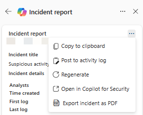

# Create an incident report with Microsoft Copilot in Microsoft Defender

[!INCLUDE [Microsoft Defender XDR rebranding](../includes/microsoft-defender.md)]

**Applies to:**

- Microsoft Defender XDR
- Microsoft Defender unified security operations center (SOC) platform

[Microsoft Copilot for Security](/security-copilot/microsoft-security-copilot) in the Microsoft Defender portal assists security operations teams with writing incident reports efficiently. Utilizing Copilot for Security's AI-powered data processing, security teams can immediately create incident reports with a click of a button in the Microsoft Defender portal.

A comprehensive and clear incident report is an essential reference for security teams and security operations management. However, writing a comprehensive report with the important details present can be a time-consuming task for security operations teams. Collecting, organizing, and summarizing incident information from multiple sources requires focus and detailed analysis to create an information-rich report. With Copilot in Defender, security teams can now instantly create an extensive incident report within the portal.

While an [incident summary](security-copilot-m365d-incident-summary.md) provides an overview of an incident and how it happened, an incident report consolidates incident information from various data sources available in Microsoft Sentinel and Defender XDR. The Copilot-generated incident report also includes all analyst-driven steps and automated actions, the analysts involved in incident response, and the comments from the analysts. Whether security teams are using Microsoft Sentinel, Defender XDR, or both, all relevant incident data are added into the generated incident report. 

Copilot generates the incident report based on the automatic and manual actions implemented, and the analysts' comments and notes posted in the incident. You can review and follow [recommendations](security-copilot-m365d-create-incident-report.md#recommendations-for-incident-report-creation) to ensure that Copilot creates a comprehensive incident report.

The incident report generation capability in Microsoft Defender is available through the [Copilot for Security license](/security-copilot/faq-security-copilot). This capability is also available in the Copilot for Security standalone portal through the Microsoft Defender XDR plugin.

This guide lists the data in incident reports and contains steps on how to access the incident report creation capability within the Microsoft Defender portal. It also includes information on how to provide feedback about the generated report.

## Incident report content

Copilot in Defender creates an incident report containing the following information:

- The main incident management actions' timestamps, including:
  - Incident creation and closure
  - First and last logs, whether the log was analyst-driven or automated, captured in the incident
- The analysts involved in incident response
- [Incident classification](manage-incidents.md#specify-the-classification), including the analyst's reason for classification that Copilot summarizes
- Investigation and remediation actions
- Follow up actions like recommendations, open issues, or next steps noted by the analysts in the incident logs

Actions like device isolation, disabling a user, and soft delete of emails are included in the incident report. For a full list of actions included in the incident report, see the [Action center](m365d-action-center.md). The incident report also includes [Microsoft Sentinel playbooks ran](/azure/sentinel/automate-responses-with-playbooks). [Live response commands](/microsoft-365/security/defender-endpoint/live-response) and response actions coming from public API sources or from custom detections are not yet supported.

We recommend resolving the incident to view all actions that have been taken. Incidents that are not resolved will partially reflect the actions in the incident report.

## Create an incident report

To create an incident report with Copilot in Defender, perform the following steps:

1. Open an incident page. In the incident page, navigate to the **More actions** ellipsis (...) and then select **Generate incident report**. Alternately, you can select the report icon found in the Copilot side panel.

   :::image type="content" source="../../media/copilot-in-defender/create-report/incident-report-create-small.png" alt-text="Screenshot highlighting the generated incident report and report icon buttons in the incident page." lightbox="../../media/copilot-in-defender/create-report/incident-report-create.png":::

2. Copilot creates the incident report. You can stop the report creation by selecting **Cancel** and restart report creation by selecting **Regenerate**. Additionally, you can restart report creation if you encounter an error.

3. The incident report card appears on the Copilot pane. The generated report depends on the incident information available from Microsoft Defender XDR and Microsoft Sentinel. Refer to the [recommendations](security-copilot-m365d-create-incident-report.md#recommendations-for-incident-report-creation) to ensure a comprehensive incident report.

   :::image type="content" source="../../media/copilot-in-defender/create-report/incident-report-main1-small.png" alt-text="Screenshot of the incident report card in the incident page showing the top half of the card." lightbox="../../media/copilot-in-defender/create-report/incident-report-main1.png":::

   :::image type="content" source="../../media/copilot-in-defender/create-report/incident-report-main2-small.png" alt-text="Screenshot of the incident report card in the incident page showing the lower bottom of the card." lightbox="../../media/copilot-in-defender/create-report/incident-report-main2.png":::

4. Select the More actions ellipsis (...) located on the upper right of the incident report card. To copy the report, select **Copy to clipboard** and paste the report to your preferred system, **Post to activity log** to add the report to the activity log in the Microsoft Defender portal, or **Export incident as PDF** to [export the incident data to PDF](manage-incidents.md#export-incident-data-to-pdf). Select **Regenerate** to restart report creation. You can also **Open in Copilot for Security** to view the results and continue accessing other plugins available in the Copilot for Security standalone portal.

   

5. Review the generated incident report. You can provide feedback on the report by selecting the feedback icon found on the bottom of the results  .

## Export incident to PDF

You can export the incident data to PDF to create a report that you can easily share with stakeholders. The exported incident data contains relevant information like the attack story, impacted assets, relevant alerts, and AI-generated content from Copilot, like the incident summary and incident report. With this capability, security teams can quickly export more incident information for post-incident discussions within team members or with other stakeholders.

You can follow the steps in [export incident data to PDF](manage-incidents.md#export-incident-data-to-pdf) to generate the PDF.

## Recommendations for incident report creation

Here are some recommendations to consider to ensure that Copilot generates a comprehensive and complete incident report:

- Classify and resolve the incident before generating the incident report.
- Ensure that you write and save comments in the Microsoft Sentinel activity log or in the [Microsoft Defender XDR incident activity log](manage-incidents.md#activity-log) to include the comments in the incident report.
- Write comments using comprehensive and clear language. In-depth and clear comments provide better context about the response actions. See the following steps to know how to access the comments field:
  - [Add comments to incidents in the Microsoft Defender portal](manage-incidents.md#add-comments)
  - Add comments to incidents in Microsoft Sentinel
- For ServiceNow users, [enable the Microsoft Sentinel and ServiceNow bi-directional sync](https://techcommunity.microsoft.com/t5/microsoft-sentinel-blog/what-s-new-introducing-microsoft-sentinel-solution-for/ba-p/3692840) to get more robust incident data.
- Copy the generated incident report and post it to the activity log in the Microsoft Defender portal to ensure that the incident report is saved in the incident page.

## See also

- [Get started with Microsoft Copilot for Security](/security-copilot/get-started-security-copilot)
- [Learn about other Copilot for Security embedded experiences](/security-copilot/experiences-security-copilot)
- Know more about [preinstalled plugins in Copilot for Security](/security-copilot/manage-plugins#preinstalled-plugins)

[!INCLUDE [Microsoft Defender XDR rebranding](../../includes/defender-m3d-techcommunity.md)]