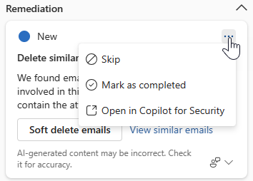
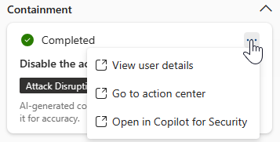

# Triage and investigate incidents with guided responses from Microsoft Copilot in Microsoft Defender

[!INCLUDE [Microsoft Defender XDR rebranding](../includes/microsoft-defender.md)]

**Applies to:**

- Microsoft Defender XDR
- Microsoft Defender unified security operations center (SOC) platform

[Microsoft Copilot for Security](/security-copilot/microsoft-security-copilot) in the Microsoft Defender portal supports incident response teams in immediately resolving incidents with guided responses. Copilot in Defender uses AI and machine learning capabilities to contextualize an incident and learn from previous investigations to generate appropriate response actions.

Responding to incidents in the Microsoft Defender portal often requires familiarity with the portal's available actions to stop attacks. In addition, new incident responders might have different ideas of where and how to start responding to incidents. The guided response capability of Copilot in Defender allows incident response teams at all levels to confidently and quickly apply response actions to resolve incidents with ease.

Guided responses are available in the Microsoft Defender portal through the [Copilot for Security license](/security-copilot/faq-security-copilot). Guided responses are also available in the Copilot for Security standalone experience through the Defender XDR plugin.

This guide outlines how to access the guided response capability, including information on providing feedback about the responses.

## Apply guided responses to resolve incidents

Guided responses recommend actions in the following categories:

- Triage - includes a recommendation to classify incidents as informational, true positive, or false positive
- Containment - includes recommended actions to contain an incident
- Investigation - includes recommended actions for further investigation
- Remediation - includes recommended response actions to apply to specific entities involved in an incident

Each card contains information about the recommended action, including the entity where the action needs to be applied and why the action is recommended. The cards also emphasize when a recommended action was done by automated investigation like [attack disruption](automatic-attack-disruption.md) or [automated investigation response](m365d-autoir.md).

The guided response cards can be sorted based on the available status for each card. You can select a specific status when viewing the guided responses by clicking on **Status** and selecting the appropriate status you want to view. All guided response cards regardless of status are shown by default.

:::image type="content" source="../../media/copilot-in-defender/guided-response/copilot-defender-guided-response-status-small.png" alt-text="Screenshot highlighting the status of responses in the Copilot pane in the Microsoft Defender incident page." lightbox="../../media/copilot-in-defender/guided-response/copilot-defender-guided-response-status.png":::

To use guided responses, perform the following steps:

1. Open an incident page. Copilot automatically generates guided responses upon opening an incident page. The Copilot pane appears on the right side of the incident page, showing the guided response cards.

   :::image type="content" source="../../media/copilot-in-defender/guided-response/copilot-defender-guided-response-small.png" alt-text="Screenshot highlighting the Copilot pane with the guided responses in the Microsoft Defender incident page." lightbox="../../media/copilot-in-defender/guided-response/copilot-defender-guided-response.png":::

2. Review each card before applying the recommendations. Select the More actions ellipsis (...) on top of a response card to view the options available for each recommendation. Here are some examples.

   

   

3. To apply an action, select the desired action found on each card. The guided response action on each card is tailored to the type of incident and the specific entity involved.

   :::image type="content" source="../../media/copilot-in-defender/guided-response/copilot-defender-guided-response-actions-small.png" alt-text="Screenshot of the guided response cards in the Copilot pane in Microsoft Defender." lightbox="../../media/copilot-in-defender/guided-response/copilot-defender-guided-response-actions.png":::

4. You can provide feedback to each response card to continuously enhance future responses from Copilot. To provide feedback, select the feedback icon  found on the bottom right of each card.

> [!NOTE]
> Grayed out action buttons mean these actions are limited by your permission. [Refer to the unified role-based access (RBAC) permissions](manage-rbac.md) page for more information.

Copilot in Defender supports incident response teams by enabling analysts to gain more context about response actions with additional insights. For remediation responses, incident response teams can view additional information with options like **View similar incidents** or **View similar emails**.

The **View similar incidents** action becomes available when there are other incidents within the organization that are similar to the current incident. The Similar incidents tab lists similar incidents that you can review. Microsoft Defender automatically identifies similar incidents within the organization through machine learning. Incident response teams can use the information from these similar incidents to classify incidents and further review the actions done in those similar incidents.

The **View similar emails** action, which is specific to phishing incidents, takes you to the [advanced hunting](advanced-hunting-overview.md) page, where a KQL query to list similar emails within the organization is automatically generated. This automatic query generation related to an incident helps incident response teams further investigate other emails that might be related to the incident. You can review the query and modify it as needed.

## See also

- [Summarize an incident](security-copilot-m365d-incident-summary.md)
- [Analyze files](copilot-in-defender-file-analysis.md)
- [Run script analysis](security-copilot-m365d-script-analysis.md)
- [Create an incident report](security-copilot-m365d-create-incident-report.md)
- [Generate KQL queries](advanced-hunting-security-copilot.md)
- [Get started with Microsoft Copilot for Security](/security-copilot/get-started-security-copilot)
- [Learn about other Copilot for Security embedded experiences](/security-copilot/experiences-security-copilot)
- Know more about [preinstalled plugins in Copilot for Security](/security-copilot/manage-plugins#preinstalled-plugins)

[!INCLUDE [Microsoft Defender XDR rebranding](../../includes/defender-m3d-techcommunity.md)]
