# Set up your Microsoft 365 Defender trial lab environment 

[!INCLUDE [Microsoft 365 Defender rebranding](../includes/microsoft-defender.md)]

**Applies to:**
- Microsoft 365 Defender 

Creating a Microsoft 365 Defender trial lab or pilot environment and deploying it is a three-phase process:

| [Phase 1: Prepare](prepare-m365d-eval.md) | Phase 2: Set up | [Phase 3: Onboard](config-m365d-eval.md) |  [Back to pilot playbook](m365d-pilot.md) |
|--|--|--|--|
||*You are here!*  | | |

You're currently in the set up phase. Take the initial steps to access Microsoft 365 Security Center then set up your trial lab or pilot environment.

Sign up for an Office 365 or Azure Active Directory subscription to generate a *.onmicrosoft.com* tenant that you can use to sign up for your Microsoft 365 E5 license. 

>[!NOTE]
>If you already have an existing Office 365 or Azure Active Directory subscription, you can skip the Office 365 E5 trial or pilot tenant creation steps.

In this phase, you'll be guided to:
- Create an Office 365 E5 trial tenant
- Enable Microsoft 365 trial subscription

## Create an Office 365 E5 trial tenant
>[!NOTE]
>If you already have an existing Office 365 or Azure Active Directory subscription, you can skip the Office 365 E5 trial tenant creation steps.

1. Go to the [Office 365 E5 product portal](https://www.microsoft.com/microsoft-365/business/office-365-enterprise-e5-business-software?activetab=pivot%3aoverviewtab) and select **Free trial**.

   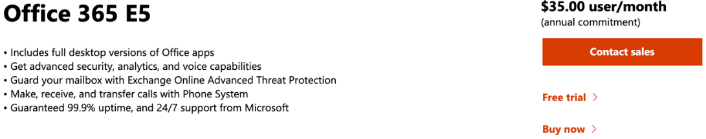
  
2. Complete the trial registration by entering your email address (personal or corporate). Click **Set up account**.

   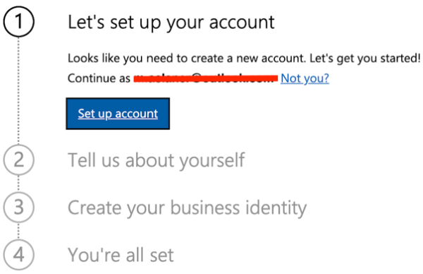

3. Fill in your first name, last name, business phone number, company name, company size, and country or region.  

   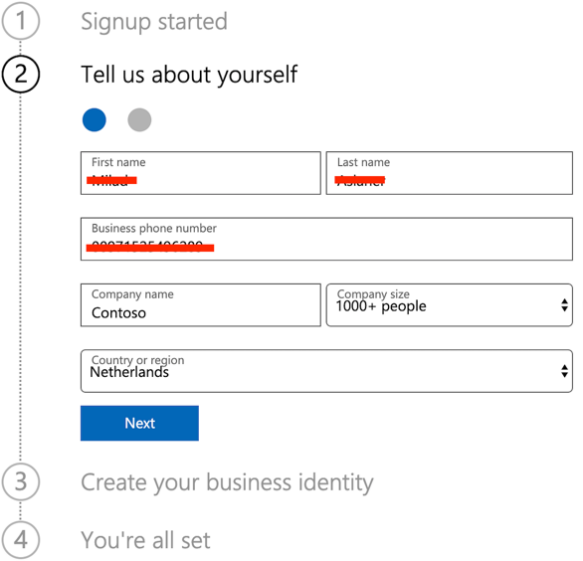
   
   > [!NOTE]
   > The country or region you set here determines the data center region your Office 365 will be hosted.
  
4. Choose your verification preference: through a text message or call. Click **Send Verification Code**. 

   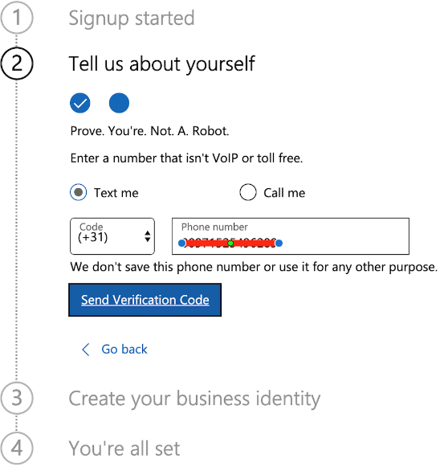

5. Set the custom domain name for your tenant, then click **Next**.

   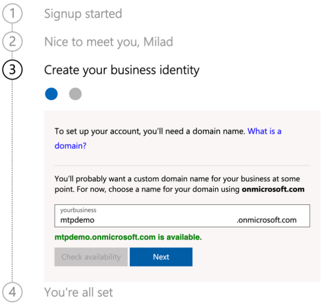
 
6. Set up the first identity, which will be a Global Administrator for the tenant. Fill in **Name** and **Password**. Click **Sign up**.

   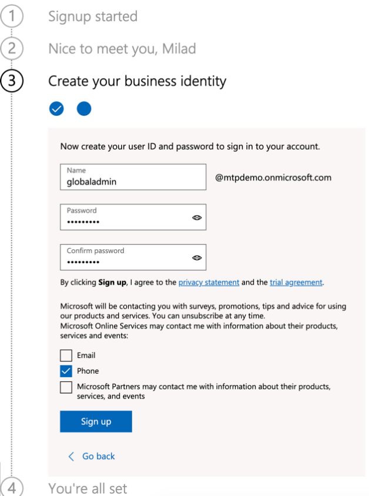

7. Click **Go to Setup** to complete the Office 365 E5 trial tenant provisioning.

   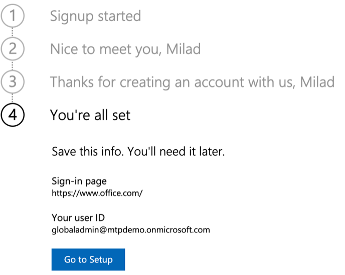

8. Connect your corporate domain to the Office 365 tenant. [Optional] Choose **Connect a domain you already own** and type in your domain name. Click **Next**.

   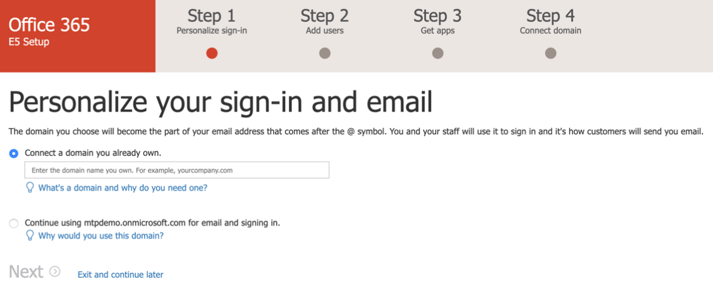
 
9. Add a TXT or MX record to validate the domain ownership. Once you’ve added the TXT or MX record to your domain, select **Verify**.

   
 
10. [Optional] Create more user accounts for your tenant. You can skip this step by clicking **Next**.

    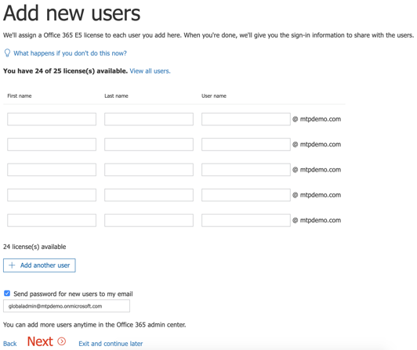
 
11. [Optional] Download Office apps. Click **Next** to skip this step. 

    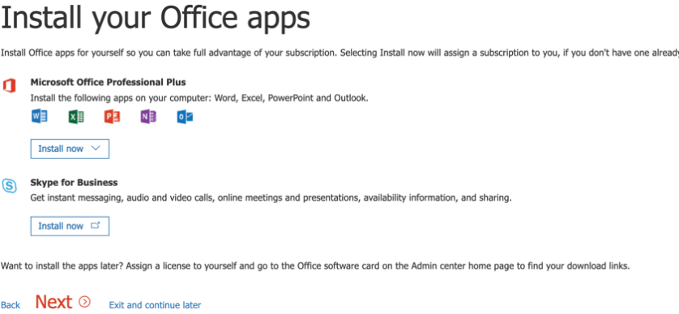

12. [Optional] Migrate email messages. Again, you can skip this step.

    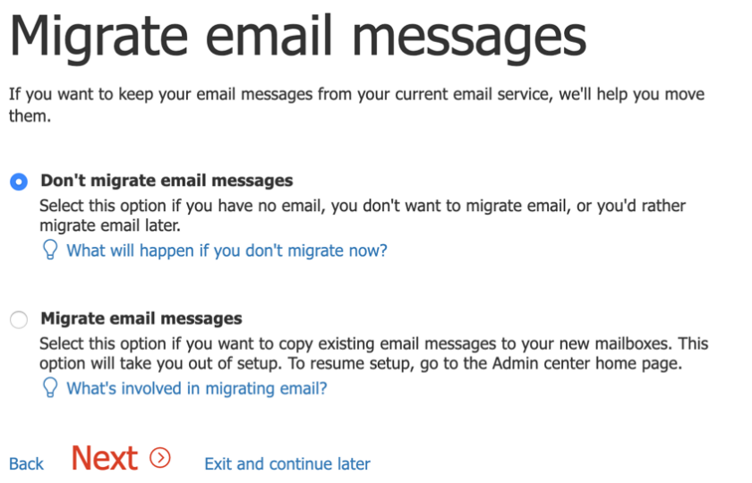
 
13. Choose online services. Select **Exchange** and click **Next**. 

    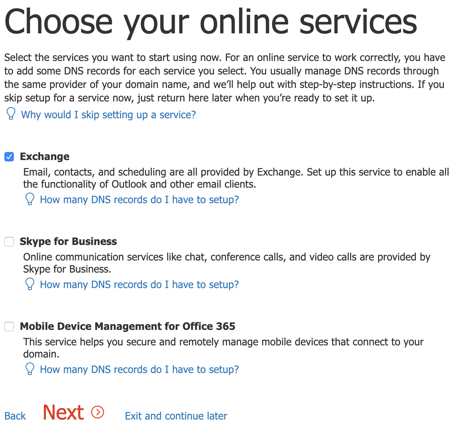

14. Add MX, CNAME, and TXT records to your domain. When completed, select **Verify**.

    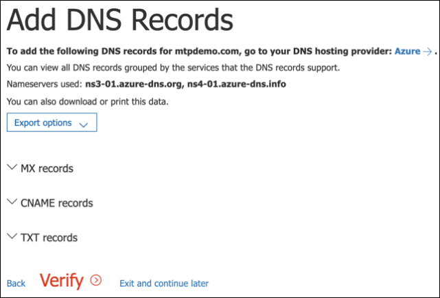
 
15. Congratulations, you have completed the provisioning of your Office 365 tenant.

    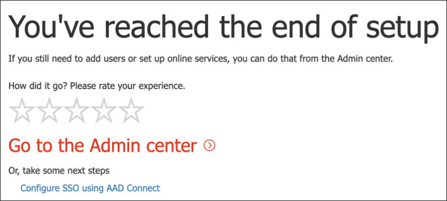

## Enable Microsoft 365 trial subscription

>[!NOTE]
>Signing up for a trial gives you 25 user licenses to use for a month. See [Try or Buy an M365 subscription](../../commerce/try-or-buy-microsoft-365.md#try-or-buy-a-microsoft-365-subscription-1) for details.

1. From [Microsoft 365 Admin Center](https://admin.microsoft.com/), click **Billing** and then navigate to **Purchase services**.

2. Select **Microsoft 365 E5** and click **Start free trial**. 

   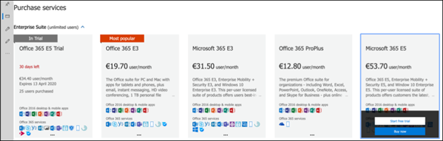

3. Choose your verification preference: through a text message or call. Once you have decided, enter the phone number, select **Text me** or **Call me** depending on your selection.

   
 
4. Enter the verification code and click **Start your free trial**.

   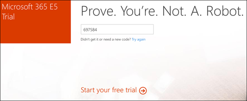

5. Click **Try now** to confirm your Microsoft 365 E5 trial.

   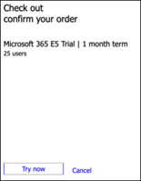
 
6. Go to the **Microsoft 365 Admin Center** > **Users** > **Active users**. Select your user account, select **Manage product licenses**, then swap the license from Office 365 E5 to **Microsoft 365 E5**. Click **Save**.

   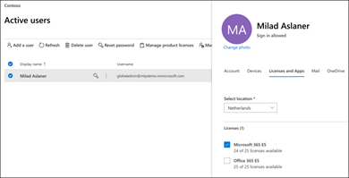
 
7. Select the global administrator account again then click **Manage username**.

   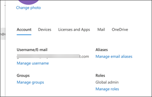

8. [Optional] Change the domain from *onmicrosoft.com* to your own domain—depending on what you chose on the previous steps. Click **Save changes**.

   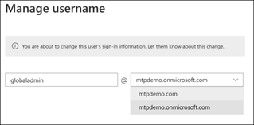

## Next step
|[Phase 3: Configure & Onboard](config-m365d-eval.md) | Configure each Microsoft 365 Defender pillar for your Microsoft 365 Defender trial lab or pilot environment and onboard your endpoints.
|:-------|:-----|
