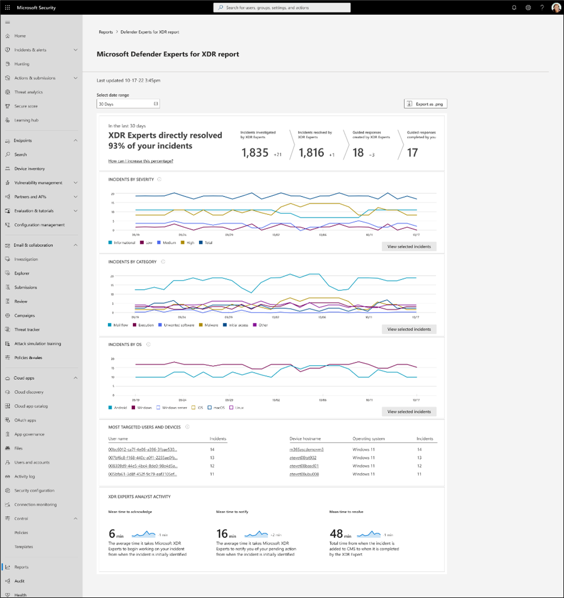

**Applies to:**

- Microsoft 365 Defender

[!INCLUDE [Prerelease](../includes/prerelease.md)]

# Start using Microsoft Defender Experts for XDR preview service

Apart from onboarding service delivery, our expertise on the Microsoft 365 Defender product suite enables Defender Experts for XDR to run an initial readiness engagement to help you get the most out of your Microsoft security products. This engagement will be based on your [Microsoft Secure Score](microsoft-secure-score.md) and Defender Experts policy recommendations. Defender Experts for XDR won't implement any of the proactive configurations, but will help prioritizing and customizing our recommendations to fit your environment.

## Receive guided response within Microsoft 365 Defender portal

Defender Experts for XDR focus on a priority incident list while reducing the noise generated by lower-level insights to drive hunting activities. This service focuses on Microsoft 365 Defender incidents in your environment, leveraging the [MITRE ATT&CK framework](https://attack.mitre.org/) and prevalence indicators to identify areas where the most targeted and prevalent threat actor activity exists.

Defender Experts for XDR provide remediation actions to be done by Defender Experts either via system automation or human-driven playbooks, depending on the situation. You can decide which remediation actions are approved in future iterations.

Defender Experts manage the Microsoft Defender incident queue on your behalf. They also send via email-guided response recommendations that provide additional context and action items to secure critical incidents. Recommendations include, but not limited to:
- Collect investigation package
- Run antivirus scan
- Trigger and prioritize action in an automatic investigation
- Stop and quarantine file
- Soft delete email
- Block designated OAuth cloud apps

These recommendations also appear in the **Comments & History** section of each related incident in the Microsoft 365 Defender portal so you can view them at your convenience.

## Get real-time visibility with XDR reports

Defender Experts for XDR will include an interactive, on-demand report that provides a clear summary of the work our expert analysts are doing on your behalf, aggregate information about your incident landscape, and granular details about specific incidents. Your service delivery manager (SDM) will also use the report to provide you with additional context regarding your XDR service during a monthly business review.

## Collaborate with a dedicated advisor

The service delivery manager (SDM) is responsible for managing the overall relationship for your organization with the Defender Experts for XDR service. They are your trusted advisor working along with XDR experts' team to help you protect your organization.

The SDM provides the following services:

- Service readiness support

  - Educate customers about the end-to-end service experience, from signup to regular operations and escalation process
  - Support customer environment discovery (Microsoft and third-party products and services)
  - Help establish a service-ready security posture, including guidance on required controls and policy updates

- Service operations support
  - Provide unique service delivery content and reporting, including periodic business reviews
  - Serve as a single point of contact for feedback and escalations

## Request advanced threat expertise on demand

Select **Ask Defender Experts** directly inside the Microsoft 365 security portal to get swift and accurate responses to all your threat questions. Experts can provide insights to better understand the complex threats your organization may face. Consult an expert to:

- Gather additional information on alerts and incidents, including root causes and scope
- Gain clarity into suspicious devices, alerts, or incidents and get the next steps if faced with an advanced attacker
- Determine risks and available protections related to threat actors, campaigns, or emerging attacker techniques

> [!NOTE]
> Ask Defender Experts is not a security incident response service. It's intended to provide a better understanding of complex threats affecting your organization. Engage with your own security incident response team to address urgent security incident response issues. If you don't have your own security incident response team and would like Microsoft's help, create a support request in the [Premier Services Hub](/services-hub/).

The option to **Ask Defender Experts** is available in the incidents and alerts pages for you to ask contextual questions about a specific incident or alert:

- ***Alerts page flyout menu***

- ***Incidents page actions menu***

## Opt out of preview

Consult your service delivery manager (SDM) to opt out of the preview.

## Go to the next step

[Read though frequently asked questions and answers](frequently-asked-questions.md)
