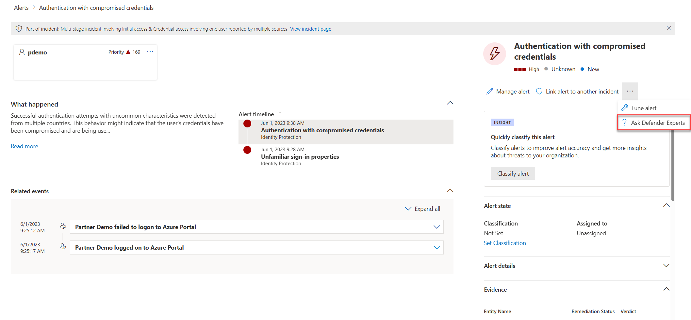

# Start using Defender Experts for XDR preview service

**Applies to:**

- [Microsoft 365 Defender](https://go.microsoft.com/fwlink/?linkid=2118804)

After you completed the [onboarding steps and readiness checks](**LINK TO GET STARTED WITH DEFENDER EXPERTS FOR XDR TOPIC**) for Microsoft Defender Experts for XDR, our experts will start monitoring your environment to streamline the service so we can perform comprehensive service on your behalf. During this stage, our experts will identify latent threats, sources of risk, and normal activity.

Once our experts begin to perform comprehensive response work on your behalf, you’ll start receiving notifications about incidents that require remediation steps and targeted recommendations on critical incidents. You can also chat with our experts or your service delivery managers (SDMs) regarding important queries and regular business and security posture reviews and view real-time reports on the number of incidents we’ve investigated and resolved on your behalf.

## Managed detection and response

Through a combination of automation and human expertise, Defender Experts for XDR triages Microsoft 365 Defender incidents, prioritizes them on your behalf, filters out the noise, carries out detailed investigations, and provides actionable guided response to your security operations center (SOC) teams.

### Incident notifications

Once our experts start investigating an incident, its **Assigned to** field is updated to _Defender Experts_ and its **Status** field is updated to _In progress_.
When our experts conclude their investigation on an incident, the incident’s **Classification** field is updated to one of the following, depending on the experts’ findings:
- True Positive
- False Positive
- Informational, Expected Activity

The **Determination** field corresponding to each classification is also updated to provide more insights on the findings that led our experts to determine the said classification.

**SCREENSHOT**[incidents-xdr]

If an incident is classified as _False Positive_ or _Informational_, _Expected Activity_, then its **Status** field gets updated to _Resolved_. Our experts then conclude their work on this incident and its **Assigned to** field gets updated to _Unassigned_. Our experts may share updates from their investigation and their conclusion when resolving an incident. These will be posted in the incident’s **Comments and history** flyout panel.

Otherwise, if an incident is classified as _True Positive_, our experts will then identify recommended response actions that need to be performed. The method in which the actions are performed depends on the permissions and access levels you have given the Defender Experts for XDR service. Learn more about granting permissions to our experts[**link to grant permissions to our experts**].

- If you have granted Defender Experts for XDR the recommended Security Operator access permissions, our experts could perform the recommended response actions on the incident on your behalf. These actions, along with an **Investigation summary**, will show up in the incident’s Guided response[**link to how to use guided response**] flyout panel in your Microsoft 365 Defender portal for your or your SOC team to review. Once our experts conclude their work on the incident, its **Status** field is then updated to _Resolved_ and the **Assigned to** field is updated to _Unassigned_.

- If you have granted Defender Experts for XDR the default Security Reader access, then the recommended response actions, along with an **Investigation summary**, will show up in the incident’s **Guided response** flyout panel in your Microsoft 365 Defender portal for you or your SOC team to perform. To identify this handover, the incident’s **Assigned to** field is updated to _Customer_.
- 
You can check the number of incidents that are awaiting your action in the Defender Experts card in your Microsoft 365 Defender portal:

## Run initial Defender readiness checks

Apart from onboarding service delivery, our expertise on the Microsoft 365 Defender product suite enables Defender Experts for XDR to run an initial readiness engagement to help you get the most out of your Microsoft security products. This engagement will be based on your [Microsoft Secure Score](microsoft-secure-score.md) and Defender Experts' policy recommendations. Our experts will help prioritizing and customizing our recommendations to fit your environment. They'll request your engagement to get those configurations implemented.

## Managed detection and response

Through a combination of automation and human expertise, our service triages Microsoft 365 Defender incidents, prioritizes them on your behalf, filters out the noise, carries out detailed investigations, and provides detailed guided response to your security operations center (SOC) teams. Alternatively, our analysts can take a response step on your behalf.

You'll receive detailed response playbooks via emails. You'll also be able to filter the Microsoft 365 Defender portal incident view using the *Defender Experts* tag to see the current state of the incidents Defender Experts are actively investigating, or the incidents that require your action. Our analysts will also add relevant comments in Microsoft 365 Defender portal's **Comments & history** section so you and your SOC analysts can track the investigation progress.

Response recommendations include, but aren't limited to:

- Collect investigation package
- Run antivirus scan
- Trigger and prioritize action in an automatic investigation
- Stop and quarantine file
- Delete email
- Block designated OAuth cloud apps

These recommendations also appear in the **Comments & history** section of each related incident in the Microsoft 365 Defender portal so you can view them at your convenience.

## Get real-time visibility with Defender Experts for XDR reports

Defender Experts for XDR will include an interactive, on-demand report that provides a clear summary of the work our expert analysts are doing on your behalf, aggregate information about your incident landscape, and granular details about specific incidents. Your service delivery manager (SDM) will also use the report to provide you with more context regarding your XDR Experts service during a monthly business review.

## Collaborate with a trusted advisor

The service delivery manager (SDM) is responsible for managing the overall relationship for your organization with the Defender Experts for XDR service. They are your trusted advisor working along with XDR experts' team to help you protect your organization.

The SDM provides the following services:

- Service readiness support

  - Educate customers about the end-to-end service experience, from signup to regular operations and escalation process.
  - Help establish a service-ready security posture, including guidance on required controls and policy updates.

- Service operations support
  - Provide unique service delivery content and reporting, including periodic business reviews.
  - Serve as a single point of contact for feedback and escalations related to Defender Experts Service.

## Proactive managed hunting

Defender Experts for XDR also includes proactive threat hunting offered by [Microsoft Defender Experts for Hunting](defender-experts-for-hunting.md). Defender Experts for Hunting was created for customers who have a robust security operations center but want Microsoft to help them proactively hunt threats using Microsoft Defender data. This proactive threat hunting service goes beyond the endpoint to hunt across endpoints, Office 365, cloud applications, and identity. Our experts investigate anything they find, then hand off the contextual alert information along with remediation instructions, so you can quickly respond.

## Request advanced threat expertise on demand

Select **Ask Defender Experts** directly inside the Microsoft 365 security portal to get swift and accurate responses to all your threat questions. Experts can provide insights to better understand the complex threats your organization may face. Consult an expert to:

- Gather additional information on alerts and incidents, including root causes and scope
- Gain clarity into suspicious devices, alerts, or incidents and get the next steps if faced with an advanced attacker
- Determine risks and available protections related to threat actors, campaigns, or emerging attacker techniques

> [!NOTE]
> Ask Defender Experts is not a security incident response service. It's intended to provide a better understanding of complex threats affecting your organization. Engage with your own security incident response team to address urgent security incident response issues. If you don't have your own security incident response team and would like Microsoft's help, create a support request in the [Premier Services Hub](/services-hub/).

The option to **Ask Defender Experts** is available in the incidents and alerts pages for you to ask contextual questions about a specific incident or alert:

- _**Alerts page flyout menu**_:

  

- _**Incidents page actions menu**_:

  

## Opt out of preview

Consult your service delivery manager (SDM) to opt out of the preview.

## See also

[Read through frequently asked questions and answers](frequently-asked-questions.md)
