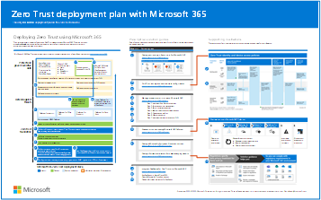
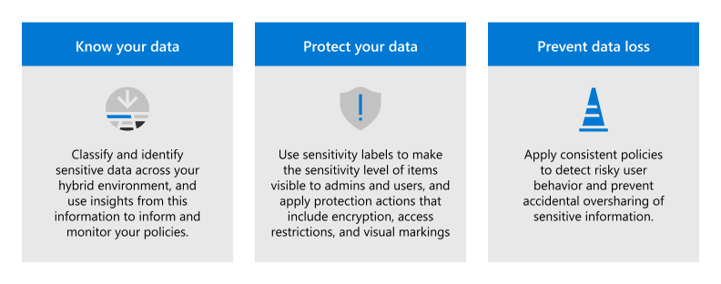

# Zero Trust deployment plan with Microsoft 365

This article provides a deployment plan for building **Zero Trust** security with Microsoft 365. Zero Trust is a new security model that assumes breach and verifies each request as though it originated from an uncontrolled network. Regardless of where the request originates or what resource it accesses, the Zero Trust model teaches us to "never trust, always verify."

Use this article together with this poster.

| Item | Description |
|:-----|:-----|
|   [PDF](https://download.microsoft.com/download/f/d/b/fdb6ab0c-34bb-4cb8-84e6-5de8f13298da/m365-zero-trust-deployment-plan.pdf) \| [Visio](https://download.microsoft.com/download/f/d/b/fdb6ab0c-34bb-4cb8-84e6-5de8f13298da/m365-zero-trust-deployment-plan.vsdx)   Updated March 2024 | **Related solution guides**   <ul><li>[Deploy your identity infrastructure for Microsoft 365](/microsoft-365/enterprise/deploy-identity-solution-overview)</li><li>[Recommended identity and device access configurations](../security/office-365-security/zero-trust-identity-device-access-policies-overview.md)</li><li>[Manage devices with Intune](../solutions/manage-devices-with-intune-overview.md)</li><li>[Evaluate and pilot Microsoft Defender XDR](../security/defender/eval-overview.md)</li><li>[Deploy an information protection solution with Microsoft Purview](../compliance/information-protection-solution.md)</li><li>[Deploy information protection for data privacy regulations with Microsoft 365](../solutions/information-protection-deploy.md)</li></ul>

## Zero Trust security architecture

A Zero Trust approach extends throughout the entire digital estate and serves as an integrated security philosophy and end-to-end strategy.

This illustration provides a representation of the primary elements that contribute to Zero Trust.

:::image type="content" source="../media/zero-trust/zero-trust-architecture.png" alt-text="The Zero Trust security architecture" lightbox="../media/zero-trust/zero-trust-architecture.png":::

In the illustration:

- Security policy enforcement is at the center of a Zero Trust architecture. This includes multifactor authentication with Conditional Access that takes into account user account risk, device status, and other criteria and policies that you set.
- Identities, devices, data, apps, network, and other infrastructure components are all configured with appropriate security. Policies that are configured for each of these components are coordinated with your overall Zero Trust strategy. For example, device policies determine the criteria for healthy devices and Conditional Access policies require healthy devices for access to specific apps and data.
- Threat protection and intelligence monitors the environment, surfaces current risks, and takes automated action to remediate attacks.

For more information about Zero Trust, see Microsoft's [_**Zero Trust Guidance Center**_](/security/zero-trust).

<!---
For more information about this architecture, including deployment objectives for your entire digital estate, see [Zero Trust Rapid Modernization Plan (RaMP)](/security/zero-trust/zero-trust-ramp-overview).
-->

## Deploying Zero Trust for Microsoft 365

Microsoft 365 is built intentionally with many security and information protection capabilities to help you build Zero Trust into your environment. Many of the capabilities can be extended to protect access to other SaaS apps your organization uses and the data within these apps.

This illustration represents the work of deploying Zero Trust capabilities. This work is broken into units of work that can be configured together, starting from the bottom and working to the top to ensure that prerequisite work is complete.

:::image type="content" source="../media/zero-trust/m365-zero-trust-deployment-stack.svg" alt-text="Diagram that shows the Microsoft 365 Zero Trust deployment stack." lightbox="../media/zero-trust/m365-zero-trust-deployment-stack.svg":::

In this illustration:

- Zero Trust begins with a foundation of identity and device protection.
- Threat protection capabilities are built on top of this foundation to provide real-time monitoring and remediation of security threats.
- Information protection and governance provide sophisticated controls targeted at specific types of data to protect your most valuable information and to help you comply with compliance standards, including protecting personal information.

This article assumes you are using cloud identity. If you need guidance for this objective, see [**Deploy your identity infrastructure for Microsoft 365**](/microsoft-365/enterprise/deploy-identity-solution-overview).

> [!TIP]
> When you understand the steps and the end-to-end deployment process, you can use the [Set up your Microsoft Zero Trust security model](https://go.microsoft.com/fwlink/?linkid=2224820) advanced deployment guide when signed in to the Microsoft 365 admin center. This guide steps you through applying Zero Trust principles for standard and advanced technology pillars. To step through the guide without signing in, go to the [Microsoft 365 Setup portal](https://go.microsoft.com/fwlink/?linkid=2222968).

## Step 1: Configure Zero Trust identity and device access protection: Starting-point policies

The first step is to build your Zero Trust foundation by configuring identity and device access protection.

:::image type="content" source="../media/zero-trust/m365-zero-trust-architecture-identities.png" alt-text="Diagram that shows the process to configure Zero Trust identity and device access protection." lightbox="../media/zero-trust/m365-zero-trust-architecture-identities.png":::

Go to [**_Zero Trust identity and device access protection_**](office-365-security/zero-trust-identity-device-access-policies-overview.md) for detailed prescriptive guidance. This series of articles describes a set of identity and device access prerequisite configurations and a set of Microsoft Entra Conditional Access, Microsoft Intune, and other policies to secure access to Microsoft 365 for enterprise cloud apps and services, other SaaS services, and on-premises applications published with Microsoft Entra application proxy.

|Includes|Prerequisites|Doesn't include|
|---------|---------|---------|
|Recommended identity and device access policies for three levels of protection: <ul><li>Starting point</li><li>Enterprise (recommended)</li><li>Specialized</li></ul>   Additional recommendations for: <ul><li>External users (guests)</li><li>Microsoft Teams</li><li>SharePoint Online</li><li>Microsoft Defender for Cloud Apps</lu></ul>|Microsoft E3 or E5    Microsoft Entra ID in either of these modes: <ul><li>Cloud-only</li><li>Hybrid with password hash sync (PHS) authentication</li><li>Hybrid with pass-through authentication (PTA)</li><li>Federated</li></ul>|Device enrollment for policies that require managed devices. See [Step 2. Manage endpoints with Intune](#step-2-manage-endpoints-with-intune) to enroll devices|

Start by implementing the starting-point tier. These policies don't require enrolling devices into management.

:::image type="content" source="../media/zero-trust/identity-access-starting-point-tier.svg" alt-text="Diagram that shows the Zero Trust identity and access policies for the Starting-point tier" lightbox="../media/zero-trust/identity-access-starting-point-tier.svg":::

## Step 2: Manage endpoints with Intune

Next, enroll your devices into management and begin protecting them with more sophisticated controls.

:::image type="content" source="../media/zero-trust/m365-zero-trust-architecture-endpoints.png" alt-text="Diagram that shows the Manage endpoints with Intune element." lightbox="../media/zero-trust/m365-zero-trust-architecture-endpoints.png":::

See [**_Manage devices with Intune_**](../solutions/manage-devices-with-intune-overview.md) for detailed prescriptive guidance.

|Includes|Prerequisites|Doesn't include|
|---------|---------|---------|
|Enroll devices with Intune: <ul><li>Corporate-owned devices</li><li>Autopilot/automated</li><li>enrollment</li></ul>   Configure policies: <ul><li>App Protection policies</li><li>Compliance policies</li><li>Device profile policies</li></ul>|Register endpoints with Microsoft Entra ID|Configuring information protection capabilities, including: <ul><li>Sensitive information types</li><li>Labels</li><li>DLP policies</li></ul>   For these capabilities, see [Step 5. Protect and govern sensitive data](#step-5-protect-and-govern-sensitive-data) (later in this article).|

For more information, see [Zero Trust for Microsoft Intune](/mem/intune/fundamentals/zero-trust-with-microsoft-intune).

## Step 3: Add Zero Trust identity and device access protection: Enterprise policies

With devices enrolled into management, you can now implement the full set of recommended Zero Trust identity and device access policies, requiring compliant devices.

:::image type="content" source="../media/zero-trust/m365-zero-trust-architecture-enterprise-policies.png" alt-text="The Zero Trust identity and access policies with device management" lightbox="../media/zero-trust/m365-zero-trust-architecture-enterprise-policies.png":::

Return to [**_Common identity and device access policies_**](office-365-security/zero-trust-identity-device-access-policies-common.md) and add the policies in the Enterprise tier.

:::image type="content" source="../media/zero-trust/identity-access-enterprise-tier.svg" alt-text="Diagram that shows the Zero Trust identity and access policies for the Enterprise (recommended) tier." lightbox="../media/zero-trust/identity-access-enterprise-tier.svg":::

## Step 4: Evaluate, pilot, and deploy Microsoft Defender XDR

Microsoft Defender XDR is an extended detection and response (XDR) solution that automatically collects, correlates, and analyzes signal, threat, and alert data from across your Microsoft 365 environment, including endpoint, email, applications, and identities.

:::image type="content" source="../media/zero-trust/m365-zero-trust-architecture-defender.png" alt-text="The process of adding Microsoft Defender XDR to the Zero Trust architecture" lightbox="../media/zero-trust/m365-zero-trust-architecture-defender.png":::

Go to [**_Evaluate and pilot Microsoft Defender XDR_**](defender/eval-overview.md) for a methodical guide to piloting and deploying Microsoft Defender XDR components.

|Includes|Prerequisites|Doesn't include|
|---------|---------|---------|
|Set up the evaluation and pilot environment for all components: <ul><li>Defender for Identity</li><li>Defender for Office 365</li><li>Defender for Endpoint</li><li>Microsoft Defender for Cloud Apps</li></ul>   Protect against threats    Investigate and respond to threats|See the guidance to read about the architecture requirements for each component of Microsoft Defender XDR.| Microsoft Entra ID Protection isn't included in this solution guide. It's included in [Step 1. Configure Zero Trust identity and device access protection](#step-1-configure-zero-trust-identity-and-device-access-protection-starting-point-policies).|

For more information, see these additional Zero Trust articles:

- [Defender for Endpoint](./defender-endpoint/zero-trust-with-microsoft-defender-endpoint.md)
- [Defender for Office 365](./office-365-security/zero-trust-with-microsoft-365-defender-office-365.md)
- [Defender for Cloud Apps](/defender-cloud-apps/zero-trust)
- [Defender for Identity](/defender-for-identity/zero-trust)

## Step 5: Protect and govern sensitive data

Implement Microsoft Purview Information Protection to help you discover, classify, and protect sensitive information wherever it lives or travels.

Microsoft Purview Information Protection capabilities are included with Microsoft Purview and give you the tools to know your data, protect your data, and prevent data loss.

:::image type="content" source="../media/zero-trust/m365-zero-trust-architecture-info-protect.png" alt-text="The Information protection capabilities protecting data through policy enforcement" lightbox="../media/zero-trust/m365-zero-trust-architecture-info-protect.png":::

While this work is represented at the top of the deployment stack illustrated earlier in this article, you can begin this work anytime.

Microsoft Purview Information Protection provides a framework, process, and capabilities you can use to accomplish your specific business objectives.

For more information on how to plan and deploy information protection, see [**_Deploy a Microsoft Purview Information Protection solution_**](../compliance/information-protection-solution.md). 

If you're deploying information protection for data privacy regulations, this solution guide provides a recommended framework for the entire process: [**_Deploy information protection for data privacy regulations with Microsoft 365_**](../solutions/information-protection-deploy.md).
