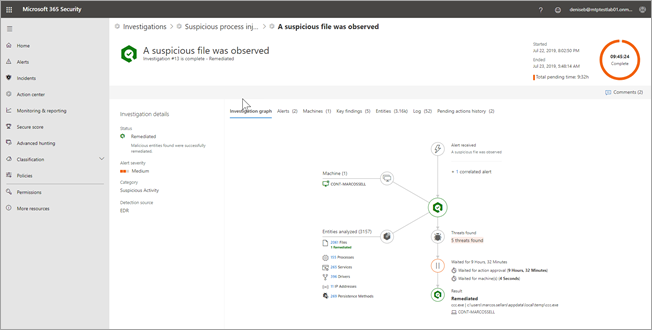

# The Action center in Microsoft Threat Protection

**Applies to**:
- Microsoft 365

In Microsoft Threat Protection, an investigation occurs within the context of an incident that is created when an alert is triggered. The **Action center** provides a view of current and past investigations across Microsoft Defender Advanced Threat Protection (ATP), Office 365 ATP, and Azure Active Directory Identity Protection. 

Viewing information about investigations across Windows, Office, and Azure in one place not only enables your security operations team to operate more effectively and efficiently, it provides a more comprehensive view of Microsoft Threat Protection at work for your organization. 

## View and use the Action center

- To go to the Action center, in the Microsoft 365 security center, in the navigation pane on the left side, choose **Action center**.

    In the Action center, you see two tabs: **Pending** and **History**:

    - The **Pending** tab lists investigations that require review and approval by someone in your security operations team to proceed. Make sure to review and take action on pending items you see here.

    - The **History** tab lists past investigations. You can view data for the past day, week, month, or six months

    Selecting an item on either the **Pending** or **History** tab brings you to the **[Investigation details](#investigation-details)** view.

- Select **Customize columns** to show only the columns you want to see.

### Investigation details

Investigation details include alerts, machines, key findings, and other relevant information associated with an investigation. The following table describes the tabs you'll see in the **Investigation details** view.

|Tab | Description |
|--------|--------|
|**Investigation graph** |Provides a visual representation of the investigation. Depicts entities and lists threats found, along with alerts and whether any actions are awaiting approval.|
|**Alerts** |Lists alerts associated with the investigation. Alerts can come from threat protection features on a user's machine, in Office apps, Cloud App Security, and other Microsoft 365 Threat Protection features.|
|**Machines** |Lists machines included in the investigation along with remediation level.|
|**Key findings** |Lists results from the investigation along with status and actions taken.|
|**Entities** |Lists user activities, files, processes, services, drivers, IP addresses, and persistence methods associated with the investigation, along with status and actions taken.|
|**Log** |Provides a detailed view of all steps taken during the investigation, along with status.|
|**Pending actions** |Lists items that require approval to proceed.|

## Next steps

- [Automatically investigate and remediate issues in Microsoft Threat Protection](mtp-autoir.md)

- [Manage actions related to automated investigation and remediation in Microsoft 365](autoir-actions.md)

- [Learn about hunting for malware and other threats](hunting.md)