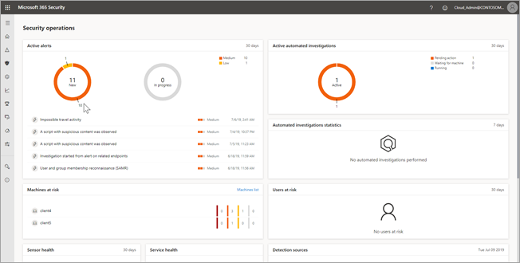
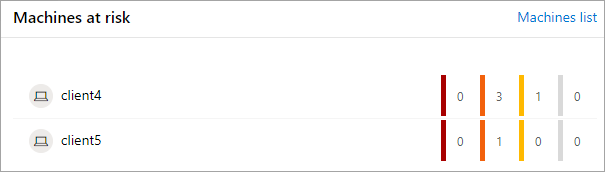
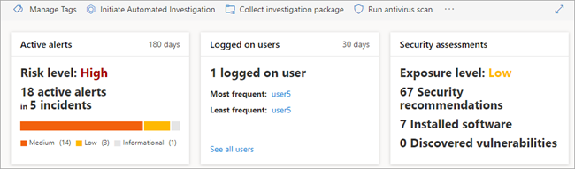
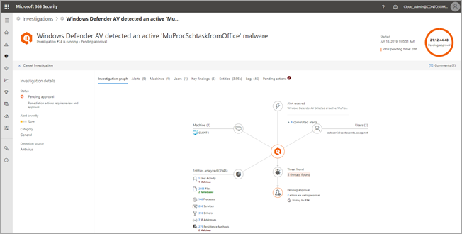
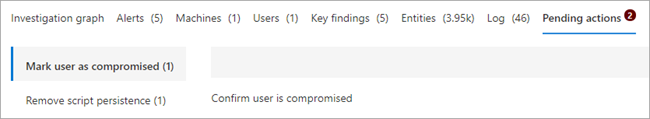

# Automatically investigate and remediate issues in Microsoft 365

**Applies to**:
- Microsoft 365

With [automated investigation and remediation](autoir-overview.md) (AIR) capabilities in Microsoft 365, security administrators can set up alerts that trigger investigations automatically, or start an automated investigation from a report in the Microsoft 365 security center. Once an investigation is underway, your security team can monitor progress, approve pending actions, review the results, and remediate security issues. 

> [!NOTE]
> You must be a global administrator, security administrator, security operator, or security reader to perform the tasks described in this article. To learn more, see [Microsoft 365 security center: roles and permissions](https://docs.microsoft.com/office365/securitycompliance/microsoft-security-and-compliance#required-licenses-and-permissions).

## Set up alerts to trigger automated investigations

Certain [alert policies](https://docs.microsoft.com/office365/securitycompliance/alert-policies) can trigger automated investigations and remediation. For example, a threat protection alert for any email messages containing malware that are detected after the messages are delivered can start an AIR process. 

To review (and if necessary, add) alert policies, follow these steps:

1. In the Microsoft 365 security center ([https://security.microsoft.com/homepage](https://security.microsoft.com/homepage)), in the navigation pane on the left side, choose **Policies**.

2. Under **Alert**, choose **Office 365 alert**. This takes you to the Office 365 Security & Compliance Center.

3. In the navigation pane on the left side, choose **Alerts** > **Alert policies**.

4. Review the list of existing policies, especially your [default alert policies](https://docs.microsoft.com/office365/securitycompliance/alert-policies?#default-alert-policies). Some default policies are set up to trigger AIR automatically through one or more security playbooks.

5. If necessary, add an alert policy. (Choose **+ New alert policy**.) To get help with this, see [Alert policies](https://docs.microsoft.com/office365/securitycompliance/alert-policies).

## Start an automated investigation from a report

When you use a view in a dashboard, such as a widget, you can click an item to view more details. Depending on the entity, whether an investigation is already underway, and whether starting an automated investigation is possible, you'll see an **Initiate Automated Investigation** button across the top of the report you're viewing. Click that button to trigger AIR.

**Example**: Start an investigation on a machine

Suppose that you are viewing a dashboard that looks the following image:

Suppose that you're interested in learning more about machines listed in the **Machines at risk** widget.

In the widget, you select an item, such as **client5**. A report opens with more details about that machine, including alerts, incidents, and recommendations.

Across the top of the report, you can click **Initiate Automated Investigation** to trigger an AIR process.

## Monitor progress of investigations

When you have one or more investigations in progress, you can monitor status and view progress.

**Example**: Navigate from a widget to a detailed view of an investigation

1. In your security dashboard, select an item, such as the chart in the **Active automated investigations** widget. 

    

    This opens the **Automated Investigations** view.

    

2. Select an item, such as an item in the **Triggering alert** column. This takes you to the Investigation details page, with the Investigation graph in view.

    

3. Use the various tabs to view details about the investigation.

    |Tab  |Description  |
    |---------|---------|
    |**Investigation graph**     |Provides a visual representation of the investigation. Depicts entities and lists threats found, along with alerts and whether any actions are awaiting approval.         |
    |**Alerts**     |Lists alerts associated with the investigation. Alerts can come from threat protection features on a user's machine, in Office apps, Cloud App Security, and other Microsoft 365 Threat Protection features.          |
    |**Machines** |Lists machines included in the investigation along with remediation level. |
    |**Users** |Lists user accounts included in the investigation, including a threat determination (verdict). | 
    |**Key findings** |Lists results from the investigation along with status and actions taken. |
    |**Entities** |Lists user activities, files, processes, services, drivers, IP addresses, and persistence methods associated with the investigation, along with status and actions taken. |
    |**Log** |Provides a detailed view of all steps taken during the investigation, along with status.  |
    |**Pending actions** |Lists items that require approval to proceed. |

## Approve pending actions

Although many steps in AIR are automated, some actions require approval from someone on your security operations team. 

**Example**: Review and approve a pending action 

1. On the **Investigation details** page, select the **Pending actions** tab.

    

2. Select an item to open a flyout, where you can view more details about the incident and proposed action. Then, choose **Approve** (or **Reject**).

## Next steps

[Analyze automated investigations](analyze-autoir.md)

[Learn about the automated investigations dashboard](autoir-dashboard-overview.md)