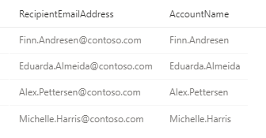

# Hunt for threats across devices, emails, apps, and identities

**Applies to:**
- Microsoft Threat Protection

[Advanced hunting](advanced-hunting-overview.md) in Microsoft Threat Protection allows you to proactively hunt for threats across:
- Devices managed by Microsoft Defender ATP
- Emails processed by Microsoft 365
- Cloud app activities, authentication events, and domain controller activities tracked by Microsoft Cloud App Security and Azure ATP

With this level of visibility, you can quickly hunt for threats that traverse sections of your network, including sophisticated intrusions that arrive on email or the web, elevate local privileges, acquire privileged domain credentials, and move laterally to across your devices. 

Here are general techniques and sample queries based on various hunting scenarios that can help you explore how you might construct queries when hunting for such sophisticated threats.

## Get entity info
Use these queries to learn how you can quickly get information about user accounts, devices, and files. 

### Obtain user accounts from email addresses
When constructing queries across [tables that cover devices and emails](advanced-hunting-schema-tables.md), you will likely need to obtain user account names from sender or recipient email addresses. You can generally do this for either recipient or sender address using the *local-host* from the email address.

In the snippet below, we use the [tostring()](https://docs.microsoft.com/azure/data-explorer/kusto/query/tostringfunction) Kusto function to extract the local-host right before the `@` from recipient email addresses in the column `RecipientEmailAddress`.

```kusto
//Query snippet showing how to extract the account name from an email address
AccountName = tostring(split(RecipientEmailAddress, "@")[0])
```
The query below shows how this snippet can be used:

```kusto
EmailEvents
| where Timestamp > ago(7d)
| project RecipientEmailAddress, AccountName = tostring(split(RecipientEmailAddress, "@")[0]);
```



### Merge the IdentityInfo table

You can get account names and other account information by merging or joining the [IdentityInfo table](advanced-hunting-identityinfo-table.md). The query below obtains the list of phishing and malware detections from the [EmailEvents table](advanced-hunting-emailevents-table.md) and then joins that information with the `IdentityInfo` table to get detailed information about each recipient. 

>[!Tip]
> This query uses `kind=inner` to specify an [inner-join](https://docs.microsoft.com/azure/data-explorer/kusto/query/joinoperator?pivots=azuredataexplorer#inner-join-flavor), which prevents deduplication of left side values or the recipient email addresses.

```kusto
EmailEvents
| where Timestamp > ago(7d)
//Get email processing events where the messages were identified as either phishing or malware
| where MalwareFilterVerdict == 'Malware' or PhishFilterVerdict == 'Phish'
//Merge email events with identity info to get recipient details
| join kind=inner IdentityInfo on $left.RecipientEmailAddress == $right.EmailAddress
//Show important message and recipient details
| project Timestamp, NetworkMessageId, Subject, PhishFilterVerdict, MalwareFilterVerdict,
SenderFromAddress, RecipientEmailAddress, AccountName, GivenName, Surname, JobTitle, 
Department, City, Country
```
### Get device information
The [advanced hunting schema](advanced-hunting-schema-tables.md) provides extensive device information in various tables. For example, the [DeviceInfo table](advanced-hunting-deviceinfo-table.md) provides comprehensive device information based on event data aggregated regularly. This query uses the `DeviceInfo` table to check if a potentially compromised user (`<account-name>`) has logged on to any devices and then lists the alerts that have been triggered on those devices.

```kusto
DeviceInfo
//Query for devices that the potentially compromised account has logged onto
| where LoggedOnUsers contains '<account-name>'
| distinct DeviceId
//Crosscheck devices against alert records in AlertEvidence and AlertInfo tables
| join kind=inner AlertEvidence on DeviceId
| project AlertId
//List all alerts on devices that user has logged on to
| join AlertInfo on AlertId
| project AlertId, Timestamp, Title, Severity, Category 
```

### Identify rare malware received through email
This query uses the [FileProfile() function](advanced-hunting-fileprofile-function.md) to enrich file information about email attachments detected as malware. The enriched information includes global prevalence data, which can highlight uncommon or rare files. 

```kusto
EmailAttachmentInfo
| where Timestamp > ago(7d)
//Get SHA-256 values of all distinct email attachments detected as malware
| where MalwareFilterVerdict == 'Malware'
| distinct SHA256
//Use FileProfile() function to enrich file information
| invoke FileProfile(SHA256)
//Show file information including global prevalence (encounter count) and sort by this count
| project SHA1, SHA256, FileSize, GlobalFirstSeen, GlobalLastSeen, GlobalPrevalence, IsExecutable
| sort by GlobalPrevalence desc
```

## Hunting scenarios

### List logon activities of users that received emails that were not zapped successfully
[Zero-hour auto purge (ZAP)](../office-365-security/zero-hour-auto-purge) addresses malicious emails after they have been received. If ZAP fails, malicious code might eventually run on the device and leave accounts compromised. This query checks for logon activity made by the recipients of emails that were not successfully addressed by ZAP.

```kusto
EmailPostDeliveryEvents 
| where Timestamp > ago(7d)
//List malicious emails that were not zapped successfully
| where ActionTrigger == "ZAP"
| where ActionResult contains "fail"
//Get identity details of recipients
| join IdentityInfo on $left.RecipientEmailAddress == $right.EmailAddress
//Get logon activity of recipients using account name info from IdentityInfo
| join kind=inner IdentityLogonEvents on AccountName
//Show only pertinent info, such as account name, the app or service, protocol, the target device, and type of logon
| project AccountName, Application, Protocol, TargetDeviceName, LogonType
```

### Get logon attempts by domain accounts targeted by credential theft
This query first identifies all credential access alerts in the `AlertInfo` table. It then merges or joins the `AlertEvidence` table, which it parses for the names of the targeted accounts and filters for domain-joined accounts only. Finally, it checks the `IdentityLogonEvents` table to get all logon activities by the domain-joined targeted accounts.

```kusto
AlertInfo
| where Timestamp > ago(7d)
//Get all credential access alerts
| where Category has "CredentialAccess"
//Get more info from AlertEvidence table to get target account name of the credential access activity
| join AlertEvidence on AlertId
| extend IsJoined=(parse_json(AdditionalFields).Account.IsDomainJoined)
| extend TargetAccountName=tostring(parse_json(AdditionalFields).Account.Name)
//Filter for domain-joined accounts only
| where IsJoined has "true"
//Merge with IdentityLogonEvents to get all logon attempts by the potentially compromised target accounts
| join kind=inner IdentityLogonEvents on $left.TargetAccountName == $right.AccountName
//Show only pertinent info, such as account name, the app or service, protocol, the target device, and type of logon
| project TargetAccountName, Application, Protocol, TargetDeviceName, LogonType
```

### Check if files from a known malicious sender are on your devices
Assuming you know of an email address sending malicious files (`MaliciousSender@example.com`), you can run this query to determine if files from this sender exist on your devices. You can use this query, for example, to identify devices affected by a malware distribution campaign.

```kusto
EmailAttachmentInfo
| where SenderFromAddress =~ "MaliciousSender@example.com"
//Get emails with attachments identified by a SHA-256
| where isnotempty(SHA256)
| join (
//Check devices for any activity involving the attachments
DeviceFileEvents
| project FileName, SHA256
) on SHA256
| project Timestamp, FileName , SHA256, DeviceName, DeviceId,  NetworkMessageId, SenderFromAddress, RecipientEmailAddress
```
### Check for cloud app activity involving files from a known malicious sender
This query checks for any cloud app activity involving potentially malicious files received from a known malicious sender (`MaliciousSender@example.com`).

```kusto
EmailAttachmentInfo
| where SenderFromAddress =~ "MaliciousSender@example.com"
//Get emails with attachments identified by a SHA-256
| where isnotempty(SHA256)
| join (
//Check devices for any activity involving the attachments
DeviceFileEvents
| project FileName, SHA256, DeviceName, DeviceId
) on SHA256
| project Timestamp, FileName, SHA256, DeviceName, DeviceId, NetworkMessageId,
SenderFromAddress, RecipientEmailAddress
```

### Review logon attempts after receipt of malicious emails
This query finds the 10 latest logons performed by email recipients within 30 minutes after they received known malicious emails. You can use this query to check whether the accounts of the email recipients have been compromised.

```kusto
//Define new table for malicious emails
let MaliciousEmails=EmailEvents
//List emails detected as malware, getting only pertinent columns
| where MalwareFilterVerdict == "Malware"
| project TimeEmail = Timestamp, Subject, SenderFromAddress, AccountName = tostring(split(RecipientEmailAddress, "@")[0]);
MaliciousEmails
| join (
//Merge malicious emails with logon events to find logons by recipients
IdentityLogonEvents
| project LogonTime = Timestamp, AccountName, DeviceName
) on AccountName 
//Check only logons within 30 minutes of receipt of an email
| where (LogonTime - TimeEmail) between (0min.. 30min)
| take 10
```

### Review PowerShell activities after receipt of emails from known malicious sender
Malicious emails often contain documents and other specially crafted attachments that run PowerShell commands to deliver additional payloads. If you are aware of emails coming from a known malicious sender (`MaliciousSender@example.com`), you can use this query to list and review PowerShell activities that occurred within 30 minutes after an email was received from the sender.  

```kusto
//Define new table for emails from specific sender
let EmailsFromBadSender=EmailEvents
| where SenderFromAddress =~ "MaliciousSender@example.com"
| project TimeEmail = Timestamp, Subject, SenderFromAddress, AccountName = tostring(split(RecipientEmailAddress, "@")[0]);
//Merge emails from sender with process-related events on devices
EmailsFromBadSender
| join (
DeviceProcessEvents
//Look for PowerShell activity
| where FileName =~ "powershell.exe"
//Add line below to check only events initiated by Outlook
//| where InitiatingProcessParentFileName =~ "outlook.exe"
| project TimeProc = Timestamp, AccountName, DeviceName, InitiatingProcessParentFileName, InitiatingProcessFileName, FileName, ProcessCommandLine
) on AccountName 
//Check only PowerShell activities within 30 minutes of receipt of an email
| where (TimeProc - TimeEmail) between (0min.. 30min)
```

## Related topics
- [Advanced hunting overview](advanced-hunting-overview.md)
- [Learn the query language](advanced-hunting-query-language.md)
- [Work with query results](advanced-hunting-query-results.md)
- [Use shared queries](advanced-hunting-shared-queries.md)
- [Understand the schema](advanced-hunting-schema-tables.md)
- [Apply query best practices](advanced-hunting-best-practices.md)