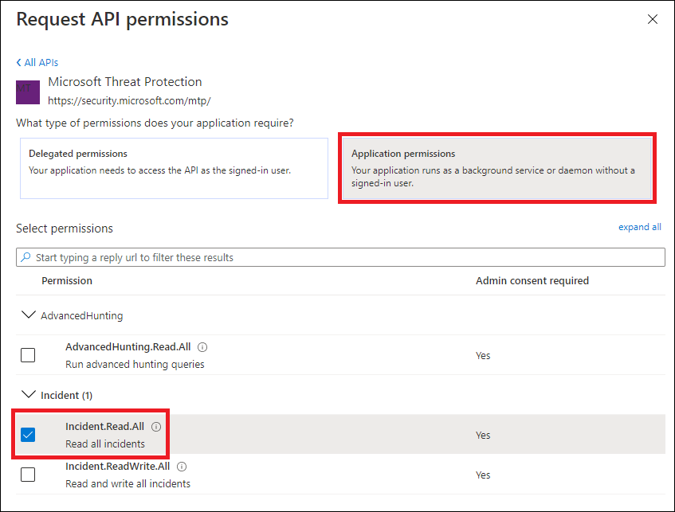
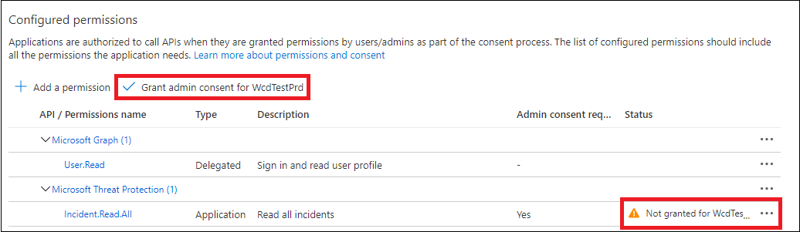
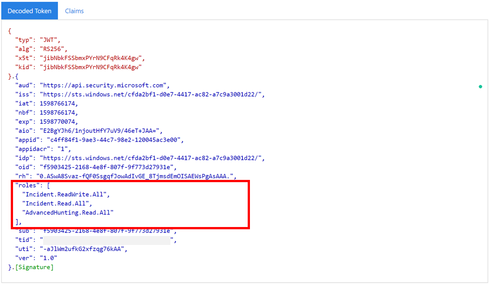

# Hello World for Microsoft 365 Defender REST API 

[!INCLUDE [Microsoft 365 Defender rebranding](../includes/microsoft-defender.md)]


**Applies to:**
- Microsoft 365 Defender

>[!IMPORTANT] 
>Some information relates to prereleased product which may be substantially modified before it's commercially released. Microsoft makes no warranties, express or implied, with respect to the information provided here.


## Get incidents using a simple PowerShell script

### How long it takes to go through this example?
It only takes 5 minutes done in two steps:
- Application registration
- Use examples: only requires copy/paste of a short PowerShell script

### Do I need a permission to connect?
For the Application registration stage, you must have a **Global administrator** role in your Azure Active Directory (Azure AD) tenant.

### Step 1 - Create an App in Azure Active Directory

1. Log on to [Azure](https://portal.azure.com) with your **Global administrator** user.

2. Navigate to **Azure Active Directory** > **App registrations** > **New registration**. 

   

3. In the registration form, choose a name for your application and then select **Register**.

4. Allow your Application to access Microsoft Defender for Endpoint and assign it **Read all incidents** permission:

   - On your application page, select **API Permissions** > **Add permission** > **APIs my organization uses** > type **Microsoft 365 Defender** and select on **Microsoft 365 Defender**.

   >[!NOTE]
   >Microsoft 365 Defender does not appear in the original list. You need to start writing its name in the text box to see it appear.

   

   - Choose **Application permissions** > **Incident.Read.All** > Select on **Add permissions**

   

   >[!IMPORTANT]
   >You need to select the relevant permissions. 

     For instance,

     - To determine which permission you need, please look at the **Permissions** section in the API you are interested to call.

5. Select **Grant admin consent**

	- >[!NOTE]
      > Every time you add permission you must select on **Grant consent** for the new permission to take effect.

	

6. Add a secret to the application.

	- Select **Certificates & secrets**, add description to the secret and select **Add**.

    >[!IMPORTANT]
    > After selecting **Add**, **copy the generated secret value**. You won't be able to retrieve after you leave!

    

7. Write down your application ID and your tenant ID:

   - On your application page, go to **Overview** and copy the following:

   


Done! You have successfully registered an application.

### Step 2 - Get a token using the App and use this token to access the API.

-   Copy the script below to PowerShell ISE or to a text editor, and save it as "**Get-Token.ps1**"
-   Running this script will generate a token and will save it in the working folder under the name "**Latest-token.txt**".

```
# That code gets the App Context Token and save it to a file named "Latest-token.txt" under the current directory
# Paste below your Tenant ID, App ID and App Secret (App key).

$tenantId = '' ### Paste your tenant ID here
$appId = '' ### Paste your Application ID here
$appSecret = '' ### Paste your Application secret here

$resourceAppIdUri = 'https://api.security.microsoft.com'
$oAuthUri = "https://login.windows.net/$TenantId/oauth2/token"
$authBody = [Ordered] @{
    resource = "$resourceAppIdUri"
    client_id = "$appId"
    client_secret = "$appSecret"
    grant_type = 'client_credentials'
}
$authResponse = Invoke-RestMethod -Method Post -Uri $oAuthUri -Body $authBody -ErrorAction Stop
$token = $authResponse.access_token
Out-File -FilePath "./Latest-token.txt" -InputObject $token
return $token
```

-   Sanity Check:<br>
Run the script.<br>
In your browser go to: https://jwt.ms/ <br>
Copy the token (the content of the Latest-token.txt file).<br>
Paste in the top box.<br>
Look for the "roles" section. Find the ```Incidents.Read.All``` role.<br>
The below example is from an app that has ```Incidents.Read.All```, ```Incidents.ReadWrite.All``` and ```AdvancedHunting.Read.All``` permissions.



### Lets get the Incidents!

-   The script below will use **Get-Token.ps1** to access the API and will get the incidents last updated in past 48 hours.
-   Save this script in the same folder you saved the previous script **Get-Token.ps1**. 
-   The script a json file with the data in the same folder as the scripts.

```
# Returns Incidents last updated in the past 48 hours.

$token = ./Get-Token.ps1       #run the script Get-Token.ps1  - make sure you are running this script from the same folder of Get-Token.ps1

# Get Incidents from the last 48 hours. Make sure you have incidents in that time frame.
$dateTime = (Get-Date).ToUniversalTime().AddHours(-48).ToString("o")

# The URL contains the type of query and the time filter we created above
$url = "https://api.security.microsoft.com/api/incidents?$filter=lastUpdateTime+ge+$dateTime"

# Set the WebRequest headers
$headers = @{ 
    'Content-Type' = 'application/json'
    'Accept' = 'application/json'
    'Authorization' = "Bearer $token"
}

# Send the webrequest and get the results. 
$response = Invoke-WebRequest -Method Get -Uri $url -Headers $headers -ErrorAction Stop

# Extract the incidents from the results. 
$incidents =  ($response | ConvertFrom-Json).value | ConvertTo-Json -Depth 99

# Get string with the execution time. We concatenate that string to the output file to avoid overwrite the file
$dateTimeForFileName = Get-Date -Format o | foreach {$_ -replace ":", "."}    

# Save the result as json
$outputJsonPath = "./Latest Incidents $dateTimeForFileName.json"     

Out-File -FilePath $outputJsonPath -InputObject $incidents 
```

You're all done! You have just successfully:
-   Created and registered and application
-   Granted permission for that application to read alerts
-   Connected the API
-   Used a PowerShell script to return incidents created in the past 48 hours


## Related topic
- [Access the Microsoft 365 Defender APIs](api-access.md)
- [Access  Microsoft 365 Defender with application context](api-create-app-web.md)
- [Access  Microsoft 365 Defender with user context](api-create-app-user-context.md)
