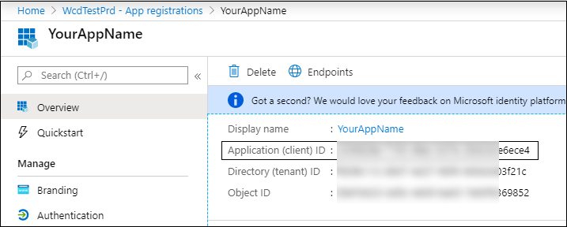

# Partner access through Microsoft 365 Defender APIs

[!INCLUDE [Microsoft 365 Defender rebranding](../includes/microsoft-defender.md)]


**Applies to:**
- Microsoft 365 Defender

>[!IMPORTANT] 
>Some information relates to prereleased product which may be substantially modified before it's commercially released. Microsoft makes no warranties, express or implied, with respect to the information provided here.


This page describes how to create an AAD application to get programmatic access to Microsoft 365 Defender on behalf of your customers.

Microsoft 365 Defender exposes much of its data and actions through a set of programmatic APIs. Those APIs will help you automate work flows and innovate based on Microsoft 365 Defender capabilities. The API access requires OAuth2.0 authentication. For more information, see [OAuth 2.0 Authorization Code Flow](https://docs.microsoft.com/azure/active-directory/develop/active-directory-v2-protocols-oauth-code).

In general, you’ll need to take the following steps to use the APIs:
- Create a **multi-tenant** AAD application.
- Get authorized (consent) by your customer administrator for your application to access Microsoft 365 Defender resources it needs.
- Get an access token using this application.
- Use the token to access Microsoft 365 Defender API.

The following steps with guide you how to create an AAD application, get an access token to Microsoft 365 Defender and validate the token.

## Create the multi-tenant app

1. Log on to your [Azure tenant](https://portal.azure.com) with user that has **Global Administrator** role.

2. Navigate to **Azure Active Directory** > **App registrations** > **New registration**. 

   

3. In the registration form:

	- Choose a name for your application.

	- Supported account types - accounts in any organizational directory.

	- Redirect URI - type: Web, URI: https://portal.azure.com

	


4. Allow your Application to access Microsoft 365 Defender and assign it with the minimal set of permissions required to complete the integration.

   - On your application page, click **API Permissions** > **Add permission** > **APIs my organization uses** > type **Microsoft 365 Defender** and click on **Microsoft 365 Defender**.

   >[!NOTE]
   >Microsoft 365 Defender does not appear in the original list. You need to start writing its name in the text box to see it appear.

   
   
   ### Request API permissions

   To determine which permission you need, please look at the **Permissions** section in the API you are interested to call. 

   In the following example we will use **'Read all incidents'** permission:

   Choose **Application permissions** > **Incidents.Read.All** > Click on **Add permissions**

   


5. Click **Grant consent**

	>[!NOTE]
    >Every time you add permission you must click on **Grant consent** for the new permission to take effect.

	

6. Add a secret to the application.

	- Click **Certificates & secrets**, add description to the secret and click **Add**.

    >[!IMPORTANT]
    > After selecting **Add**, **copy the generated secret value**. You won't be able to retrieve after you leave!

    

7. Write down your application ID:

   - On your application page, go to **Overview** and copy the following:

   

8. Add the application to your customer's tenant.

    You need your application to be approved in each customer tenant where you intend to use it. This is because your application interacts with Microsoft 365 Defender application on behalf of your customer.

    A user with **Global Administrator** from your customer's tenant need to click the consent link and approve your application.

    Consent link is of the form:

    ```
    https://login.microsoftonline.com/common/oauth2/authorize?prompt=consent&client_id=00000000-0000-0000-0000-000000000000&response_type=code&sso_reload=true
    ```

    Where 00000000-0000-0000-0000-000000000000 should be replaced with your Application ID

	After clicking on the consent link, login with the Global Administrator of the customer's tenant and consent the application.

	

	In addition, you will need to ask your customer for their tenant ID and save it for future use when acquiring the token.

- **Done!** You have successfully registered an application! 
- See examples below for token acquisition and validation.

## Get an access token examples:

>[!NOTE]
> To get access token on behalf of your customer, use the customer's tenant ID on the following token acquisitions.

<br>For more details on AAD token, refer to [AAD tutorial](https://docs.microsoft.com/azure/active-directory/develop/active-directory-v2-protocols-oauth-client-creds)

### Using PowerShell

```
# That code gets the App Context Token and save it to a file named "Latest-token.txt" under the current directory
# Paste below your Tenant ID, App ID and App Secret (App key).

$tenantId = '' ### Paste your tenant ID here
$appId = '' ### Paste your Application ID here
$appSecret = '' ### Paste your Application key here

$resourceAppIdUri = 'https://api.security.microsoft.com'
$oAuthUri = "https://login.windows.net/$TenantId/oauth2/token"
$authBody = [Ordered] @{
    resource = "$resourceAppIdUri"
    client_id = "$appId"
    client_secret = "$appSecret"
    grant_type = 'client_credentials'
}
$authResponse = Invoke-RestMethod -Method Post -Uri $oAuthUri -Body $authBody -ErrorAction Stop
$token = $authResponse.access_token
Out-File -FilePath "./Latest-token.txt" -InputObject $token
return $token
```

### Using C#:

>The below code was tested with Nuget Microsoft.IdentityModel.Clients.ActiveDirectory

- Create a new Console Application
- Install Nuget [Microsoft.IdentityModel.Clients.ActiveDirectory](https://www.nuget.org/packages/Microsoft.IdentityModel.Clients.ActiveDirectory/)
- Add the below using

    ```
    using Microsoft.IdentityModel.Clients.ActiveDirectory;
    ```

- Copy/Paste the below code in your application (do not forget to update the 3 variables: ```tenantId, appId, appSecret```)

    ```
    string tenantId = "00000000-0000-0000-0000-000000000000"; // Paste your own tenant ID here
    string appId = "11111111-1111-1111-1111-111111111111"; // Paste your own app ID here
    string appSecret = "22222222-2222-2222-2222-222222222222"; // Paste your own app secret here for a test, and then store it in a safe place! 

    const string authority = "https://login.windows.net";
    const string mtpResourceId = "https://api.security.microsoft.com";

    AuthenticationContext auth = new AuthenticationContext($"{authority}/{tenantId}/");
    ClientCredential clientCredential = new ClientCredential(appId, appSecret);
    AuthenticationResult authenticationResult = auth.AcquireTokenAsync(mtpResourceId, clientCredential).GetAwaiter().GetResult();
    string token = authenticationResult.AccessToken;
    ```


### Using Curl

> [!NOTE]
> The below procedure supposed Curl for Windows is already installed on your computer

- Open a command window
- Set CLIENT_ID to your Azure application ID
- Set CLIENT_SECRET to your Azure application secret
- Set TENANT_ID to the Azure tenant ID of the customer that wants to use your application to access Microsoft 365 Defender application
- Run the below command:

```
curl -i -X POST -H "Content-Type:application/x-www-form-urlencoded" -d "grant_type=client_credentials" -d "client_id=%CLIENT_ID%" -d "scope=https://api.security.microsoft.com.default" -d "client_secret=%CLIENT_SECRET%" "https://login.microsoftonline.com/%TENANT_ID%/oauth2/v2.0/token" -k
```

You will get an answer of the form:

```
{"token_type":"Bearer","expires_in":3599,"ext_expires_in":0,"access_token":"eyJ0eXAiOiJKV1QiLCJhbGciOiJSUzI1NiIsIn <truncated> aWReH7P0s0tjTBX8wGWqJUdDA"}
```

## Validate the token

Sanity check to make sure you got a correct token:

- Copy/paste into [JWT](https://jwt.ms) the token you get in the previous step in order to decode it
- Validate you get a 'roles' claim with the desired permissions
- In the screenshot below, you can see a decoded token acquired from an Application with multiple permissions to Microsoft 365 Defender:
- The "tid" claim is the tenant ID the token belongs to.


## Use the token to access Microsoft 365 Defender API

- Choose the API you want to use, for more information, see [Supported Microsoft 365 Defender APIs](api-supported.md)
- Set the Authorization header in the Http request you send to "Bearer {token}" (Bearer is the Authorization scheme)
- The Expiration time of the token is 1 hour (you can send more then one request with the same token)

- Example of sending a request to get a list of incidents **using C#** 
    ```
    var httpClient = new HttpClient();

    var request = new HttpRequestMessage(HttpMethod.Get, "https://api.security.microsoft.com/api/incidents");

    request.Headers.Authorization = new AuthenticationHeaderValue("Bearer", token);

    var response = httpClient.SendAsync(request).GetAwaiter().GetResult();

    // Do something useful with the response
    ```

## Related topics 

- [Access the Microsoft 365 Defender APIs](api-access.md)
- [Access  Microsoft 365 Defender with application context](api-create-app-web.md)
- [Access  Microsoft 365 Defender with user context](api-create-app-user-context.md)
