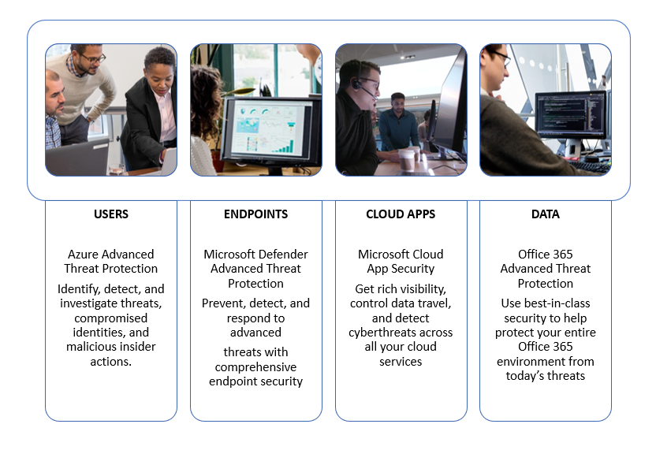

# Configure Microsoft Threat Protection pillars for your trial lab environment

**Applies to:**
- Microsoft Threat Protection

Creating a Microsoft Threat Protection trial lab environment and deploying it is a three-phase process:

 
<table border="0" width="100%" align="center">
  <tr style="text-align:center;">
    <td align="center" style="width:25%; border:0;" >
      <a href= "https://docs.microsoft.com/microsoft-365/security/mtp/prepare-mtpeval?view=o365-worldwide"> 
        
       Phase 1: Prepare </a> 
    </td>
     <td align="center">
      <a href="https://docs.microsoft.com/microsoft-365/security/mtp/setup-mtpeval?view=o365-worldwide">
        
       Phase 2: Setup </a> 
    </td>
    <td align="center" bgcolor="#d5f5e3">
      <a href="https://docs.microsoft.com/microsoft-365/security/mtp/config-mtpeval?view=o365-worldwide">
        
       Phase 3: Configure & Onboard </a> 
</td>

  </tr>
</table>

You are currently in the configuration phase.

Preparation is key to any successful deployment. In this article, you'll be guided on the points you'll need to consider as you prepare to deploy Microsoft Defender ATP.

## Microsoft Threat Protection pillars
Microsoft Threat Protection consists of four pillars. Although one pillar can already provide value to your network organization's security, enabling the four Microsoft Threat Protection pillars will give your organization the most value.

  

This section will guide you to configure:
-	Office 365 Advanced Threat Protection
-	Azure Advanced Threat Protection 
-	Microsoft Cloud App Security
-	Microsoft Defender Advanced Threat Protection

## Configure Office 365 Advanced Threat Protection
>[!NOTE]
>Skip this step if you have already enabled Office 365 Advanced Threat Protection. 

There is a PowerShell Module called the *Office 365 Advanced Threat Protection Recommended Configuration Analyzer (ORCA)* that helps determine some of these settings. When run as an administrator in your tenant, get-ORCAReport will help generate an assessment of the anti-spam, anti-phish, and other message hygiene settings. You can download this module from https://www.powershellgallery.com/packages/ORCA/. 

1. Navigate to [Office 365 Security & Compliance Center](https://protection.office.com/homepage) > **Threat management** > **Policy**.
  
 
2. Click **ATP anti-phishing**, select **Create** and fill in the policy name and description. Click **Next**.
  

>[!NOTE]
>Edit your Advanced ATP anti-phishing policy. Change **Advanced Phishing Threshold** to **2 - Aggressive**.
 

3. Click the **Add a condition** drop-down menu and select your domain(s) as recipient domain. Click **Next**.
  
 
4. Review your settings. Click **Create this policy** to confirm. 
  
 
5. Select **ATP Safe attachments** and select the **Turn on ATP for SharePoint, OneDrive, and Microsoft Teams** option.  
  

6. Click the + icon to create a new safe attachment policy, apply it as recipient domain to your domains. Click **Save**.
  
 
7. Next, select the **ATP Safe Links** policy, then click the pencil icon to edit the default policy.

8. Make sure that the **Do not track when users click safe links** option is not selected, while the rest of the options are selected. See [Safe Links settings](https://docs.microsoft.com/microsoft-365/security/office-365-security/recommended-settings-for-eop-and-office365-atp?view=o365-worldwide) for details. Click **Save**. 
  

9. Next select the **Anti-malware** policy, select the default, and choose the pencil icon.

10. Click **Settings** and select **Yes and use the default notification text** to enable **Malware Detection Response**. Turn the **Common Attachment Types Filter** on. Click **Save**.
   
  
11. Navigate to [Office 365 Security & Compliance Center](https://protection.office.com/homepage) > **Search** > **Audit log search** and turn Auditing on.  
  

12. Integrate Office 365 ATP with Microsoft Defender ATP. Navigate to [Office 365 Security & Compliance Center](https://protection.office.com/homepage) > **Threat management** > **Explorer** and select **WDATP Settings** on the upper right corner of the screen. In the Microsoft Defender ATP connection dialog box, turn on **Connect to Windows ATP**.
  

## Configure Azure Advanced Threat Protection
>[!NOTE]
>Skip this step if you have already enabled Azure Advanced Threat Protection

1. Navigate to [Microsoft 365 Security Center](https://security.microsoft.com/info) > select **More Resources** > **Azure Advanced Threat Protection**.
  

2. Click **Create** to start the Azure Advanced Threat Protection wizard. 
   

3. Choose **Provide a username and password to connect to your Active Directory forest**.  
  

4. Enter your Active Directory on-premises credentials. This can be any user account that has read access to Active Directory.
  

5. Next, choose **Download Sensor Setup** and transfer file to your domain controller. 
  

6. Execute the Azure ATP Sensor Setup and begin following the wizard.
   
 
7. Click **Next** at the sensor deployment type.
   
 
8. Copy the access key as you will need to enter it next in the Wizard.
  
 
9. Copy the access key into the Wizard and click **Install**. 
   

10. Congratulations, you have successfully configured Azure Advanced Threat Protection on your domain controller.
  
 
11. Under the [Azure Azure ATP](https://go.microsoft.com/fwlink/?linkid=2040449) settings section, select **Windows Defender ATP**, then turn the toggle on. Click **Save**. 
  

>[!NOTE]
>Windows Defender ATP has been rebranded as Microsoft Defender ATP. Rebranding changes across all of our portals are being rolled out the for consistency.

## Configure Microsoft Cloud App Security
>[!NOTE]
>Skip this step if you have already enabled Microsoft Cloud App Security. 

1. Navigate to [Microsoft 365 Security Center](https://security.microsoft.com/info) > **More Resources** > **Microsoft Cloud App Security**.
  

2. At the information prompt to integrate Azure ATP, select **Enable Azure ATP data integration**. 
   

>[!NOTE]
>If you don’t see this prompt, it might mean that your Azure ATP data integration has already been enabled. However, if you are not sure, contact your IT Administrator to confirm. 

3. Go to **Settings**, turn the **Azure ATP integration** toggle on, then click **Save**. 
  
>[!NOTE]
>For new Azure ATP instances, this integration toggle is automatically turned on. Confirm that your Azure ATP integration has been enabled before you proceed to the next step.
 
4. Under the Cloud discovery settings, select **Microsoft Defender ATP integration**, then enable the integration. Click **Save**.
  

5. Under Cloud discovery settings, select **User enrichment**, then enable the integration with Azure Active Directory.
  

## Configure Microsoft Defender Advanced Threat Protection
>[!NOTE]
>Skip this step if you have already enabled Microsoft Defender Advanced Threat Protection.

1. Navigate to [Microsoft 365 Security Center](https://security.microsoft.com/info) > **More Resources** > **Microsoft Defender Security Center**. Click **Open**.
   
 
2. Follow the Microsoft Defender Advanced Threat Protection wizard. Click **Next**. 
   

3. Choose based on your preferred data storage location, data retention policy, organization size, and opt-in for preview features. 
   
>[!NOTE]
>You cannot change some of the settings, like data storage location, afterwards. 
 

Click **Next**. 

4. Click **Continue** and it will provision your Microsoft Defender ATP tenant.
   

5. Onboard your endpoints through Group Policies, Microsoft Endpoint Manager or by running a local script to Microsoft Defender ATP. For simplicity, this guide uses the local script.

6. Click **Download package** and copy the onboarding script to your endpoint(s).  
   

7. On your endpoint, run the onboarding script as Administrator and choose Y. 
   

8. Congratulations, you have onboarded your first endpoint.  
   

9. Copy-paste the detection test from the Microsoft Defender ATP wizard.
   

10. Copy the PowerShell script to an elevated command prompt and run it. 
   

11. Select **Start using Microsoft Defender ATP** from the Wizard.
   
 
12. Visit the [Microsoft Defender Security Center](https://securitycenter.windows.com/). Go to **Settings** and then select **Advanced features**. 
   

13. Turn on the integration with **Azure Advanced Threat Protection**.  
   

14. Turn on the integration with **Office 365 Threat Intelligence**.
   

15. Turn on integration with **Microsoft Cloud App Security**.
   

16. Scroll down and click **Save preferences** to confirm the new integrations.
   

## Start the Microsoft Threat Protection service
>[!NOTE]
>Starting June 1, 2020, Microsoft automatically enables Microsoft Threat Protection features for all eligible tenants. See this [Microsoft Tech Community article on license eligibility](https://techcommunity.microsoft.com/t5/security-privacy-and-compliance/microsoft-threat-protection-will-automatically-turn-on-for/ba-p/1345426) for details. 
 

Go to [Microsoft 365 Security Center](https://security.microsoft.com/homepage). Navigate to **Settings** and then select **Microsoft Threat Protection**.
   

For a more comprehensive guidance, see [Turn on Microsoft Threat Protection](mtp-enable.md). 

Congratulations! You've just created your Microsoft Threat Protection trial lab environment! You can now simulate an attack and see how the cross product capabilities detect, create alerts, and automatically respond to a fileless attack on an endpoint.

## Next steps
[Generate a test alert](generate-test-alert.md).
