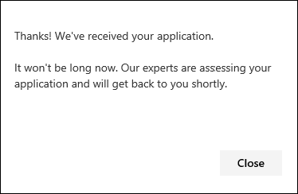

# Configure and manage Microsoft Threat Experts capabilities through Microsoft 365 Defender

[!INCLUDE [Microsoft 365 Defender rebranding](../includes/microsoft-defender.md)]

**Applies to:**

- [Microsoft 365 Defender](https://go.microsoft.com/fwlink/?linkid=2118804)
- [Microsoft Defender for Endpoint](https://go.microsoft.com/fwlink/p/?linkid=2154037)

[!INCLUDE [Prerelease](../includes/prerelease.md)]

## Before you begin

> [!IMPORTANT]
> Before you apply, make sure to discuss the eligibility requirements for the Microsoft Threat Experts – Targeted Attack Notifications managed threat hunting service with your Microsoft Technical Service provider and account team.

To receive targeted attack notifications, you'll need to have Microsoft 365 Defender deployed with devices enrolled. Then, submit an application through the M365 portal for Microsoft Threat Experts - Targeted Attack Notifications.

Contact your account team or Microsoft representative to subscribe to Microsoft Threat Experts - Experts on Demand. Experts on Demand lets you consult with our threat experts on how to protect your organization from relevant detections and adversaries.

## Apply for Microsoft Threat Experts - Targeted Attack Notifications service

If you already have Microsoft Defender for Endpoint and Microsoft 365 Defender, you can apply for Microsoft Threat Experts – Targeted Attack Notifications through their Microsoft 365 Defender portal.  Targeted attack notifications grant you special insight and analysis to help identify the most critical threats to your organization, so you can respond to them quickly.

1. From the navigation pane, go to **Settings > Endpoints > General > Advanced features > Microsoft Threat Experts - Targeted Attack Notifications**.

2. Select **Apply**.

    

3. Enter your name and email address so that Microsoft can contact you about your application.

    

4. Read the [privacy statement](https://privacy.microsoft.com/en-us/privacystatement), then select **Submit** when you're done. You'll receive a welcome email once your application is approved.

    

5. After you receive your welcome email, you'll automatically start receiving targeted attack notifications.

6. You can verify your status by visiting **Settings > Endpoints > General > Advanced features**. Once approved, the **Microsoft Threat Experts - Targeted Attack Notification** toggle will be visible and switched **On**.

## Where you'll see the targeted attack notifications from Microsoft Threat Experts

You can receive targeted attack notification from Microsoft Threat Experts through the following mediums:

- The Microsoft 365 Defender portal's **Incidents** page
- The Microsoft 365 Defender portal's **Alerts** dashboard
- OData alerting [API](/windows/security/threat-protection/microsoft-defender-atp/get-alerts) and [REST API](/windows/security/threat-protection/microsoft-defender-atp/pull-alerts-using-rest-api)
- [DeviceAlertEvents](/windows/security/threat-protection/microsoft-defender-atp/advanced-hunting-devicealertevents-table) table in Advanced hunting
- Your inbox, if you choose to have targeted attack notifications sent to you via email. See [Create an email notification rule](#create-an-email-notification-rule) below.

### Create an email notification rule

You can create rules to send email notifications for notification recipients. For full details, see  [Configure alert notifications](/windows/security/threat-protection/microsoft-defender-atp/configure-email-notifications) to create, edit, delete, or troubleshoot email notification.

## View targeted attack notifications

You'll start receiving targeted attack notification from Microsoft Threat Experts in your email after you have configured your system to receive email notification.

1. Select the link in the email to go to the corresponding alert context in the dashboard tagged with **Threat experts**.

2. From the **Alerts** page, select the same alert topic as the one you received in the email, to view further details.

## Subscribe to Microsoft Threat Experts - Experts on Demand

If you're already a Microsoft Defender for Endpoint customer, you can contact your Microsoft representative to subscribe to Microsoft Threat Experts - Experts on Demand.

## Consult a Microsoft threat expert about suspicious cybersecurity activities in your organization

You can contact Microsoft Threat Experts from inside the Microsoft 365 Defender portal. Experts can help you understand complex threats and targeted attack notifications. Partner with experts for further details about alerts and incidents, or advice on handling compromise. Gain insight into the threat intelligence context described by your portal dashboard.

> [!NOTE]
>
> - Alert inquiries related to your organization's customized threat intelligence data are not currently supported. Consult with your security operations or incident response team for details.
> - You need to have the **Manage security settings in Security Center** permission in the Microsoft 365 Defender portal to submit an inquiry through the **Consult a threat expert** form.

1. Navigate to the portal page related to the information that you'd like to investigate: for example, **Device**, **Alert**, or **Incident**. Make sure that the portal page related to your inquiry is in view before you send an investigation request.

2. From the top menu, select **? Consult a threat expert**.

    

    A flyout screen will open.

    The header will indicate if you are on a trial subscription, or a full Microsoft Threat Experts - Experts on-Demand subscription.

    

    The **Investigation topic** field will already be populated with the link to the relevant page for your request.

3. In the next field, provide enough information to give the Microsoft Threat Experts enough context to start the investigation.

4. Enter the email address that you'd like to use to correspond with Microsoft Threat Experts.

> [!NOTE]
> If you would like to track the status of your Experts on Demand cases through Microsoft Services Hub, reach out to your technical account manager.

Watch this video for a quick overview of the Microsoft Services Hub.

> [!VIDEO https://www.microsoft.com/videoplayer/embed/RE4pk9f]

## Sample investigation topics

### Alert information

- We saw a new type of alert for a living-off-the-land binary. We can provide the alert ID. Can you tell us more about this alert and how we can investigate it further?
- We've observed two similar attacks, which both try to execute malicious PowerShell scripts but generate different alerts. One is "Suspicious PowerShell command line" and the other is "A malicious file was detected based on indication provided by O365". What is the difference?
- We received an odd alert today about an abnormal number of failed logins from a high profile user’s device. We can't find any further evidence for these attempts. How can Microsoft 365 Defender see these attempts? What type of logins are being monitored?
- Can you give more context or insight about the alert, "Suspicious behavior by a system utility was observed"?
- I observed an alert titled "Creation of forwarding/redirect rule". I believe the activity is benign. Can you tell me why I received an alert?

### Possible machine compromise

- Can you help explain why we see a message or alert for "Unknown process observed" on many devices in our organization? We appreciate any input to clarify whether this message or alert is related to malicious activity.
- Can you help validate a possible compromise on the following system, dating from last week? It's behaving similarly as a previous malware detection on the same system six months ago.

### Threat intelligence details

- We detected a phishing email that delivered a malicious Word document to a user. The document caused a series of suspicious events, which triggered multiple alerts for a particular malware family. Do you have any information on this malware? If yes, can you send us a link?
- We recently saw a blog post about a threat that is targeting our industry. Can you help us understand what protection Microsoft 365 Defender provides against this threat actor?
- We recently observed a phishing campaign conducted against our organization. Can you tell us if this was targeted specifically to our company or vertical?

### Microsoft Threat Experts’ alert communications

- Can your incident response team help us address the targeted attack notification that we got?
- We received this targeted attack notification from Microsoft Threat Experts. We don’t have our own incident response team. What can we do now, and how can we contain the incident?
- We received a targeted attack notification from Microsoft Threat Experts. What data can you provide to us that we can pass on to our incident response team?

> [!NOTE]
> Microsoft Threat Experts is a managed threat hunting service and not an incident response service. However, the experts can seamlessly transition the investigation to Microsoft Cybersecurity Solutions Group (CSG)'s Detection and Response Team (DART) services, when necessary. You can also opt to engage with your own incident response team to address issues that requires an incident response.

## Scenario

### Receive a progress report about your managed hunting inquiry

The response from Microsoft Threat Experts will vary according to your inquiry. You'll generally receive one of the following responses:

- More information is needed to continue with the investigation
- A file or several file samples are needed to determine the technical context
- Investigation requires more time
- Initial information was enough to conclude the investigation

If an expert requests more information or file samples, it's crucial to respond quickly to keep the investigation moving.

## See also

- [Microsoft Threat Experts overview](microsoft-threat-experts.md)
