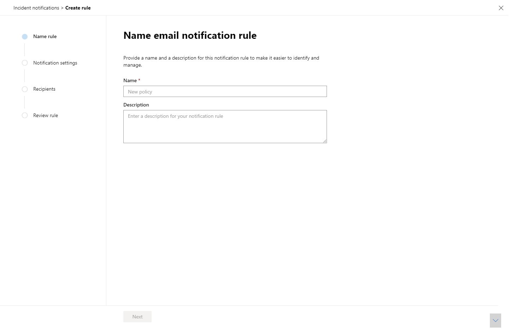
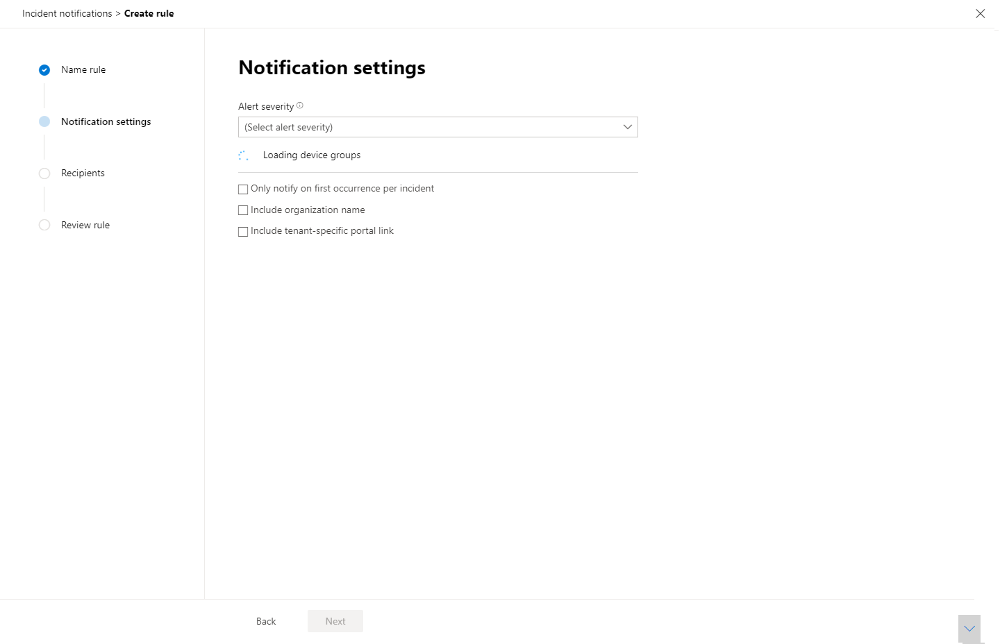
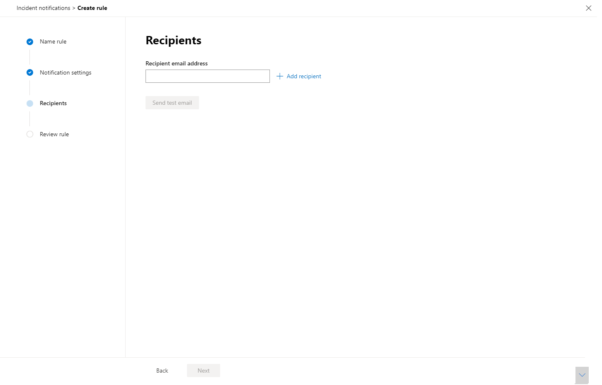

# Get incident notifications by email

[!INCLUDE [Microsoft 365 Defender rebranding](../includes/microsoft-defender.md)]

**Applies to:**
- Microsoft 365 Defender

You can set up Microsoft 365 Defender to notify you by email every time there are new incidents or new updates to existing incidents. 

You can choose to get notifications based on incident severity or by device group. You can also choose to get a notification only on the first update per incident.

You can add or remove other recipients in the email notifications. Newly added recipients get notified about incidents after they are added. 

The email notification contains important details about the incident like the incident name, severity, and categories, among others. You can also directly go to incidents to start your investigation right away. For more on investigating incidents, see [Investigate incidents in Microsoft 365 Defender](https://docs.microsoft.com/microsoft-365/security/mtp/investigate-incidents).

>[!NOTE]
>You need 'Manage security settings' permissions to configure email notification settings. If you've chosen to use basic permissions management, users with Security Administrator or Global Administrator roles can configure email notifications for you.    
Likewise, if your organization is using role-based access control (RBAC), you can only create, edit, delete, and receive notifications based on device groups that you are allowed to manage.

## Create rules for incident notifications

To set up your first email notification for incidents, create a new rule and customize email notification settings.

1. In the navigation pane, select **Settings** > **Incident email notifications**.
2. Select **Add item**.
3. Give the rule a name in **Name** and supply a **Description**.

     
4. Select **Next** to go to **Notification settings**. Here you can specify the following:
    - **Alert severity** - Choose the alert severity that will trigger an inncident notification. For example, if you only want to be informed about High severity incidents, select High.
    - **Device group scope** - This displays all the device groups the user can access. Select which device groups you are creating the incident notification rules for.
    - **Only notify on first occurrence per incident** - Selecting this option will send an email notification only on the first alert that matches your other selections. Subsequent updates or alerts related to the incident will not trigger a notification.
    - **Include organization name** - Indicates whether or not the customer name appears on the email notification.
    - **Include tenant-specific portal link** -  Adds a link with the tenant ID to allow access to a specific tenant.
    
    
5. Select **Next** to go the **Recipients** section. Here you can specify email addresses that will receive the incident email notifications. Select **Add a recipient** after typing every email address.

     

6. Finally, select **Next** to go to **Review rule** so you can see all the settings associated with your new rule.

