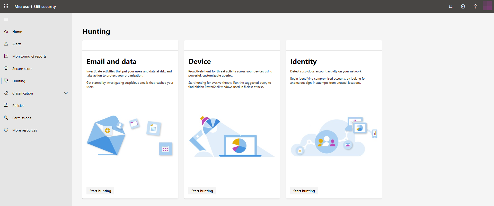

# Hunt for threats in Microsoft 365

With threat hunting capabilities in the Microsoft 365 security center, you can proactively find threats in your organization affecting email and data, devices, and identities. From the **Hunting** screen, you can access threat hunting tools made available by various solutions:
- Office 365 ATP — [hunt for threats to email and data](../office-365-security/office-365-atp.md)
- Microsoft Defender ATP — [hunt for threats to devices](https://docs.microsoft.com/windows/security/threat-protection/microsoft-defender-atp/advanced-hunting)
- Azure ATP — [hunt for threats to identities](https://docs.microsoft.com/azure-advanced-threat-protection/investigate-a-user)

## Hunt with Microsoft Threat Protection

[Turn on Microsoft Threat Protection](mtp-enable.md) to get the advanced hunting query interface directly in the Microsoft 365 security center. With [advanced hunting](advanced-hunting-overview.md), you can create single queries that look into data from both Microsoft Defender ATP, covering data from onboarded devices, and Office 365 ATP, providing data from emails.

## Related topics
- [Advanced hunting overview](advanced-hunting-overview.md)
- [Microsoft Threat Protection overview](microsoft-threat-protection.md)
- [Turn on Microsoft Threat Protection](mtp-enable.md)