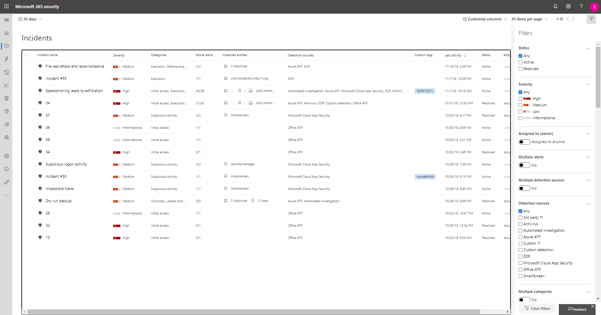

# Prioritize incidents in Microsoft Threat Protection

**Applies to:**
- Microsoft Threat Protection

[!INCLUDE [Prerelease information](../includes/prerelease.md)]

Microsoft Threat Protection applies correlation analytics and aggregates all related alerts and investigations from different products into one incident. Microsoft Threat Protection also triggers unique alerts on activities that can only be identified as malicious given the end-to-end visibility that Microsoft Threat Protection has across the entire estate and suite of products. By doing so, Microsoft Threat Protection narrates the broader attack story, allowing a security operations analyst to understand and deal with complex threats across the organization.

The **Incidents queue** shows a collection of incidents that were flagged from across devices, users, and mailboxes. It helps you sort through incidents to prioritize and create an informed cybersecurity response decision.

 

By default, the queue in the Microsoft 365 security center displays incidents seen in the last 30 days, with the most recent incident showing at the top of the list, helping you see the most recent incidents first.

The incident queue exposes customizable columns that give you visibility into different characteristics of the incident or the contained entities, helping you make an informed decision regarding prioritization of incidents to handle. 

The incident queue also exposes multiple filtering options, that when applied, enable you to choose to perform a broad sweep of all existing incidents in your environment, or decide to focus on a specific scenario or threat. Applying filters on the incident queue can help determine which incident requires immediate attention. 

## Available filters

### Status
You can choose to limit the list of incidents shown based on their status to see which ones are active or resolved.

### Severity
The severity of an incident is indicative of the impact it can have in your assets. The higher the severity the bigger the impact and typically requires the most immediate attention. 

### Assigned to (owner)
You can choose to filter the list by selecting assigned to anyone or ones that are assigned to you.

### Multiple alerts 
Filter to see only incidents containing more than one alert. This could be an indication for an attack that is more complex or progressed in the kill chain. 

### Multiple service sources 
Filter to only see incidents that contain alerts from different sources (Microsoft Defender ATP, Microsoft Cloud App Security, Azure ATP, Office 365 ATP)
### Service sources
By choosing a specific source, you can focus on incidents that contain at least one alert from that chosen source. 

### Multiple categories 
You can choose to see only incidents that have mapped to multiple categories of the kill chain and can potentially cause more damage. 

### Categories
Choose specific categories to focus on a specific step in the kill chain

### Data sensitivity
Some attacks focus on targeting to exfiltrate sensitive or valuable data. By applying a filter to see if sensitive data is involved in the incident, you can quickly determine if sensitive information has potentially been compromised and prioritize addressing those incidents.

>[!NOTE]
>Only applicable if Microsoft Information Protection is turned on.

## Next steps
After you've determined which incident requires the highest priority, you can proceed to do further investigative work on an incident.
- [Investigate incidents](investigate-incidents.md)

## Related topics
- [Incidents overview](incidents-overview.md)
- [Investigate incidents](investigate-incidents.md)
- [Manage incidents](manage-incidents.md)