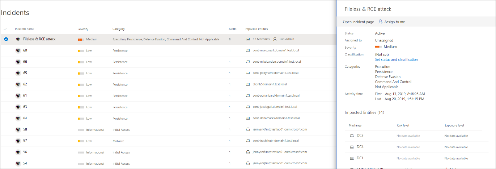
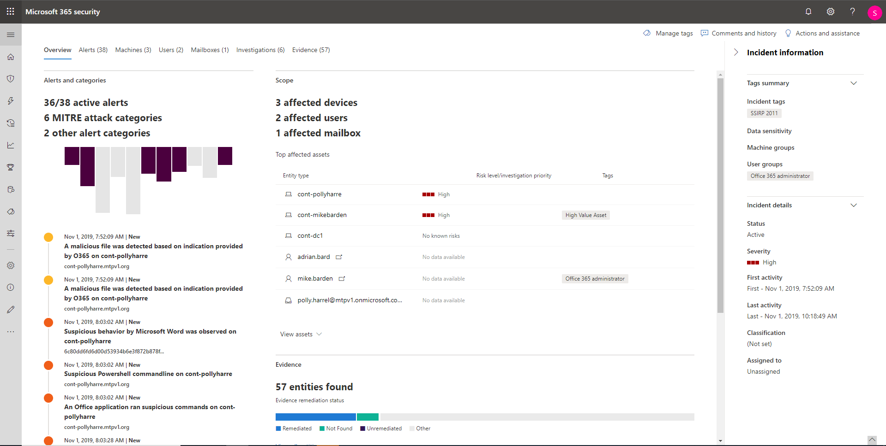
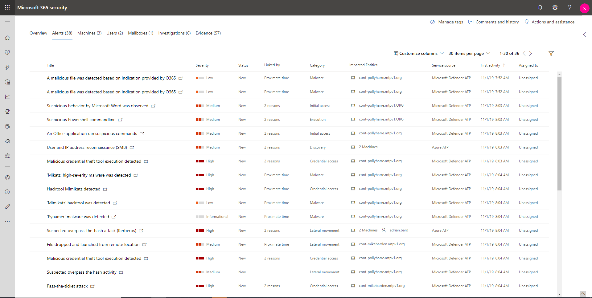

# Investigate incidents in Microsoft Threat Protection

**Applies to:**
- Microsoft Threat Protection

Microsoft Threat Protection aggregates all related alerts, assets, investigations and evidence from across your devices, users, and mailboxes to give you a comprehensive look into the entire breadth of an attack. 

Investigate the alerts that affect your network, understand what they mean, and collate evidence associated with the incidents so that you can devise an effective remediation plan. 

## Investigate an incident

1. Select an incident from the incident queue.   This opens a side panel and gives a preview of important information such as status, severity, categories, and the impacted entities.

    

2. Select **Open incident page**.   This opens the incident page where you'll find more information incident details, comments and actions, tabs (overview, alerts, devices, users, investigations, evidence).

3. Review the alerts, devices, users, other entities involved in the incident.

## Incident overview 
The overview page gives you a snapshot glance into the top things to notice about the incident.

The attack categories give you visual and numeric view of how advanced the attack has progressed against the kill chain. As with other Microsoft security products, Microsoft Threat Protection is aligned to the [MITRE ATT&CK&trade;](https://attack.mitre.org/) framework. 

The scope section gives you a list of top impacted assets that are part of this incident. If there is specific information regarding this asset, such as risk level, investigation priority as well as any tagging on the assets this will also surface in this section.

The alerts timeline provides a sneak peek into the chronological order in which the alerts occurred, as well as the reasons that these alerts linked to this incident.

And last - the evidence section provides a summary of how many different artifacts were included in the incident and their remediation status, so you can immediately identify if any action is needed on your end. 

This overview can assist in the initial triage of the incident by providing insight to the top characteristics of the incident that you should be aware of. 

## Alerts 
You can view all the alerts related to the incident and other information about them such as severity, entities that were involved in the alert, the source of the alerts (Azure ATP, Microsoft Defender ATP , Office  365 ATP) and the reason they were linked together. 

By default, the alerts are ordered chronologically, to allow you to first view how the attack played out over time. Clicking on each alert will lead you to the relevant alert page where you can conduct an in depth investigation of that alert. 

## Devices 
The devices tab lists all the devices where alerts related to the incident are seen. 

Clicking the name of the machine where the attack was conducted navigates you to its Machine page where you can see alerts that were triggered on it and related events provided to ease investigation. 

Selecting the Timeline tab enables you to scroll through the machine timeline and view all events and behaviors observed on the machine in chronological order, interspersed with the alerts raised. 

## Users 
See users that have been identified to be part of, or related to a given incident. 

Clicking the username navigates you to the user's Cloud App Security page where further investigation can be conducted.

## Mailboxes
Investigate mailboxes that's been identified to be part of, or related to an incident. To do further investigative work, selecting the mail related alert will open Office 365 Advanced Threat Protection where you can take remediation actions.

## Investigations
Select **Investigations** to see all the automated investigation striggered by alerts in this incident. The investigations will perform remediation actions or wait for analyst approval of actions, depending on how you configured your automated investigations to run in Microsoft Defender ATP and Office 365 Advanced Threat Protection.

Select an investigation to navigate to the Investigation details page to get full information on the investigation and remediation status. If there are any actions pending for approval as part of the investigation they will appear in the Pending actions tab. Take action as part of incident remediation.

## Evidence
Microsoft Threat Protection automatically investigates all the incidents' supported events and suspicious entities in the alerts, providing you with auto-response and information about the important files, processes, services, emails, and more. This helps quickly detect and block potential threats in the incident. 

Each of the analyzed entities will be marked with a verdict (Malicious, Suspicious, Clean) as well as a remediation status. This assists you in understanding the remediation status of the entire incident and what are the next steps that can be taken to further remediate.

## Related topics
- [Incidents overview](incidents-overview.md)
- [Prioritize incidents](incident-queue.md)
- [Manage incidents](manage-incidents.md)