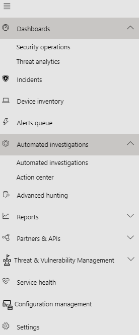

# Microsoft Defender for Endpoint in the Microsoft 365 security center

**Applies to:**
- [Microsoft 365 Defender](https://go.microsoft.com/fwlink/?linkid=2118804)

The new [Microsoft 365 security center](https://docs.microsoft.com/microsoft-365/security/mtp/overview-security-center) at [https://security.microsoft.com](https://security.microsoft.com) combines security capabilities that protect, detect, investigate, and respond to email, collaboration, identity, and device threats. This security center brings together functionality from existing Microsoft security portals, including Microsoft Defender Security Center and the Office 365 Security & Compliance center.

If you are familiar with the Microsoft Defender Security Center, this article helps describe some of the changes and improvements in the new Microsoft 365 security center. However there are some new and updated elements to be aware of.

Historically, the [Microsoft Defender Security Center](https://docs.microsoft.com/windows/security/threat-protection/microsoft-defender-atp/portal-overview) has been the home for Microsoft Defender for Endpoint. Enterprise security teams have used it to monitor and assist in responding to alerts of potential advanced persistent threat activity or data breaches. To help reduce the number of portals, the Microsoft 365 security center will be the new home for monitoring and managing security across your Microsoft identities, data, devices, apps, and infrastructure.

> [!IMPORTANT]
> What you see in the Microsoft 365 security center depends on your current subscriptions. For example, if you don't have a license for Microsoft Defender for Office 365, then the Email & Collaboration section will not be shown.

Take a look at the new security center: [https://security.microsoft.com](https://security.microsoft.com).

Learn more about the benefits: [Overview of the Microsoft 365 security center](overview-security-center.md)

## What's changed

This table is a quick reference of the changes between the Microsoft Defender Security Center and the new Microsoft 365 security center.

### Alerts and actions

|**Area**  |**Description of change**  |
|---------|---------|
| [Incidents & alerts](incidents-overview.md)  | In the Microsoft 365 security center, you can manage incidents and alerts across all of your endpoints, email, and identities. We've converged the experience to help you find related events more easily. For more information, see [Incidents Overview](incidents-overview.md).   |
| [Hunting](advanced-hunting-overview.md)  |  Modifying custom detection rules created in Microsoft Defender for Endpoint to include identity and email tables automatically moves them to Microsoft 365 Defender. Their corresponding alerts will also appear in Microsoft 365 Defender. For more details about these changes, read [Migrate custom detection rules](https://docs.microsoft.com/microsoft-365/security/mtp/advanced-hunting-migrate-from-mdatp#migrate-custom-detection-rules). The `DeviceAlertEvents` table for advanced hunting is not available in Microsoft 365 Defender. To query device-specific alert information in Microsoft 365 Defender, you can use the `AlertInfo` and `AlertEvidence` tables which can accommodate even more information from a diverse set of sources. Craft your next device-related query by following [Write queries without DeviceAlertEvents](https://docs.microsoft.com/microsoft-365/security/mtp/advanced-hunting-migrate-from-mdatp#write-queries-without-devicealertevents).|
|[Action center](mtp-action-center.md)    | Lists pending and completed actions that were taken following automated investigations and remediation actions. Formerly, the Action center in the Microsoft Defender Security Center listed pending and completed actions for remediation actions taken on devices only, while Automated investigations listed alerts and status. In the new and improved Microsoft 365 security center, the Action center brings together remediation actions and investigations across email, devices, and users—all in one location.  |
| [Threat analytics](https://docs.microsoft.com/windows/security/threat-protection/microsoft-defender-atp/threat-analytics) |  Moved from under the "Dashboards" section.   |

### Endpoints

|**Area**  |**Description of change**  |
|---------|---------|
|Search   |  Instead of being in the heading, Microsoft Defender for Endpoint search bar is moving under the Endpoints section. You can continue to search for devices, files, users, URLs, IPs, vulnerabilities, software, and recommendations.  |
|[Dashboard](https://docs.microsoft.com/windows/security/threat-protection/microsoft-defender-atp/security-operations-dashboard)   |  This is your security operations dashboard. It tells you at a glance how many active alerts were triggered, which devices are at risk, which users are at risk, and severity level for alerts, devices, and users. You can also see if any devices have sensor issues, your overall service health, and how any unresolved alerts were detected.      Formerly, the security operations dashboard that was in the Microsoft Defender Security Center also listed the number and status of any automated investigations. In the new and improved Microsoft 365 security center, details about automated investigations are found in the Incidents view. In the navigation pane, go to Incidents & alerts > Incidents. Select an incident, then choose the Investigations tab to view details about an automated investigation.     The threat analytics dashboard is now in the top alerts and actions navigation section.   |
|Device inventory | No changes. |
|[Vulnerability management](https://docs.microsoft.com/windows/security/threat-protection/microsoft-defender-atp/next-gen-threat-and-vuln-mgt)    |    Name was shortened to fit in the navigation pane. It is the same as the threat and vulnerability management section, with all the pages underneath.     |
| Partners and APIs | No changes. |
| Evaluations & tutorials    |     New testing and learning capabilities.     |
| Configuration management   |  No changes.  |

### Access and reporting

|**Area**  |**Description of change**  |
|---------|---------|
| Reports  | See reports from the endpoint section and the email & collaboration section, including the Threat protection, Device health and compliance, and Vulnerable devices reports. |
| Health  |  Currently includes the "Service health" page. |
| Settings |  Manage your settings for the Microsoft 365 security center, Microsoft 365 Defender, Endpoints, Email & collaboration, Identities, and Device discovery.   |

> [!NOTE]
> **Automatic investigation and remediation** is now a part of  incidents. You can see Automated  investigation and remediation events in the **Incident > Investigation** tab. 

> [!NOTE]
> **Service Health** is available from the [Microsoft 365 Admin Center](https://admin.microsoft.com/)

## Microsoft 365 security navigation description

The left navigation, or quick launch bar, will look familiar. However, there are some new and updated elements in this security center.

### Incidents and alerts

Brings together incident and alert management across your email, devices, and identities. Alerts are now available under the Investigation node, and help provide a broader view of an attack. The alert page provides full context to the alert, by combining attack signals to construct a detailed story. Previously, alerts were specific to different workloads. A new, unified experience now brings together a consistent view of alerts across workloads. You can quickly triage, investigate, and take effective action.

- [Learn more about Investigations](incidents-overview.md)
- [Learn more about managing alerts](https://docs.microsoft.com/windows/security/threat-protection/microsoft-defender-atp/review-alerts)

#### Hunting

Proactively search for threats, malware, and malicious activity across your endpoints, Office 365 mailboxes, and more by using [advanced hunting queries](advanced-hunting-overview.md). These powerful queries can be used to  locate and review threat indicators and entities for both known and potential threats.

[Custom detection rules](https://docs.microsoft.com/windows/security/threat-protection/microsoft-defender-atp/custom-detection-rules)  can be built from advanced hunting queries to help you proactively watch for events that might be indicative of breach activity and misconfigured devices.

#### Action center

Action center shows you the investigations created by automated investigation and response capabilities. This automated, self-healing in Microsoft 365 Defender can help security teams by automatically responding to specific events.

[Learn more about Action Center](mtp-action-center.md)

#### Threat Analytics

Threat Analytics provides a summary of the latest threats that could be affecting your organization. With this information, security teams can learn the specifics about each individual threat in the Threat Analytics reports as well as see how these threats might be impacting your organization. New in the Microsoft 365 security center is a combined view of threats that include signals from both Defender for Endpoint as well as Defender for Office 365.

[Learn more about Threat Analytics](https://docs.microsoft.com/windows/security/threat-protection/microsoft-defender-atp/threat-analytics)

### Endpoints

View and manage the security of endpoints in your organization. If you've used the Microsoft Defender security center, this will look familiar.

### Email & collaboration

Track and investigate threats to your users' email, track campaigns, and more. If you've used the Office 365 Security and Compliance center, this will look familiar. 

### Access and reports

View reports, change your settings, and modify user roles.

## Microsoft Defender Security Center navigation

This what the current Microsoft Defender Security Center navigation pane looks like, for comparison.

## Related information

- [Microsoft 365 security center](overview-security-center.md)
- [Microsoft Defender for Endpoint in the Microsoft 365 security center](microsoft-365-security-center-mde.md)
- [Redirecting accounts from Microsoft Defender for Endpoint to the new Microsoft 365 security center](microsoft-365-security-mde-redirection.md)
