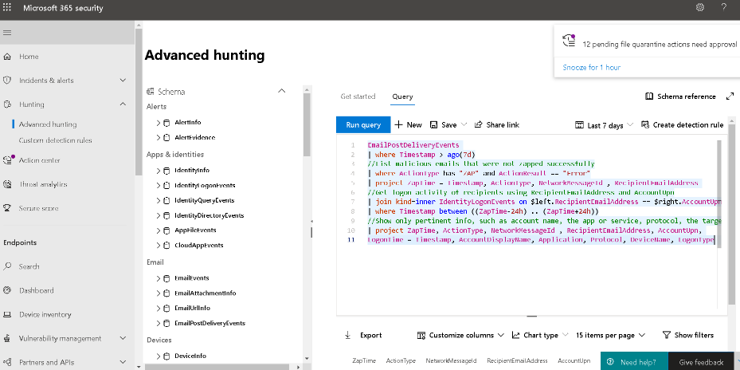

# Microsoft Defender for Office 365 in the Microsoft 365 security center

**Applies to:**
- [Microsoft 365 Defender](https://go.microsoft.com/fwlink/?linkid=2118804)

The new [Microsoft 365 security center](https://docs.microsoft.com/microsoft-365/security/mtp/overview-security-center) at [https://security.microsoft.com](https://security.microsoft.com) combines security capabilities that protect, detect, investigate, and respond to email, collaboration, identity, and device threats. This security center brings together functionality from existing Microsoft security portals, including Microsoft Defender Security Center and the Office 365 Security & Compliance Center.

If you are familiar with the Office 365 Security and Compliance portal, this article helps describe some of the changes and improvements in the new Microsoft 365 Security Center.

Access the new security center: [https://security.microsoft.com](https://security.microsoft.com).

## What's Changed

This table is a quick reference of Email & Collaboration areas where change has occurred between the **Security & Compliance center** and the **Microsoft 365 Security** portal. Click the links to navigate to topics.
<p>

|**Changed**  |**Unchanged**  |
|---------|---------|
|[Dashboard](https://docs.microsoft.com/microsoft-365/security/mtp/microsoft-365-security-center-dashboard)     |  [Explorer](https://docs.microsoft.com/microsoft-365/security/office-365-security/threat-explorer)       |
|[Attack Simulator ](https://docs.microsoft.com/microsoft-365/security/office-365-security/attack-simulation-training-insights)   |  [Policies & Rules](https://docs.microsoft.com/microsoft-365/compliance/alert-policies)       |
|[Investigation](https://docs.microsoft.com/microsoft-365/security/office-365-security/office-365-air#changes-are-coming-soon-in-your-security-center)    |    [Campaign](https://docs.microsoft.com/microsoft-365/security/office-365-security/campaigns)     |
|     |    [Submissions](https://docs.microsoft.com/microsoft-365/security/office-365-security/admin-submission)     |
|     |    [Review](https://docs.microsoft.com/microsoft-365/security/mtp/mtp-action-center)     |
|     |    [Threat Tracker](https://docs.microsoft.com/microsoft-365/security/office-365-security/threat-trackers)    |
|     |          |

Also, check the **Related Information** section at the bottom of this article.

> [!IMPORTANT]
> The Microsoft 365 Security portal (https://security.microsoft.com) combines security features in https://securitycenter.windows.com, and https://protection.office.com. However, what you see will depend on your subscription. If you only have Microsoft Defender for Office 365 Plan 1 or 2, as standalone subscriptions, for example, you won't see capabilities around Security for Endpoints.

## The Microsoft 365 Security Center home page

The home page of the new portal surfaces:

- Secure Score ratings
- the number of users and devices at risk
- active incident lists
- lists of privileged OAuth apps
- device health data
- tweets from Microsoft’s security intelligence twitter feed
- and more summary information

As soon as you arrive at this information page, you’ll also see a pop-up for security notifications if there are any.

:::image type="content" source="../../media/converge-5-microsoft-365-security-center.png" alt-text="This is the Microsoft Security center page with Home, Endpoints, Email and Collaboration, and miscellaneous areas.":::

The home page also welcomes you to the new Microsoft 365 security center experience with three headings **Intro**, **Next steps**, and **Give feedback**.

- The links under **Next steps** will take you to the [Secure Score](https://security.microsoft.com/securescore?viewid=overview) page for deeper analysis of your security posture. Otherwise, clicking to [Proactively hunt](https://security.microsoft.com/advanced-hunting) for intrusions will take you directly to Hunting > Advanced Hunting.
- **Give feedback** allows you to both [join the Windows Insider program](https://insider.windows.com/) and preview coming changes, and the **leave feedback** on your experiences with the portal.

The **Welcome** page will disappear after you navigate through the Next button to Close. Be sure to take note of any URLs you’d want for your records, or bookmark this page (since the URLs are listed above).

The **Guided Tour** will remain on the page and you can choose a tour of Endpoint or Email & collaboration pages.  


Also included is a link to the **Office 365 Security and Compliance center** for comparison. The last link is to the **What's New** page that describes recent updates.

## Navigation and the Guided Tour

The left navigation, or quick launch bar, will look familiar. However, there are some new and updated elements in this security center.

### Alerts & Actions

Brings together incident and alert management across your email, devices, and identities. You can also hunt for security threats using hunting queries.


### Endpoints

View and manage the security of endpoints in your organization. If you've used the Microsoft Defender security center, this will look familiar.


### Email & collaboration

Track and investigate threats to your users' email, track campaigns, and more. If you've used the Office 365 Security and Compliance center, this will familiar.


### Access and Reports

View reports, change your settings, and modify user roles.


## Advanced Hunting example for Microsoft Defender for Office 365
Want to get started searching for email threats using advanced hunting? Try this: 

The *[Getting Started](https://docs.microsoft.com/microsoft-365/security/office-365-security/office-365-atp#getting-started)* section of the [Microsoft Defender for Office 365 article](https://docs.microsoft.com/microsoft-365/security/office-365-security/office-365-atp) has logical early configuration chunks that look like this:

- Configure everything with 'anti' in the name.
    - anti-malware
    - anti-phishing
    - anti-spam
- Set up everything with 'safe' in the name.
    - safe links
    - safe attachments
- Defend the workloads (ex. SharePoint Online, OneDrive, and Teams)
- Protect with Zero-Hour auto purge

Along with a [link](https://docs.microsoft.com/microsoft-365/security/office-365-security/protect-against-threats&preserve-view=true) to jump right in and get configuration going on Day 1.

The last step in **Getting Started** is protecting users with **Zero-Hour auto purge**, also known as ZAP. Knowing if your efforts to ZAP a suspicious or malicious mail, post-delivery, were successful can be very important.

Quickly navigating to Kusto query language to hunt for issues is an advantage of converging these two security centers. Security teams can monitor ZAP misses by taking their next steps [here](https://security.microsoft.com/advanced-hunting), under **Hunting** > **Advanced Hunting**.

1. On the Advanced Hunting page, click Query.
1. Copy the query below into the query window.
1. Select Run query.


```kusto
EmailPostDeliveryEvents 
| where Timestamp > ago(7d)
//List malicious emails that were not zapped successfully
| where ActionType has "ZAP" and ActionResult == "Error"
| project ZapTime = Timestamp, ActionType, NetworkMessageId , RecipientEmailAddress 
//Get logon activity of recipients using RecipientEmailAddress and AccountUpn
| join kind=inner IdentityLogonEvents on $left.RecipientEmailAddress == $right.AccountUpn
| where Timestamp between ((ZapTime-24h) .. (ZapTime+24h))
//Show only pertinent info, such as account name, the app or service, protocol, the target device, and type of logon
| project ZapTime, ActionType, NetworkMessageId , RecipientEmailAddress, AccountUpn, 
LogonTime = Timestamp, AccountDisplayName, Application, Protocol, DeviceName, LogonType
```


The data from this query will appear in the results panel below the query itself. Results include information like 'DeviceName', 'AccountDisplayName', and 'ZapTime' in a customizable result set. Results can also be exported for your records. If the query is one you'll need again, select **Save** > **Save As** and add the query to your list of queries, shared, or community queries.

## Related information

[The Action center](https://docs.microsoft.com/microsoft-365/security/mtp/mtp-action-center)

[Email & collaboration alerts](https://docs.microsoft.com/microsoft-365/compliance/alert-policies#default-alert-policies)

[Hunt for threats across devices, emails, apps, and identities](https://docs.microsoft.com/microsoft-365/security/mtp/advanced-hunting-query-emails-devices)

[Custom detection rules](https://docs.microsoft.com/windows/security/threat-protection/microsoft-defender-atp/custom-detection-rules)

**Attack Simulator** [Create a phishing attack simulation](https://docs.microsoft.com/microsoft-365/security/office-365-security/attack-simulation-training) and [create a payload for training your people](https://docs.microsoft.com/microsoft-365/security/office-365-security/attack-simulation-training-payloads)
