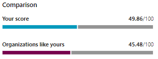

# Track your Microsoft Secure Score history and meet goals

[Microsoft Secure Score](microsoft-secure-score.md) is a measurement of an organization's security posture, with a higher number indicating more improvement actions taken. It can be found at https://security.microsoft.com/securescore in the [Microsoft 365 security center](overview-security-center.md).

## Gain insights into activity that has affected your score

View a graph of your organization's score over time in the **History** tab.

Below the graph is a list of all the actions taken in the selected time range and their attributes, such as resulting points and category. You can customize a date range and filter by category.

If you select the improvement action associated with an activity, the full improvement action flyout will appear.

To view all history for that specific improvement action, select the history link in the flyout.

## Discover trends and set goals

In the **Metrics & trends** tab, there are several graphs and charts to give you more visibility into trends and set goals. You can set the date range for the whole page of visualizations. The visualizations include:

* **Your Secure Score zone** — Customized based on your organization's goals and definitions of good, okay, and bad score ranges.
* **Regression trend** — A timeline of points that have regressed due to configuration, user, or device changes.  
* **Comparison trend** — How your organization's Secure Score compares to others' over time. This view can include lines representing the score average of organizations with similar seat count and a custom comparison view that you can set.
* **Risk acceptance trend** — Timeline of improvement actions marked as "risk accepted."
* **Score changes** — The number of points achieved, points regressed, along with the subsequent score change, in the specified date range.

### Compare your score to organizations like yours

There are two 

## We want to hear from you

If you have any issues, please let us know by posting in the [Security, Privacy & Compliance](https://techcommunity.microsoft.com/t5/Security-Privacy-Compliance/bd-p/security_privacy) community. We're monitoring the community and will provide help.

## Related resources

- [Microsoft Secure Score overview](microsoft-secure-score.md)
- [Gain visibility into your security posture](microsoft-secure-score-improvement-actions.md)
- [What's coming](microsoft-secure-score-whats-coming.md)