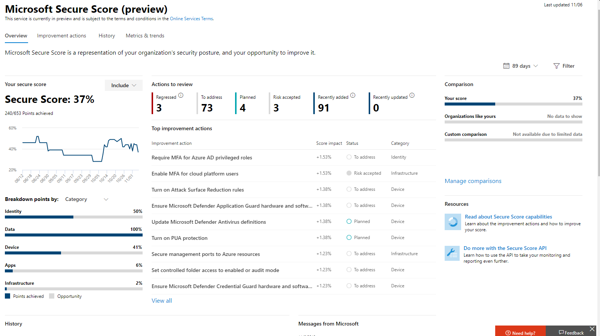

# Microsoft Secure Score (preview)

>[!IMPORTANT]
>Some information relates to prereleased product which may be substantially modified before it's commercially released. Microsoft makes no warranties, express or implied, with respect to the information provided here.

Microsoft Secure Score is a measurement of an organization’s security posture, with a higher number indicating more improvement actions taken. Following the Security Score recommendations can protect your organization from threats. From a centralized dashboard in the Microsoft 365 security center, organizations can monitor and work on the security of their Microsoft 365 identities, data, apps, devices, and infrastructure.

Secure Score helps organizations:  

* Report on the current state of the organization’s security posture.
* Improve their security posture by providing discoverability, visibility, guidance, and control.  
* Compare with benchmarks and establish key performance indicators (KPIs).

Organizations gain access to robust visualizations of metrics and trends, integration with other Microsoft products, score comparison with similar organizations, and much more. The score can also reflect when third-party solutions have addressed recommended actions.

Additionally, you can access your recommendations and score through the [Microsoft Graph API](https://www.microsoft.com/security/partnerships/graph-security-api). Learn about the [Secure Score resource type](https://go.microsoft.com/fwlink/?linkid=2092996).

## How it works

You are given points for configuring recommended security features, performing security-related tasks, or addressing the improvement action with a third-party application or software. Some improvement actions only give points when fully completed, and some give partial points if they are completed for some devices or users. If you cannot or do not want to enact one of the improvement actions, you can choose to accept the risk or the remaining risk.

We show you the full set of possible improvements, regardless of license, so you can understand security best practices and improve your score. Your absolute security posture is represented by Secure Score, which stays the same no matter what product licenses your organization owns. Keep in mind that security should be balanced with usability, and not every recommendation can work for your environment.

Your score is updated in real time to reflect the information presented in the visualizations and improvement action pages. Secure Score also syncs daily to receive system data about your achieved points for each action.

### How improvement actions are scored

Each improvement action is worth 10 points or less. Most are scored in a binary fashion — if you implement the improvement action, like create a new policy or turn on a specific setting, you get 100% of the points. For other improvement actions, points are given as a percentage of the total configuration. For example, if the improvement action states you get 30 points by protecting all your users with multi-factor authentication and you only have 5 of 100 total users protected, you would be given a partial score of around 2 points (5 protected / 100 total * 30 max pts = 2 pts partial score).

### Products included in Secure Score

Currently there are recommendations for Office 365 (including SharePoint Online, Exchange Online, OneDrive for Business, Microsoft Information Protection, and more), Azure AD, Microsoft Defender ATP, and Cloud App Security. Recommendations for other security products are coming soon. The recommendations will not cover all the attack surfaces associated with each product, but they are a good baseline. You can also mark the improvement actions as covered by a third party.

## Required permissions

To have permission to access Microsoft Secure Score, you must be assigned one of the following roles in Azure Active Directory.

### Read and write roles

With read and write access, you can make changes and directly interact with Secure Score. You can also assign read-only access to other users.

* Global administrator
* Security administrator
* Exchange administrator
* SharePoint administrator

### Read-only roles

With read-only access, you are not able to edit status or notes for an improvement action, edit score zones, or edit custom comparisons.

* Helpdesk administrator
* User administrator
* Service administrator
* Security reader
* Security operator
* Global reader

### Graph API

To access the Graph API, you need to have one of the following scopes in addition to a role:

* SecurityEvents.Read.All (for read-only roles)
* SecurityEvents.ReadWrite.All (for read and write roles)

## Gain visibility into your security posture

To help you the information you need more quickly, Microsoft improvement actions are organized into groups:

* Identity (Azure AD accounts & roles, with Azure ATP coming soon)
* Data  (Microsoft Information Protection)
* Device (Microsoft Defender ATP devices)
* App (email and cloud apps, including Office 365 and Microsoft Cloud App Security)
* Infrastructure (Azure resources)

In the Microsoft Secure Score overview page, you can see how points are split between these groups and what points are available. The overview page is also the place to get an all-up view of the total score, historical trend of your secure score with benchmark comparisons, and prioritized improvement actions that can be taken to improve your score.

*Figure 1: Microsoft Secure Score overview page*

## Take action to improve your score

The improvement actions tab lists the security recommendations that address possible attack surfaces, along with their status (completed, planned, risk accepted, third party, and to address). You can search, filter, and group all the improvement actions.  

### Ranking

Ranking is based on the number of remaining points left to achieve, implementation difficulty, user impact, and complexity. The highest ranked improvement actions have a large number of points remaining with low difficulty, user impact, and complexity.

### Actions

When you select a specific improvement action, a full page flyout appears.  

*Figure 2: Improvement action flyout example*

To complete the action, you have a few options:

* Select **Manage** to go the configuration screen and make the change. You will then gain the points that the action is worth, visible in the fly out. Points generally take about 24 hours to update.

* Select **Share** to copy the direct link to the improvement action, or choose the platform to share the link such as email, Microsoft Teams, Microsoft Planner, or ServiceNow. Selecting ServiceNow will let you create a change ticket which will be visible in ServiceNow and the Microsoft 365 security center home. To learn more, see [Microsoft 365 Security Center and ServiceNow integration](tickets.md).

* Select **Edit status and notes** to edit any manual statuses or record notes specific to the improvement action. You can filter or group by the statuses in the improvement actions tab. The statues you can select are the following

    * **To address** — You recognize that the improvement action is necessary and plan to address it at some point in the future. This state also applies to actions which are detected as partially, but not fully completed.
    * **Planned** — There are concrete plans in place to complete the improvement action.
    * **Risk accepted** — Security should always be balanced with usability, and not every recommendation will work for your environment. When that is the case, you can choose to accept the risk, or the remaining risk, and not enact the improvement action. You will not be given any points, but the action will no longer be visible in the list of improvement actions. You can view this action in history or undo it at any time.
    * **Resolve through third party** — The improvement action has already been addressed by a third-party application or software. You will gain the points that the action is worth, so your score better reflects your overall security posture. If a third party no longer covers the control, you can choose another status. Please keep in mind, Microsoft will have no visibility into the completeness of implementation if the improvement action is marked as resolved through third party

### Prerequisites

Prerequisites in the Implementation section will list any licenses that need to be obtained or actions that need to be completed before the improvement action is addressed. Make sure you have enough seats in your license to complete the improvement action and that those licenses are applied to the necessary users.  

## Track your score history and meet goals

You can view a graph of your organization's score over time in the **History** tab. Below the graph is a list of all the actions taken in the selected time range and their attributes, such as resulting points and category. You can customize a date range and filter by category.

In the **Metrics & trends** tab, there are several graphs and charts to give you more visibility into trends and set goals. You can set the date range for the whole page of visualizations. The visualizations include:

* **Your Secure Score zone** — Customized based on your organization's goals and definitions of good, okay, and bad score ranges.
* **Regression trend** — A timeline of points that have regressed due to configuration, user, or device changes.  
* **Comparison trend** — How your organization's Secure Score compares to others' over time. This view can include lines representing the score average of organizations with similar seat count and a custom comparison view that you can set.
* **Risk acceptance trend** — Timeline of improvement actions marked as "risk accepted."
* **Score changes** — The number of points achieved, points regressed, or new actions added, along with the subsequent score change, in the specified date range.

## Risk awareness

Microsoft Secure Score is a numerical summary of your security posture based on system configurations, user behavior and other security related measurements; it is not an absolute measurement of how likely your system or data will be breached. Rather, it represents the extent to which you have adopted security controls in your Microsoft environment which can help offset the risk of being breached. No online service is completely immune from security breaches, and secure score should not be interpreted as a guarantee against security breach in any manner.

## What's coming?

### MFA improvement action updates

To reflect the need for businesses to ensure the upmost security while applying policies that work with their business, Microsoft Secure Score is removing three improvement actions centered around multi-factor authentication, and adding two.

The three that will be removed:
- Register all users for multi-factor authentication
- Require MFA for all users
- Require MFA for Azure AD privileged roles

New improvement actions:
- Ensure all users can complete multi-factor authentication for secure access
- Require MFA for administrative roles

 These new improvement actions will require registering your users or admins for multi-factor authentication (MFA) across your directory and establishing the right set of policies that fit your organizational needs. The main goal is have flexibility while ensuring all your users and admins can authenticate with multiple factors or risk-based identity verification prompts. That can take the form of setting security defaults that let Microsoft decide when to challenge users for MFA, or having multiple policies that apply scoped decisions.

## What’s new? 

To make Microsoft Secure Score a better representative of your security posture and improve usability, we have made some changes. Your score and the maximum possible score have changed. However, this does not imply a change in your security posture.

### Updated interface and functionality

* All new metrics and trends views for CISO and lead level discussions
* New ways to track and benchmark your score
* Better tracking and understanding for score regressions
* Filter, tag, search, and group your improvement actions
* Manage towards your future goals using score projections and planned actions
* And more!

### Removed “not scored” and “review” improvement actions

One of the principles of Secure Score is that the score should be standardized and easy to relate to. Having improvement actions that are not measurable or actionable has been causing confusion. One Microsoft Secure Score only makes sense when every recommendation can have a clear effect on the score. Not scored improvement actions are not measurable, and review improvement actions are not measured to the same standard as other improvement actions.

For these reasons, all improvement actions that were not scored or required a review cadence have been temporarily removed. No action is needed on your part.

### Simplification of the point system

To standardize points across multiple experiences, each Secure Score improvement action point total has been updated to be worth 10 points or less. It is necessary be more consistent across the wide breather of security controls that we have today and ones that we will be adding in the future. While this is a significant change and you will see a drop in point totals, there will be no change to your security posture.

## We want to hear from you

If you have any issues, please let us know by posting in the [Security, Privacy & Compliance](https://techcommunity.microsoft.com/t5/Security-Privacy-Compliance/bd-p/security_privacy) community. We're monitoring the community and will provide help.
