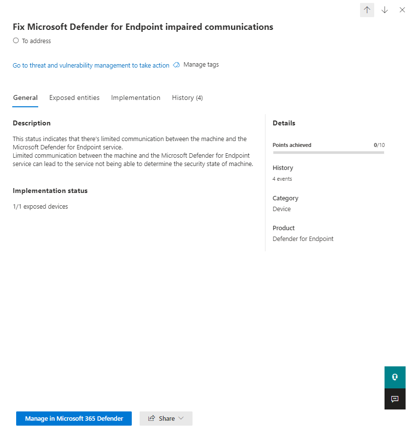

# Microsoft Secure Score

Microsoft Secure Score is a measurement of an organization's security posture, with a higher number indicating more improvement actions taken. It can be found at https://security.microsoft.com/securescore in the [Microsoft 365 security center](overview-security-center.md).

Following the Secure Score recommendations can protect your organization from threats. From a centralized dashboard in the Microsoft 365 security center, organizations can monitor and work on the security of their Microsoft 365 identities, data, apps, devices, and infrastructure.

Secure Score helps organizations:  

* Report on the current state of the organization's security posture.
* Improve their security posture by providing discoverability, visibility, guidance, and control.  
* Compare with benchmarks and establish key performance indicators (KPIs).

Organizations gain access to robust visualizations of metrics and trends, integration with other Microsoft products, score comparison with similar organizations, and much more. The score can also reflect when third-party solutions have addressed recommended actions.

## How it works

You are given points for configuring recommended security features, performing security-related tasks, or addressing the improvement action with a third-party application or software, or an alternate mitigation. Some improvement actions only give points when fully completed, and some give partial points if they are completed for some devices or users. If you cannot or do not want to enact one of the improvement actions, you can choose to accept the risk or the remaining risk.

We show you the full set of possible improvements, regardless of license, so you can understand security best practices and improve your score. Your absolute security posture is represented by Secure Score, which stays the same no matter what product licenses your organization owns. Keep in mind that security should be balanced with usability, and not every recommendation can work for your environment.

Your score is updated in real time to reflect the information presented in the visualizations and improvement action pages. Secure Score also syncs daily to receive system data about your achieved points for each action.

### How improvement actions are scored

Each improvement action is worth 10 points or less. Most are scored in a binary fashion — if you implement the improvement action, like create a new policy or turn on a specific setting, you get 100% of the points. For other improvement actions, points are given as a percentage of the total configuration. For example, if the improvement action states you get 10 points by protecting all your users with multi-factor authentication and you only have 50 of 100 total users protected, you would be given a partial score of 5 points (50 protected / 100 total * 10 max pts = 5 pts partial score).

### Products included in Secure Score

Currently there are recommendations for Microsoft 365 (including Exchange Online), Azure AD, Microsoft Defender ATP, Azure ATP, and Cloud App Security. Recommendations for other security products are coming soon. The recommendations will not cover all the attack surfaces associated with each product, but they are a good baseline. You can also mark the improvement actions as covered by a third party or alternate mitigation.

### Security defaults

Microsoft Secure Score has updated improvement actions to support [security defaults in Azure Active Directory](https://docs.microsoft.com/azure/active-directory/fundamentals/concept-fundamentals-security-defaults), which make it easier to help protect your organization with preconfigured security settings for common attacks.

If you turn on security defaults, you will be awarded full points for the following improvement actions:

- Ensure all users can complete multi-factor authentication for secure access (9 points)
- Require MFA for administrative roles (10 points)
- Enable policy to block legacy authentication (7 points)

>[!IMPORTANT]
>Security defaults include security features that provide similar security to the "sign-in risk policy" and "user risk policy" improvement actions. Instead of setting up these policies on top of the security defaults, we recommend updating their statuses to "Resolved through alternative mitigation."

## Required permissions

To have permission to access Microsoft Secure Score, you must be assigned one of the following roles in Azure Active Directory.

### Read and write roles

With read and write access, you can make changes and directly interact with Secure Score. You can also assign read-only access to other users.

* Global administrator
* Security administrator
* Exchange administrator
* SharePoint administrator
* Account administrator

### Read-only roles

With read-only access, you are not able to edit status or notes for an improvement action, edit score zones, or edit custom comparisons.

* Helpdesk administrator
* User administrator
* Service administrator
* Security reader
* Security operator
* Global reader

## Gain visibility into your security posture

To help you the information you need more quickly, Microsoft improvement actions are organized into groups:

* Identity (Azure AD accounts & roles)
* Data  (Microsoft Information Protection)
* Device (Microsoft Defender ATP, known as [Configuration score](https://docs.microsoft.com/windows/security/threat-protection/microsoft-defender-atp/configuration-score))
* App (email and cloud apps, including Office 365 and Microsoft Cloud App Security)
* Infrastructure (no improvement actions for now)

>[!NOTE]
>In the recent release of Microsoft Secure Score, an improved scoring model has been released which made Microsoft Secure Score temporarily incompatible with Identity Secure Score and the Graph API. [View details](microsoft-secure-score.md#incompatibility-with-identity-secure-score-and-graph-api)

In the Microsoft Secure Score overview page, you can see how points are split between these groups and what points are available. The overview page is also the place to get an all-up view of the total score, historical trend of your secure score with benchmark comparisons, and prioritized improvement actions that can be taken to improve your score.

## Take action to improve your score

The **Improvement actions** tab lists the security recommendations that address possible attack surfaces, along with their status (to address, planned, risk accepted, resolved through third party, resolved through alternate mitigation, and completed). You can search, filter, and group all the improvement actions.  

### Ranking

Ranking is based on the number of remaining points left to achieve, implementation difficulty, user impact, and complexity. The highest ranked improvement actions have a large number of points remaining with low difficulty, user impact, and complexity.

### View improvement action details

When you select a specific improvement action, a full page flyout appears.  

*Figure 2: Improvement action flyout example*

To complete the action, you have a few options:

* Select **Manage** to go the configuration screen and make the change. You will then gain the points that the action is worth, visible in the fly out. Points generally take about 24 hours to update.

* Select **Share** to copy the direct link to the improvement action, or choose the platform to share the link such as email, Microsoft Teams, Microsoft Planner, or ServiceNow. Selecting ServiceNow will let you create a change ticket which will be visible in ServiceNow and the Microsoft 365 security center home. To learn more, see [Microsoft 365 Security Center and ServiceNow integration](tickets.md).

### Choose an improvement action status

Choose any statuses and record notes specific to the improvement action. The statues you can select are the following:

* **To address** — You recognize that the improvement action is necessary and plan to address it at some point in the future. This state also applies to actions which are detected as partially, but not fully completed.
* **Planned** — There are concrete plans in place to complete the improvement action.
* **Risk accepted** — Security should always be balanced with usability, and not every recommendation will work for your environment. When that is the case, you can choose to accept the risk, or the remaining risk, and not enact the improvement action. You will not be given any points, but the action will no longer be visible in the list of improvement actions. You can view this action in history or undo it at any time.
* **Resolved through third party** and **Resolved through alternate mitigation** — The improvement action has already been addressed by a third-party application or software, or an internal tool. You will gain the points that the action is worth, so your score better reflects your overall security posture. If a third party or internal tool no longer covers the control, you can choose another status. Please keep in mind, Microsoft will have no visibility into the completeness of implementation if the improvement action is marked as either of these statuses.

#### Threat & Vulnerability Management improvement actions

For improvement actions in the "Device" category, you will not be able to choose statuses. Instead, you will be directed to the associated [Threat & Vulnerability Management (TVM) security recommendation](https://docs.microsoft.com/windows/security/threat-protection/microsoft-defender-atp/tvm-security-recommendation) in the [Microsoft Defender Security Center](https://docs.microsoft.com/windows/security/threat-protection/microsoft-defender-atp/use) to take action. The exception you choose and justification you write will specific to that portal, and will not be present in the Microsoft Secure Score portal.

#### Completed improvement actions

Improvement actions have a "completed" status once all possible points for the improvement action have been achieved. Completed improvement actions are confirmed though Microsoft data, and you will not be able to change the status.

### Assess information and review user impact

The **At a glance** section will tell you the category, attacks it can protect against, and the product.

The **User impact** shows what the users will experience if the improvement action is enacted, and **Users affected​** shows who will experience it.

### Implement the improvement action

The **Implementation** section shows any prerequisites, step by step next steps to complete the improvement action, the current implementation status of the improvement action, and any learn more links.

Prerequisites will be any licenses that need to be obtained or actions that need to be completed before the improvement action is addressed. Make sure you have enough seats in your license to complete the improvement action and that those licenses are applied to the necessary users.  

## Track your score history and meet goals

You can view a graph of your organization's score over time in the **History** tab. Below the graph is a list of all the actions taken in the selected time range and their attributes, such as resulting points and category. You can customize a date range and filter by category.

In the **Metrics & trends** tab, there are several graphs and charts to give you more visibility into trends and set goals. You can set the date range for the whole page of visualizations. The visualizations include:

* **Your Secure Score zone** — Customized based on your organization's goals and definitions of good, okay, and bad score ranges.
* **Regression trend** — A timeline of points that have regressed due to configuration, user, or device changes.  
* **Comparison trend** — How your organization's Secure Score compares to others' over time. This view can include lines representing the score average of organizations with similar seat count and a custom comparison view that you can set.
* **Risk acceptance trend** — Timeline of improvement actions marked as "risk accepted."
* **Score changes** — The number of points achieved, points regressed, along with the subsequent score change, in the specified date range.

## Risk awareness

Microsoft Secure Score is a numerical summary of your security posture based on system configurations, user behavior and other security related measurements; it is not an absolute measurement of how likely your system or data will be breached. Rather, it represents the extent to which you have adopted security controls in your Microsoft environment which can help offset the risk of being breached. No online service is completely immune from security breaches, and secure score should not be interpreted as a guarantee against security breach in any manner.

## What's new? 

To make Microsoft Secure Score a better representative of your security posture, we have made some changes. To learn about planned changes, see [What's coming in Microsoft Secure Score?](microsoft-secure-score-whats-coming.md).

### Incompatibility with Identity Secure Score and Graph API

In the recent release of Microsoft Secure Score, an improved scoring model has been released. These changes allow for a more flexible and accurate view of your security posture. However, these updates have made Microsoft Secure Score temporarily incompatible with Identity Secure Score and the Graph API.

In time, Identity Secure Score and the Graph API will adopt the new scoring model. Until then, customers will see differences in the scores reported by Microsoft Secure Score, Identity Secure Score, and the Graph API. We apologize for any inconvenience this causes, and are working to ensure these experiences are more compatible in the future.

### Updated improvement actions

- Added Azure Active Directory improvement actions
- Added Azure Advanced Threat Protection improvement actions
- Support for Microsoft Defender ATP [Threat & Vulnerability Management](https://docs.microsoft.com/windows/security/threat-protection/microsoft-defender-atp/next-gen-threat-and-vuln-mgt) security recommendations
    - All released security recommendations supplied by TVM are now available

### Updated interface and functionality

* All new metrics and trends views for CISO and lead level discussions
* New ways to track and benchmark your score
* Better tracking and understanding for score regressions
* Filter, tag, search, and group your improvement actions
* Manage towards your future goals using score projections and planned actions
* And more!

### June 2020

#### Removed improvement action for Microsoft Defender Advanced Threat Protection

* Turn on Attack Surface Reduction rules

#### Added improvement actions for Microsoft Defender Advanced Threat Protection

* Block Adobe Reader from creating child processes
* Use advanced protection against ransomware
* Block all Office applications from creating child processes
* Block Office applications from creating executable content
* Block JavaScript or VBScript from launching downloaded executable content
* Block execution of potentially obfuscated scripts
* Block executable content from email client and webmail
* Block Office communication application from creating child processes
* Block untrusted and unsigned processes that run from USB
* Block persistence through WMI event subscription
* Block Office applications from injecting code into other processes
* Block executable files from running unless they meet a prevalence, age, or trusted list criterion
* Block process creations originating from PSExec and WMI commands
* Block credential stealing from the Windows local security authority subsystem (lsass.exe)
* Block Win32 API calls from Office macros

## We want to hear from you

If you have any issues, please let us know by posting in the [Security, Privacy & Compliance](https://techcommunity.microsoft.com/t5/Security-Privacy-Compliance/bd-p/security_privacy) community. We're monitoring the community and will provide help.

