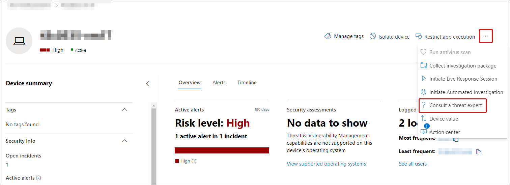
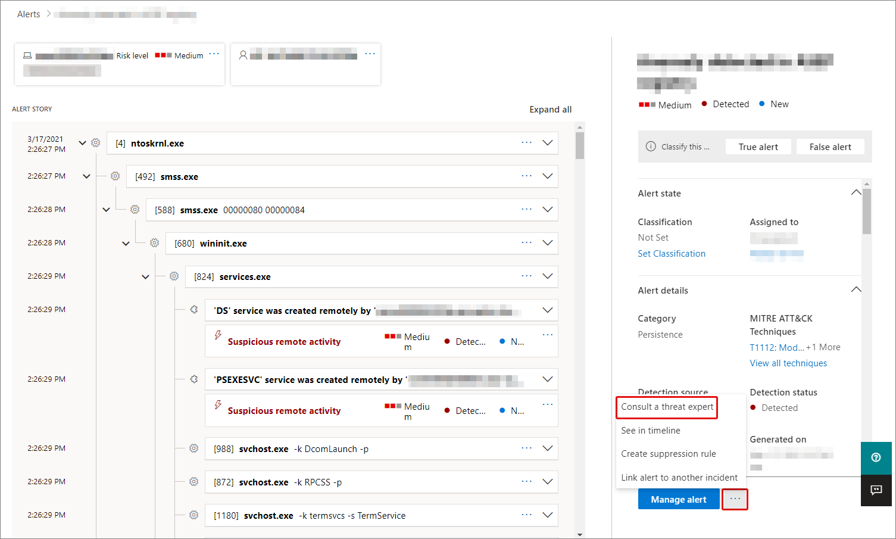
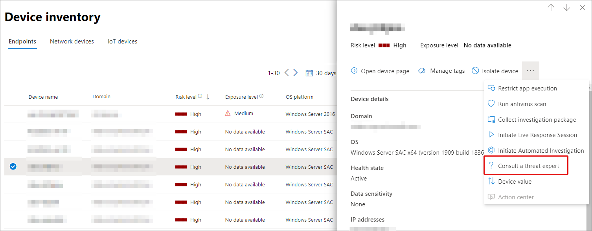

# Microsoft Threat Experts in Microsoft 365 overview

[!INCLUDE [Microsoft 365 Defender rebranding](../includes/microsoft-defender.md)]

**Applies to:**

- [Microsoft 365 Defender](https://go.microsoft.com/fwlink/?linkid=2118804)
- [Microsoft Defender for Endpoint](https://go.microsoft.com/fwlink/p/?linkid=2154037)

[!INCLUDE [Prerelease](../includes/prerelease.md)]

Microsoft Threat Experts - Targeted Attack Notifications is a managed threat hunting service. Once you apply and are accepted, you'll receive targeted attack notifications from Microsoft threat experts, so you won't miss critical threats to your environment. These notifications will help you protect your organization's endpoints, email, and identities.
Microsoft Threat Experts – Experts on Demand lets you get expert advice about threats your organization is facing. You can reach out for help on threats your organization is facing. It's available as a subscription service.

## Apply for Microsoft Threat Experts – Targeted Attack Notifications

> [!IMPORTANT]
> Before you apply, make sure to discuss the eligibility requirements for Microsoft Threat Experts – Targeted Attack Notifications  with your Microsoft Technical Service provider and account team.

If you already have Microsoft Defender for Endpoint and Microsoft 365 Defender, you can apply for Microsoft Threat Experts – Targeted Attack Notifications through their Microsoft 365 Defender portal. Go to **Settings > Endpoints > General > Advanced features > Microsoft Threat Experts – Targeted Attack Notifications**, and select **Apply**. See [Configure Microsoft Threat Experts capabilities](./configure-microsoft-threat-experts.md) for a full description.

Once your application is approved, you'll start receiving targeted attack notifications whenever Threat Experts detect a threat to your environment.

## Subscribe to Microsoft Threat Experts - Experts on Demand

Contact your Microsoft representative to subscribe to Experts on Demand.  See [Configure Microsoft Threat Experts capabilities](./configure-microsoft-threat-experts.md) for full details.

## Receive targeted attack notification

The Microsoft Threat Experts – Targeted Attack Notification capability provides proactive hunting for the most important threats to your network. Our threat experts hunt for human adversary intrusions, hands-on-keyboard attacks, and advanced attacks, such as cyberespionage. These notifications will show up as a new alert. The managed hunting service includes:

- Threat monitoring and analysis, reducing dwell time and the risk to your business
- Hunter-trained artificial intelligence to discover and target both known attacks and emerging threats
- Identification of the most pertinent risks, helping SOCs maximize their effectiveness
- Help scoping compromises and providing as much context as can be quickly delivered to enable a swift SOC response.

## Collaborate with experts on demand

You can also contact Microsoft threat experts from directly inside the Microsoft 365 security portal, for a swift and accurate threat response.  Experts can provide insight to better understand the complex threats your organization may face.  Consult an expert to:

- Gather additional information on alerts and incidents, including root causes and scope
- Gain clarity into suspicious devices, alerts, or incidents and get next steps if faced with an advanced attacker
- Determine risks and available protections related to threat actors, campaigns, or emerging attacker techniques

The option to **Consult a threat expert** is available in several places throughout the portal:

- <i>**Device page actions menu**</i> 

- <i>**Device inventory page flyout menu**</i> 

- <i>**Alerts page flyout menu**</i> 

- <i>**Incidents page actions menu**</i> 

- <i>**Incidents inventory page**</i> 

> [!NOTE]
> If you have Premier Support subscription mapped to your Microsoft Defender for Office 365 license, you can track the status of your Experts on Demand cases through Microsoft Services Hub.

Watch this video for a quick overview of the Microsoft Services Hub.

> [!VIDEO https://www.microsoft.com/videoplayer/embed/RE4pk9f]

## See also

- [Configure Microsoft Threat Experts capabilities](./configure-microsoft-threat-experts.md)
