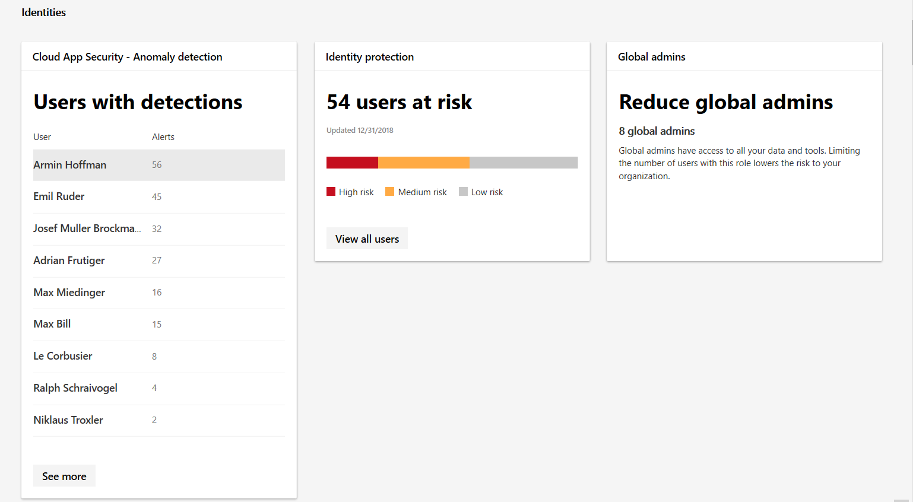

# Identity monitoring and reporting in the Microsoft 365 security center

[!INCLUDE [Microsoft 365 Defender rebranding](../includes/microsoft-defender.md)]

Monitor the identities in your organization and keep track of suspicious or risky behaviors. In the **Identities** category of **Reports**, you can track:

* Users with the most detected anomalies
* How many users are reported at risk by conditional access policies
* The number of global admins in your org

For users with specific detections, you can explore the specific alert and investigate in Microsoft Defender Security Center. Detections include anomalies such as users who sign in from unfamiliar locations.

For a complete set of risk events, see [Azure Active Directory risk events](https://docs.microsoft.com/azure/active-directory/reports-monitoring/concept-risk-events).
