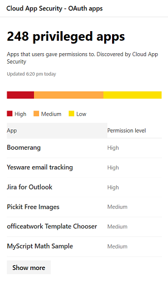
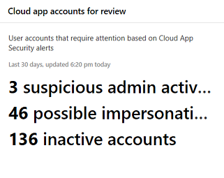
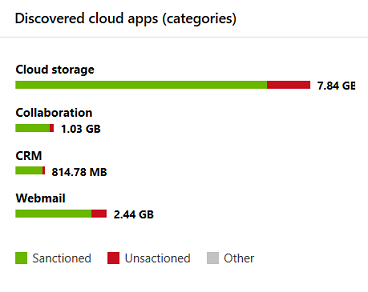
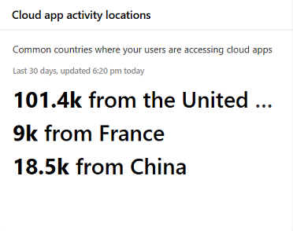

# App monitoring and reporting in the Microsoft 365 security center

[!INCLUDE [Microsoft 365 Defender rebranding](../includes/microsoft-defender.md)]

These reports provide more insight into how cloud apps are being used in your organization. Includes different kinds of apps, their level of risk, and alerts.

## Monitor email accounts at risk

**Email protection** shows email accounts at risk. You can select an account to investigate further in Microsoft Defender Security Center.

## Monitor app permissions granted by users

**Cloud App Security - OAuth apps** lists apps discovered by Cloud App Security that have been granted permissions by users. Cloud App Security's risk catalog includes over 16,000 apps that are assessed using over 70 risk factors.

The risk factors start from general information, such as the app publisher. It then moves to security measures and controls, such as whether the app supports encryption at rest or provides an audit log of user activity.

## Monitor cloud app user accounts

**Cloud app accounts for review** lists accounts that may require attention.

## Understand which cloud apps are used

**Discovered cloud apps (categories)** show what kinds of apps are being used in your organization. It links to the Cloud Discovery dashboard in Cloud App Security. For more information, see [Quickstart: Work with discovered apps](https://docs.microsoft.com/cloud-app-security/discovered-apps).  

## Monitor where users access cloud apps

**Cloud app activity locations** show where users are accessing cloud apps.

## Monitor health for infrastructure workloads

**Infrastructure health** shows health status alerts for infrastructure workloads in Azure Defender.

Azure Defender provides unified security management and Defender for Office 365 across on-premises and cloud workloads. You can collect, search, and analyze security data from different sources, including firewalls and other partner solutions.

For more information, see [Azure Defender Documentation](https://docs.microsoft.com/azure/security-center/).

