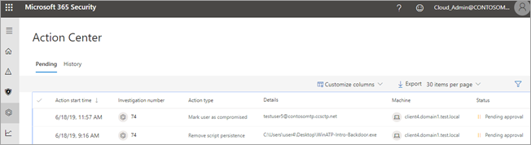
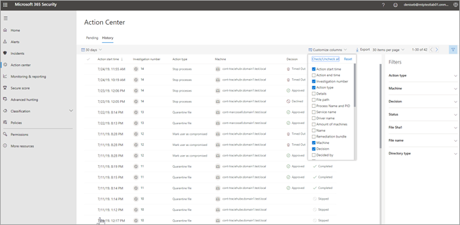

# The Action center

[!INCLUDE [Microsoft 365 Defender rebranding](../includes/microsoft-defender.md)]

**Applies to:**
- Microsoft 365 Defender

Use the Action center ([https://security.microsoft.com/action-center](https://security.microsoft.com/action-center)) to see the results of current and past investigations across your organization's devices and mailboxes. Depending on the type of threat and resulting verdict, [remediation actions](https://docs.microsoft.com/microsoft-365/security/mtp/mtp-remediation-actions) can occur automatically or upon approval by your organization's security operations team. All remediation actions, whether they are pending approval or were already approved, are consolidated in the Action center. 

## A "single pane of glass" experience

The Action center provides a "single pane of glass" experience for tasks, such as:
- Approving pending remediation actions;
- Viewing an audit log of already approved remediation actions; and
- Reviewing completed remediation actions.

Your security operations team can operate more effectively and efficiently, because the Action center provides a comprehensive view of Microsoft 365 Defender at work.

## Go to the Action center

1. Go to [https://security.microsoft.com](https://security.microsoft.com) and sign in. 

2. In the navigation pane, choose **Action center**. 

3. In the Action center, you'll see two tabs: **Pending** and **History**.

    - The **Pending** tab lists investigations that require review and approval by someone in your security operations team to continue. Make sure to review and take action on pending items you see here.

    - The **History** tab lists past investigations and remediation actions that were taken automatically. You can view data for the past day, week, month, or six months.

4. To show only the columns you want to see, select **Customize columns**. 

5. Select an item in the list to view more details about an investigation. The investigation details view opens. 

    - If the investigation pertains to email content (such as, the entity is a mailbox), investigation details open in the Security & Compliance Center ([https://protection.office.com/threatinvestigation](https://protection.office.com/threatinvestigation)). 

    - If the investigation involves a device, investigation details open in the security center ([https://security.microsoft.com](https://security.microsoft.com)). 

> [!TIP]
> If you think something was missed or wrongly detected by automated investigation and response features in Microsoft 365 Defender, let us know! See [How to report false positives/negatives in automated investigation and response (AIR) capabilities in Microsoft 365 Defender](mtp-autoir-report-false-positives-negatives.md).

## Available actions

As remediation actions are taken, they're listed on the History tab in the Action center. Such actions include the following:

- Collect investigation package 
- Isolate device (this action can be undone) 
- Offboard machine 
- Release code execution 
- Release from quarantine 
- Request sample 
- Restrict code execution (this action can be undone) 
- Run antivirus scan 
- Stop and quarantine 

> [!NOTE]
> In addition to remediation actions that are taken automatically, your security operations team can take manual actions to address detected threats. For more information about automatic and manual remediation actions, see [Remediation actions](mtp-remediation-actions.md).

## Action source

(**NEW!**) The new and improved Action center includes a column indicating the source of each remediation action. The following table summarizes values you might see in the **Action source** column:

| Action source value | Description |
|:---|:---|
| **Manual device action** | A manual action taken on a device. Examples include device isolation or file quarantine. |
| **Manual email action** | A manual action taken on email. An example includes soft-deleting email messages. |
| **Automated device action** | An automated action taken on an entity, such as a file or process. Examples of automated actions include sending a file to quarantine, stopping a process, and removing a registry key. |
| **Automated email action** | An automated action taken on email content, such as an email message, attachment, or URL. Examples of automated actions include soft-deleting email messages, blocking URLs, and turning off external mail forwarding. |
| **Advanced hunting action** | Actions taken on devices or email with [advanced hunting](https://docs.microsoft.com/microsoft-365/security/mtp/advanced-hunting-overview). |
| **Explorer action** | Actions taken on email content with Explorer. |
| **Manual live response action** | Actions taken on a device with live response. Examples include deleting a file, stopping a process, and removing a scheduled task. |
| **Live response action** | Actions taken on a device with Microsoft Defender for Endpoint APIs. Examples of actions include isolating a device, running an antivirus scan, and getting information about a file. |

## Required permissions for Action center tasks

To approve or reject pending actions in the Action center, you must have permissions assigned as listed in the following table:

|Remediation action |Required roles and permissions |
|--|----|
|Microsoft Defender for Endpoint remediation (devices) |Security Administrator role assigned in either Azure Active Directory ([https://portal.azure.com](https://portal.azure.com)) or the Microsoft 365 admin center ([https://admin.microsoft.com](https://admin.microsoft.com)) --- or --- Active remediation actions role assigned in Microsoft Defender for Endpoint     To learn more, see the following resources:  - [Administrator role permissions in Azure Active Directory](https://docs.microsoft.com/azure/active-directory/users-groups-roles/directory-assign-admin-roles) - [Create and manage roles for role-based access control (Microsoft Defender for Endpoint)](https://docs.microsoft.com/windows/security/threat-protection/microsoft-defender-atp/user-roles)  |
|Microsoft Defender for Office 365 remediation (Office content and email)  |Security Administrator role assigned in either Azure Active Directory ([https://portal.azure.com](https://portal.azure.com)) or the Microsoft 365 admin center ([https://admin.microsoft.com](https://admin.microsoft.com)) --- and ---  Search and Purge role assigned the Security & Compliance Center ([https://protection.office.com](https://protection.office.com))   **IMPORTANT**: If you have the Security Administrator role assigned only in the Security & Compliance Center, you will not be able to access the Action center or Microsoft 365 Defender capabilities. You must have the Security Administrator role assigned in Azure Active Directory or the Microsoft 365 admin center.   To learn more, see the following resources:  - [Administrator role permissions in Azure Active Directory](https://docs.microsoft.com/azure/active-directory/users-groups-roles/directory-assign-admin-roles) - [Permissions in the Security & Compliance Center](https://docs.microsoft.com/microsoft-365/security/office-365-security/permissions-in-the-security-and-compliance-center) |

> [!NOTE]
> Users who have the Global Administrator role assigned in Azure Active Directory can approve or reject any pending action in the Action center. However, as a best practice, your organization should limit the number of people who have the Global Administrator role assigned. We recommend using the Security Administrator, Active remediation actions, and Search and Purge roles listed above for Action center permissions.

## Next steps 

- [Approve or reject pending actions following an automated investigation](mtp-autoir-actions.md)
- [View the results of an automated investigation](mtp-autoir-results.md)

