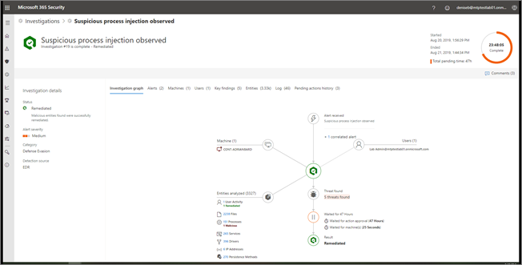

# The Action center

**Applies to:**
- Microsoft Threat Protection

[!include[Prerelease information](prerelease.md)]

## Overview of the Action center

The Action center provides a view of current and past investigations across identities, devices, and mailboxes. The Action center not only enables your security operations team to operate more effectively and efficiently, it also provides a more comprehensive view of Microsoft Threat Protection at work for your organization. 

Depending on the type of threat and resulting verdict, remediation actions occur automatically or upon approval by your organization’s security operations team. All remediation actions, whether they are pending approval or were already approved, are consolidated in the Action center. This provides a "single pane of glass" experience for both approving pending remediation actions and viewing an audit log of already approved remediation actions across Microsoft Threat Protection. 

The following table lists remediation actions that are currently supported in the Action center: 

|Endpoints remediation actions  |Email remediation actions  |
|---------|---------|
|Quarantine file Remove registry key Kill process  Stop service  Remove registry key  Disable driver  Remove scheduled task      |Soft delete emails Block URL (time-of-click) Turn off external mail forwarding Soft delete emails          |

> [!NOTE]
> You must be a global administrator, security administrator, security operator, or security reader to perform the tasks described in this article. 

## Action center permissions

[Automated investigation and remediation](mtp-autoir-actions.md) capabilities can take appropriate actions on email messages, forwarding rules, files, persistence mechanisms, and other artifacts found during investigations. Some actions require approval by your organization's security operations team to proceed. Permissions to approve (or reject) pending actions in the Action center require certain roles to be assigned in [Azure Active Directory](https://docs.microsoft.com/azure/active-directory/users-groups-roles/directory-assign-admin-roles) (Azure AD) and the [Office 365 Security & Compliance Center](../office-365-security/permissions-in-the-security-and-compliance-center.md). The following table summarizes roles and permissions needed for certain Action center tasks.

| Azure AD role | Office 365 "Search & purge" role |  Actions you can approve (or reject) |
|----|----|----|
| Security administrator | Assigned | All tasks |
| Security administrator | Not assigned | Block email, Delete forwarding rule |
| Security operator, Security reader | Assigned | Delete emails and email clusters |
| Security operator, Security reader | Not assigned | None |

|Action | Role(s) needed |More information |
|---|---|---|
|Approve (or reject) actions on devices (endpoints) | | |
| | | |
| | | |

> [!NOTE]
> Users with the Global Administrator role assigned in Azure AD can approve or reject any pending action in the Action center. However, as a best practice, your organization should limit the number of people who have the Global Administrator role assigned. We recommend using the roles listed in the table above for Action center permissions.

## Visit the Action center

1. Go to [https://security.microsoft.com](https://security.microsoft.com) and sign in. 

2. In the navigation pane, choose **Action center**. 

3. In the Action center, you’ll see two tabs: **Pending** and **History**.

    - The **Pending** tab lists investigations that require review and approval by someone in your security operations team to continue. Make sure to review and take action on pending items you see here.

    - The **History** tab lists past investigations and remediation actions that were taken automatically. You can view data for the past day, week, month, or six months.

4. To show only the columns you want to see, select **Customize columns**. 

5. Select an item in the list to view more details about an investigation. The investigation details view opens. 

    - If the investigation pertains to email content (such as, the entity is a mailbox), investigation details open in the Office 365 Security & Compliance Center ([https://protection.office.com/threatinvestigation](https://protection.office.com/threatinvestigation)). 

    - If the investigation involves a user account or a device, investigation details open in the security center ([https://security.microsoft.com](https://security.microsoft.com)). 

## Next steps 

[Learn about hunting in Microsoft Threat Protection](hunting.md)

[Learn about incidents in Microsoft Threat Protection](incidents-overview.md)
