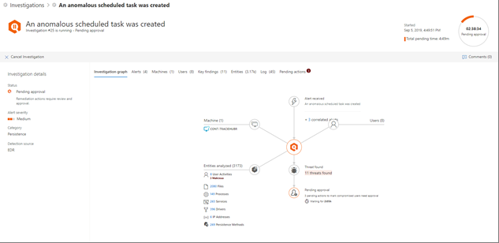

# Approve or reject pending actions following an automated investigation

[!INCLUDE [Microsoft 365 Defender rebranding](../includes/microsoft-defender.md)]

**Applies to:**
- Microsoft 365 Defender

When an automated investigation runs, it can result in one or more [remediation actions](https://docs.microsoft.com/microsoft-365/security/mtp/mtp-remediation-actions) that require approval to proceed. For example, a cluster of email messages might need to be deleted, or a quarantined file might need to be removed. It's important to approve (or reject) pending actions as soon as possible so that your automated investigations can proceed and complete in a timely manner. 

> [!TIP]
> If you think something was missed or wrongly detected by automated investigation and response features in Microsoft 365 Defender, let us know! See [How to report false positives/negatives in automated investigation and response (AIR) capabilities in Microsoft 365 Defender](mtp-autoir-report-false-positives-negatives.md).

Pending actions can be reviewed and approved by using the [Action center](#review-a-pending-action-in-the-action-center) or the [investigation details view](#review-a-pending-action-in-the-investigation-details-view).

> [!NOTE]
> You must have [appropriate permissions](mtp-action-center.md#required-permissions-for-action-center-tasks) to approve or reject remediation actions.

## Review a pending action in the Action center

1. Go to [https://security.microsoft.com](https://security.microsoft.com) and sign in. 

2. In the navigation pane, choose **Action center**. 

3. In the Action Center, on the **Pending** tab, select an item in the list. 

    - If you select an item in the **Investigation number** column, the investigation details page opens. There, you can view the results of the investigation, and then either approve or reject the recommended action.
 
    - If you select a row in the list, a flyout opens, where you can view information about that item.   Use the links to view an associated alert or an investigation, and approve or reject the action.

## Review a pending action in the investigation details view

1. On an [investigation details](mtp-autoir-results.md) page, select the **Pending actions** (or **Actions**) tab. Items that are pending approval are listed here.

2. Select an item in the list, and then choose **Approve** or **Reject**.

## Next steps

- [View the details and results of an automated investigation](mtp-autoir-results.md)
- [Handle false positives/negatives in automated investigation and response capabilities](mtp-autoir-report-false-positives-negatives.md)
