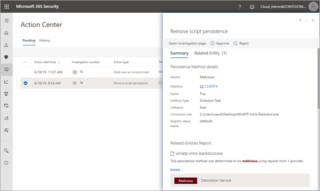

# Approve or reject pending actions

**Applies to:**
- Microsoft Threat Protection

[!include[Prerelease information](prerelease.md)]

During and after an automated investigation runs, you might have one or more [remediation actions](mtp-action-center.md#remediation-actions) that require approval to proceed. For example, a cluster of email messages might need to be deleted, or a quarantined file might need to be removed. If you have the [necessary permissions](mtp-action-center.md#required-permissions-for-action-center-tasks), you can review and approve (or reject) actions [within the Action center](#review-a-pending-action-in-the-action-center) or [within an investigation details view](#review-a-pending-action-in-the-investigation-details-view), as described in the following sections. 

## Review a pending action in the Action center

1. Go to [https://security.microsoft.com](https://security.microsoft.com) and sign in. 

2. In the navigation pane, choose **Action center**. 

3. In the Action Center, on the **Pending** tab, select an item in the list. Depending on what you select, one of the following occurs:

    - If you select an item in the **Investigation number** column, the investigation details page opens. There, you can view the results of the investigation, and then either approve or reject the recommended action.
 
    - If you select a row in the list, a flyout opens, where you can view information about that item, click links to an associated alert or an investigation, and either approve or reject the action. 

## Review a pending action in the investigation details view

1. On an [investigation details](mtp-autoir-results.md) page, select the **Pending actions** (or **Actions**) tab. Items that are pending approval are listed here.

2. Select an item in the list, and then choose **Approve** or **Reject**.

## Next steps

- [Learn more about incidents](incidents-overview.md)

- [Learn about hunting](hunting.md)
