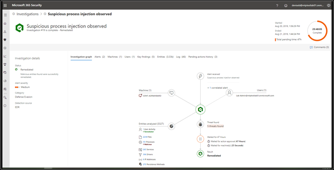

# View the results of an automated investigation in Microsoft Threat Protection

**Applies to**:
- Microsoft 365

During and after an automated investigation, you can view detailed information about the investigation in an investigation details view. You can open this view in one of two ways:
- In the Action center, select an item on either the **Pending** or **History** tab.
- On an incident details page, select **Investigations**, and then select an item in the list.

Either step takes you to the investigation details view, which resembles the following image:

> [!NOTE]
> If the item you select in either the Action center or incident details page is a mailbox investigation, you'll be taken to the investigation details in the Office 365 Security & Compliance Center. 

In the Investigation details view, you can see information on the **Investigation graph**, **Alerts**, **Machines**, **Identities**, **Key findings**, **Entities**, **Log**, and **Pending actions** tabs, described in the following table.

|Tab	|Description |
|--------|--------|
|Investigation graph	|Provides a visual representation of the investigation. Depicts entities and lists threats found, along with alerts and whether any actions are awaiting approval.
You can click an item on the graph to view more details. For example, clicking the **Threats found** icon takes you to the **Key findings** tab. |
|Alerts	|Lists alerts associated with the investigation. Alerts can come from threat protection features on a user's machine, in Office apps, Cloud App Security, and other Microsoft 365 Threat Protection features.|
|Machines	|Lists machines included in the investigation along with remediation level.|
|Key findings	|Lists results from the investigation along with status and actions taken or pending. You can approve pending actions for devices and identities in on this tab.|
|Entities	|Lists user activities, files, processes, services, drivers, IP addresses, and persistence methods associated with the investigation, along with status and actions taken.|
|Log	|Provides a detailed view of all steps taken during the investigation, along with status.|
|Pending actions	|Lists items that require approval to proceed.|

## Remediation actions following automated investigation

When an automated investigation completes, a verdict is reached for every piece of evidence involved, and remediation actions are identified. In some cases, remediation actions are taken automatically; in other cases, remediation actions are pending approval. The following table lists possible verdicts and outcomes:

|Verdict	|Area	|Outcomes|
|------|------|------|
|Malicious	|Device (endpoints) Identity (user accounts)	|Remediation actions are taken automatically|
|Malicious	|Email content (URLs or attachments) | Recommended remediation actions are pending approval|
|Suspicious	|Device, identity, or email content |Recommended remediation actions are pending approval|
|Clean	|Device, identity, or email content	|No remediation actions are needed|

## Next steps

[Approve or reject actions related to automated investigation and remediation](mtp-autoir-actions.md)