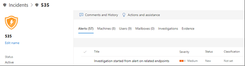

# Details and results of an automated investigation

[!INCLUDE [Microsoft 365 Defender rebranding](../includes/microsoft-defender.md)]

**Applies to:**
- Microsoft 365 Defender

When an automated investigation occurs in Microsoft 365 Defender, details about that investigation are available during and after the automated investigation process. If you have the [necessary permissions](mtp-action-center.md#required-permissions-for-action-center-tasks), you can view those details in an investigation details view. The investigation details view provides you with up-to-date status and the ability to approve any pending actions. 

## Open the investigation details view

You can open the investigation details view by using one of the following methods:
- [Select an item in the Action center](#select-an-item-in-the-action-center)
- [Select an investigation from an incident details page](#open-an-investigation-from-an-incident-details-page)

### Select an item in the Action center

Use the Action center to view actions that are either pending approval (on the **Pending** tab) or were already approved (on the **History** tab). 

1. Go to [https://security.microsoft.com](https://security.microsoft.com) and sign in. 

2. In the navigation pane, choose **Action center**. 

3. On either the **Pending** or **History** tab, select an item. If you have the [necessary permissions](mtp-action-center.md#required-permissions-for-action-center-tasks), you can approve (or reject) pending actions.

### Open an investigation from an incident details page

Use an incident details page to view detailed information about an incident, including alerts that were triggered information about any affected devices, user accounts, or mailboxes.

1. Go to [https://security.microsoft.com](https://security.microsoft.com) and sign in. 

2. In the navigation pane, choose **Incidents**. 

3. Select an item in the list to open the incident details view. 

4. On the **Investigations** tab, select an investigation in the list.

## Investigation details

Use the investigation details view to see past, current, and pending activity pertaining to an investigation. The investigation details view resembles the following image:

In the Investigation details view, you can see information on the **Investigation graph**, **Alerts**, **Devices**, **Identities**, **Key findings**, **Entities**, **Log**, and **Pending actions** tabs, described in the following table.

| Tab | Description |
|--------|--------|
| **Investigation graph**	| Provides a visual representation of the investigation. Depicts entities and lists threats found, along with alerts and whether any actions are awaiting approval. You can click an item on the graph to view more details. For example, clicking the **Threats found** icon takes you to the **Key findings** tab. |
| **Alerts**	| Lists alerts associated with the investigation. Alerts can come from threat protection features on a user's machine, in Office apps, Cloud App Security, and other Microsoft 365 Defender features.|
| **Devices** | Lists machines included in the investigation along with remediation level.|
| **Key findings**	| Lists results from the investigation along with status and actions taken or pending. You can approve pending actions for devices and identities in on this tab.|
| **Entities**	| Lists user activities, files, processes, services, drivers, IP addresses, and persistence methods associated with the investigation, along with status and actions taken.|
|**Log**	| Provides a detailed view of all steps taken during the investigation, along with status.|
| **Pending actions** | Lists items that require approval to proceed.|

## Next steps

- [Approve or reject actions related to automated investigation and response](mtp-autoir-actions.md)
- [Review remediation actions](mtp-remediation-actions.md)
