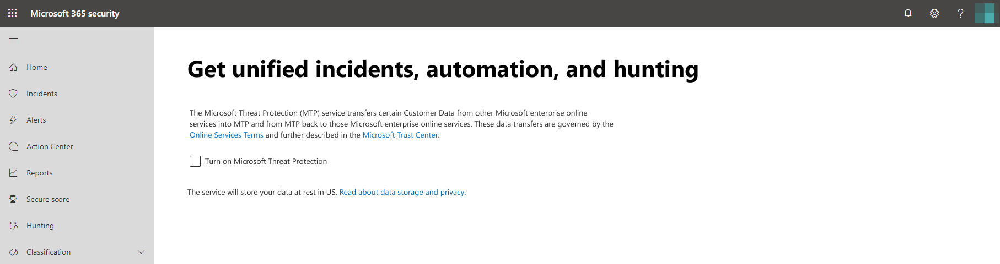

# Turn on Microsoft Threat Protection

**Applies to:**
- Microsoft Threat Protection

[Microsoft Threat Protection](microsoft-threat-protection.md) unifies your incident response process by integrating key capabilities across Microsoft Defender Advanced Threat Protection (ATP), Office 365 ATP, Microsoft Cloud App Security, and Azure ATP. This unified experience adds powerful features you can access in the Microsoft 365 security center.

Microsoft Threat Protection automatically turns on when eligible customers with the required permissions visit Microsoft 365 security center. Read this article to understand various prerequisites and how Microsoft Threat Protection is provisioned.

## Check license eligibility and required permissions
A license to a Microsoft 365 security product generally entitles you to use Microsoft Threat Protection in Microsoft 365 security center without additional licensing cost. We do recommend getting a Microsoft 365 E5, E5 Security, A5, or A5 Security license or a valid combination of licenses that provides access to all supported services.

For detailed licensing information, [read the licensing requirements](prerequisites.md#licensing-requirements).

### Check your role
You must be a **global administrator** or a **security administrator** in Azure Active Directory to turn on Microsoft Threat Protection. [View your roles in Azure AD](https://docs.microsoft.com//azure/active-directory/users-groups-roles/directory-manage-roles-portal)

## Supported services
Microsoft Threat Protection aggregates data from the various supported services that you've already deployed. It will process and store data centrally to identify new insights and make centralized response workflows possible. It does this without affecting existing deployments, settings, or data associated with the integrated services.

To get the best protection and optimize Microsoft Threat Protection, we recommend deploying all applicable supported services on your network. For more information, [read about deploying supported services](deploy-supported-services.md).

## Before starting the service
Before you turn on the service, the Microsoft 365 security center ([security.microsoft.com](https://security.microsoft.com)) shows the Microsoft Threat Protection settings page when you select **Incidents**, **Action center**, or **Hunting** from the navigation pane. These navigation items are not shown if you are not eligible to use Microsoft Threat Protection.

*Microsoft Threat Protection settings in Microsoft 365 security center*

## Starting the service
To turn on Microsoft Threat Protection, simply select **Turn on Microsoft Threat Protection** and apply the change. You can also access this option by selecting **Settings** ([security.microsoft.com/settings](https://security.microsoft.com/settings)) in the navigation pane and then selecting **Microsoft Threat Protection**.

>[!NOTE]
>If you don't see **Settings** in the navigation pane or couldn't access the page, check your permissions and licenses.

### Data center location
Microsoft Threat Protection will store and process data in the [same location used by Microsoft Defender ATP](https://docs.microsoft.com/windows/security/threat-protection/microsoft-defender-atp/data-storage-privacy). If you don't have Microsoft Defender ATP, a new data center location is automatically selected based on the location of active Microsoft 365 security services. The selected data center location is shown in the screen. 

Select **Need help?** in the Microsoft 365 security center to contact Microsoft support about provisioning Microsoft Threat Protection in a different data center location. 

>[!NOTE]
>Microsoft Defender ATP automatically provisions in European Union (EU) data centers when turned on through Azure Security Center. Microsoft Threat Protection will automatically provision in the same EU data center for customers who have provisioned Microsoft Defender ATP in this manner. 

### Confirm that the service is on
Once the service is provisioned, it adds:

- [Incidents management](incidents-overview.md)
- An action center for managing [automated investigation and response](mtp-autoir.md)
- [Advanced hunting](advanced-hunting-overview.md) capabilities

*Microsoft 365 security center with incidents management and other Microsoft Threat Protection capabilities*

### Getting Azure ATP data
To share Azure ATP data with Microsoft Threat Protection, ensure that Microsoft Cloud App Security and Azure ATP integration is turned on. [Learn more about this integration](https://docs.microsoft.com/cloud-app-security/aatp-integration)

## Turn off Microsoft Threat Protection
To stop using Microsoft Threat Protection, go to **Settings** > **Microsoft Threat Protection** > **Opt-in / Opt-out** in the Microsoft 365 security center. Unselect **Turn on Microsoft Threat Protection** and apply the changes.

Corresponding features will be removed from the Microsoft 365 security center.

## Get assistance

To get answers to the most commonly asked questions about turning on Microsoft Threat Protection, [read the FAQ](mtp-enable-faq.md).

Microsoft support staff can help provision or deprovision the service and related resources on your tenant. For assistance, select **Need help?** in the Microsoft 365 security center. When contacting support, mention Microsoft Threat Protection.

## Related topics

- [Frequently asked questions](mtp-enable-faq.md)
- [Licensing requirements and other prerequisites](prerequisites.md)
- [Deploy supported services](deploy-supported-services.md)
- [Microsoft Threat Protection overview](microsoft-threat-protection.md)
- [Microsoft Defender ATP overview](https://docs.microsoft.com/windows/security/threat-protection/microsoft-defender-atp/microsoft-defender-advanced-threat-protection)
- [Office 365 ATP overview](../office-365-security/office-365-atp.md)
- [Microsoft Cloud App Security overview](https://docs.microsoft.com/cloud-app-security/what-is-cloud-app-security)
- [Azure ATP overview](https://docs.microsoft.com/azure-advanced-threat-protection/what-is-atp)
- [Microsoft Defender ATP data storage](https://docs.microsoft.com/windows/security/threat-protection/microsoft-defender-atp/data-storage-privacy)
