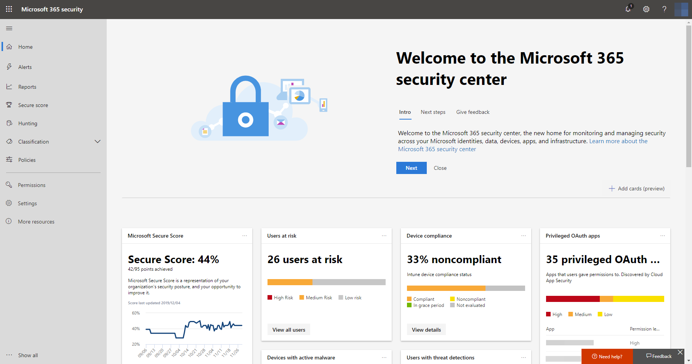
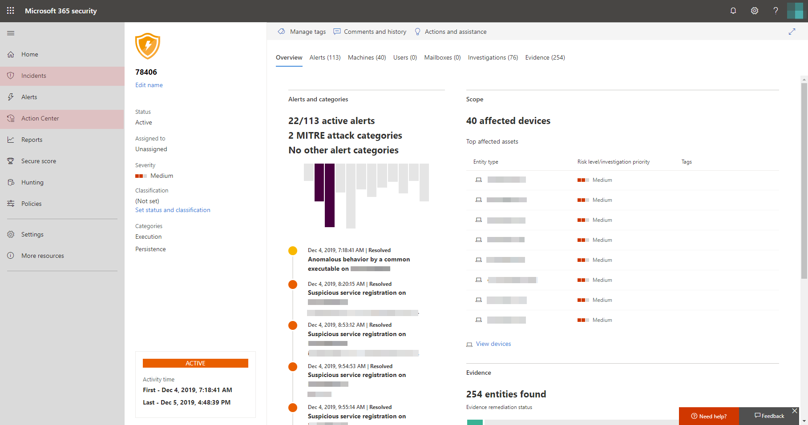

# Turn on Microsoft Threat Protection

**Applies to:**
- Microsoft Threat Protection

[!INCLUDE [Prerelease information](../includes/prerelease.md)]

Microsoft Threat Protection unifies your incident response process by integrating key capabilities across Microsoft Defender Advanced Threat Protection (ATP), Office 365 ATP, Microsoft Cloud App Security, and Azure ATP. This unified experience adds powerful features you can access in the Microsoft 365 security center.

## Check license eligibility and required permissions
Customers with Microsoft 365 E5, Microsoft 365 E5 Security, or an equivalent combination of licenses can use Microsoft Threat Protection. For more information, [read the licensing requirements](prerequisites.md#licensing-requirements).

You must be a **global administrator** or a **security administrator** in [Azure Active Directory](https://docs.microsoft.com/azure/active-directory/users-groups-roles/directory-assign-admin-roles#available-roles) to turn on Microsoft Threat Protection.

## Start using the service
Microsoft Threat Protection aggregates data from the various integrated services. It will process and store data centrally to identify new insights and make centralized response workflows possible.

Before you turn on the service, the Microsoft 365 security center ([security.microsoft.com](https://security.microsoft.com)) doesn't show the **Incidents** and the **Action center** options in the navigation pane.

*Microsoft 365 security center with Microsoft Threat Protection turned off*

To turn on Microsoft Threat Protection, select **Settings** in the navigation pane. In the **[Settings page](https://security.microsoft.com/settings)**, go to **Microsoft Threat Protection** > **Opt-in / Opt-out**.

>[!NOTE]
>If you don't see **Settings** in the navigation pane or couldn't access the page, check your permissions and licenses.

### Select data center location
If Microsoft Defender ATP has been provisioned for your organization, data will be stored and processed in the same data center location you have selected for [your Microsoft Defender ATP data](https://docs.microsoft.com/windows/security/threat-protection/microsoft-defender-atp/data-storage-privacy). If you don't have Microsoft Defender ATP, you will be asked to choose a new data center location specifically for Microsoft Threat Protection. 

You need to provide consent before data is shared between services and aggregated.

### Confirm that the service is on
Once the service is provisioned, it adds:

- [Incidents management](incidents-overview.md)
- An action center for managing [automated investigation and response](mtp-autoir.md)
- [Advanced hunting](advanced-hunting-overview.md) capabilities to the existing **Hunting** page

*Microsoft 365 security center with incidents management and other Microsoft Threat Protection capabilities*

### Getting Azure ATP data
To share Azure ATP data with Microsoft Threat Protection, ensure that Microsoft Cloud App Security and Azure ATP integration is turned on. [Learn more about this integration](https://docs.microsoft.com/cloud-app-security/aatp-integration)

## Turn off Microsoft Threat Protection
To stop using Microsoft Threat Protection, go to **Settings** > **Microsoft Threat Protection** > **Opt-in / Opt-out** in the Microsoft 365 security center. Unselect **Turn on Microsoft Threat Protection** and save the changes.

Data will be permanently deleted and corresponding features will be removed from the Microsoft 365 security center.

## Get assistance

Microsoft support staff can help provision or deprovision the service and related resources on your tenant. For assistance, select **Need help?** in the Microsoft 365 security center. When contacting support, mention Microsoft Threat Protection.

## Related topics

- [Microsoft Threat Protection overview](microsoft-threat-protection.md)
- [Licensing requirements and other prerequisites](prerequisites.md)
- [Microsoft Defender ATP overview](https://docs.microsoft.com/windows/security/threat-protection/microsoft-defender-atp/microsoft-defender-advanced-threat-protection)
- [Office 365 ATP overview](../office-365-security/office-365-atp.md)
- [Microsoft Cloud App Security overview](https://docs.microsoft.com/cloud-app-security/what-is-cloud-app-security)
- [Azure ATP overview](https://docs.microsoft.com/azure-advanced-threat-protection/what-is-atp)
- [Microsoft Defender ATP data storage](https://docs.microsoft.com/windows/security/threat-protection/microsoft-defender-atp/data-storage-privacy)
